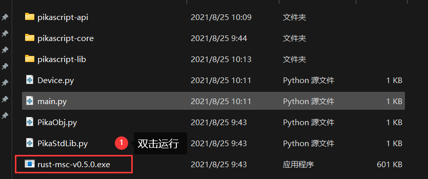

# Keil 仿真工程

在本篇中，你将可以在手边没有硬件的情况下对 pikascript 进行上手测试。
测试使用 keil5 的仿真工程，仿真目标板为 stm32f103 ，下载仿真工程即可直接开始测试。
## 创建工程
进入 pikascript 官网 [http://pikascript.com](http://pikascript.com)
选择 simulation-keil，然后点击“开始生成”

解压下载的 zip 压缩包，打开工程


## 运行仿真工程
选择使用仿真器进行调试


编译工程然后进入调试

打开串口显示面板

运行然后查看输出结果


## 交互式运行

可以直接在 UART 窗口输入 Python 脚本交互运行，注意缩进应使用 **4个空格**


## 改改脚本看看

用任意编辑器打开 main.py ，推荐 vscode ， 没有 vscode 用记事本打开也可以

以下就是 main.py

```python
# main.py
from PikaObj import  *
import Device
import PikaStdLib 

led = Device.LED()
uart = Device.Uart()
mem = PikaStdLib.MemChecker()

print('hello wrold')
uart.setName('com1')
uart.send('My name is:')
uart.printName()
print('mem used max:')
mem.max()
print('mem used now:')
mem.now()
```
这个脚本使用标准的 python3 语法，那么如何让这个脚本在单片机里运行呢？

事实上，pikascript 虽然使用 python 语法，但原理上更像是 java，是半编译半解释型的，pikascript 的类和方法是需要编译的，而方法调用和对象新建/销毁则是在运行时解释的。

编译 pikascript 分为两步，第一步是使用 pikascript 预编译器将 .py 文件编译为 pikascript-api 中的 .c 和 .h 文件。

第二步是使用 c 编译器编译所有的 c 文件，然后下载到单片机里即可。

双击 rust-msc-v0.5.0.exe 运行 pika 预编译器，值得一提的是，这个预编译器是使用 rust 语言编写的。

为了验证编译的效果，我们可以先把 pikascript-api 文件夹里的文件全部删除，然后再运行编译器，看看能不能自动生成 pikascript-api 里面的 .c,.h文件。


注意不要把 pikascript-api 文件夹给删掉了，只删除里面的文件即可。

下面就是 pikascript-api 生成的 .c,.h 文件

接下来我们来修改一下 main.py 看看效果

```python
from PikaObj import  *
import Device
import PikaStdLib 

led = Device.LED()
uart = Device.Uart()
mem = PikaStdLib.MemChecker()

print('hello wrold')
uart.setName('com1')
uart.send('My name is:')
uart.printName()
print('mem used max:')
mem.max()
print('mem used now:')
mem.now()

# new code start
print('add new code start')
uart.setName('com2')
uart.printName()
print('add new code end')
# new code end
```
我们在 main.py 下面新加了4行脚本，我们来编译运行看看效果。
编译 pikascript-api

编译 keil 工程然后进入调试

运行然后观察输出

我们发现多了3行输出，说明编译运行顺利。
好了，到这里 pikaScript 的三分钟快速上手就结束了。
