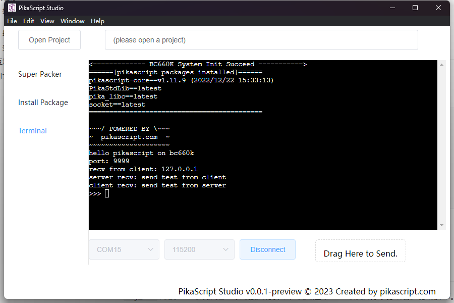

# Pika 派开发板快速上手

今天我们不聊驱动开发还有架构原理这些令人头大的硬核内容，我们就单纯的用 Pika 派开发板玩玩 Python 编程！在单片机上点亮一个“人生苦短，我用 Python ”的成就！

[视频链接](https://www.bilibili.com/video/BV1kg411K7W2)

## 开发板获取

如果手里还没有 Pika 派开发板的话，可以用下面的链接购买：

[https://item.taobao.com/item.htm?spm=a21dvs.23580594.0.0.52de3d0dt7rqAx&ft=t&id=654947372034](https://item.taobao.com/item.htm?spm=a21dvs.23580594.0.0.52de3d0dt7rqAx&ft=t&id=654947372034)

开发板长下面这个样子，板载一个 STM32G0 芯片，上面有4个炫彩 RGB ，采用 Type-C 接口。

可选配置：

- Lite 青春版：STM32G030 + CH340 串口芯片 64k flash 8k ram

- Pro 专业版：STM32G030 + DAPLink 调试器 64K flash 8k ram

- Plus 顶配版：STM32G070 + DAPLink 调试器 128k flash 32k ram


这个开发板由 PikaPython 项目官方支持，持续滚动更新，PikaPython 的最新内核，最新功能，都可以在这个开发板上抢先体验到。

这个开发板也由项目官方适配了丰富外设模块、包括 GPIO、TIME、ADC、IIC、LCD、KEY、PWM 等模块的驱动都已经开发好，可以直接用 python 进行编程。

## 视频教程

[https://space.bilibili.com/5365336/channel/seriesdetail?sid=1034902](https://space.bilibili.com/5365336/channel/seriesdetail?sid=1034902)

## 固件升级

**【重要】！ 拿到开发板之后，先升级固件，否则不能运行例程！**

### 编译固件

固件是一个 Keil 工程，编译非常简单。

下载固件工程：

进入 pikapython 官网 [http://pikascript.com](http://pikascript.com)

Lite 版和 Pro版使用 stm32g030 平台。

Plus 版使用  stm32g070 平台。

然后点击 "开始生成"。

（选择平台后会自动选择默认的模块)


直接打开 Keil 工程就可以编译了。

> **[注意]**
>
> 编译时需要使用不低于 V5.36 的 Keil，需要激活。


### 使用SWD升级

Lite 版自行连接 J-Link \ DAP-Link \ ST-Link 即可SWD升级。

Pro 版和 Plus 版板载 DAP-Link，直接连接USB即可SWD升级。

Lite 版和 Pro 版使用 [bsp/stm32g030](https://gitee.com/Lyon1998/pikapython/tree/master/bsp/stm32g030c8) 工程。

Plus 版使用  [bsp/stm32g070](https://gitee.com/Lyon1998/pikapython/tree/master/bsp/stm32g070cb) 工程。

在使用SWD升级时，应选择"全部擦除"的下载方式


## 如何给单片机下载 Python 程序

下载方法非常简单，只需要连接上 Type-C 数据线就可以了。


我们用一根 USB 数据线，连接电脑和 Pika 派开发板，就可以下载程序了。

下载程序的时候，需要使用一个串口助手工具，我们可以使用正点原子开发的 XCOM 助手，在正点原子的论坛可以下载到。

[http://www.openedv.com/thread-279749-1-1.html](http://www.openedv.com/thread-279749-1-1.html)


选择好 COM 口，然后波特率选为 115200，再点打开串口，这时候，就和 Pika 派连接上了。直接发送一个 Pthon 脚本文件，就可以给 Pika 派下载 Python 程序了。为了验证下载能不能成功，我们使用 PikaPython 源码仓库里面的示例 Python 脚本。

我们进入 PikaPython 的代码仓库

[https://gitee.com/Lyon1998/pikapython](https://gitee.com/Lyon1998/pikapython)

惯例点一个 Star~


然后我们点击 examples 文件夹，里面放的就是可以运行的 Python 例程。


我们打开 Device 文件夹，来点亮一下流水灯看看~

Device 文件夹里面的 GPIO.py 就是 GPIO 的示例代码

我们可以点开 GPIO.py 看看~

```python
import PikaStdLib
import machine

mem = PikaStdLib.MemChecker()
io1 = machine.GPIO()
time = machine.Time()

io1.setPin('PA8')
io1.setMode('out')
io1.enable()
io1.low()

print('hello pikapython')
print('mem.max :')
mem.max()
print('mem.now :')
mem.now()

while True:
    io1.low()
    time.sleep_ms(500)
    io1.high()
    time.sleep_ms(500)
    
```

先不解释里面的内容，我们直接下载这个脚本看看。

我们在桌面新建一个 main.py 文件，然后把这段代码复制进去。

> **[注意]**
> 
> 1. python 文件开头应当包含 `import` 语句，才能触发 Python 文件下载功能。
> 2. 需要在脚本的末尾保留 2 个空行，确保识别到文件结尾


我们选择这个 main.py 文件


然后点击"发送文件", 就可以把脚本下载进去了！

我们可以看到 [ OK ]: Programing ok! 的提示，这就是说明下载成功了！


这时开发板上面的 LED 就会闪动起来！


恭喜你达成单片机玩 Python 的成就！

## GPIO的脚本里写了什么?

下面我们来逐行解析一下 GPIO 的这个例程。


```python
import PikaStdLib
import machine
```


首先是第一行和第二行，这表示导入了两个模块，一个是`PikaStdLib`模块，一个是`machine`模块。

PikaStdLib 是 PikaPython 的标准库，里面有一些系统的功能，比如可以检查内存的占用。第四行里面，我们就新建了一个 mem 对象，这个对象的类是 PikaStdLib.MemChecker()。

```python
mem = PikaStdLib.MemChecker()
```

这个类有 max() 方法和 now() 方法，使用这两个方法，就可以打印出当前 PikaPython 所使用的内存大小。

```python
print('hello pikapython')
print('mem.max :')
mem.max()
print('mem.now :')
mem.now()
```

我们可以看看串口的打印输出，可以看到最大的内存占用是 1.51kB，而当前的内存占用是 0.61kB，是不是很小！


time 对象是通过 machine 的 Time() 类新建的，可以提供基本的延时功能。

```python
time = machine.Time()
```

通过 time.sleep_ms() 方法，就可以按毫秒进行延时了，比如下面代码的作用就是延时500ms。

```python
time.sleep_ms(500)
```

io1 就是我们今天的主角了，这是一个 GPIO 对象，是用 machine .GPIO() 类新建的。

```python
io1 = machine.GPIO()
```

在新建了 io1 对象之后，setPin('PA8') 表示使用 PA8 口 setMode('out') 表示使用输出模式，而 enable() 表示启动 io1 的硬件，low() 将 io1 的电平拉低。

PA8 上连接了 Pika 派上面的一个 led 灯，只要控制 PA8 的电平，就可以控制灯的亮灭了。

```python
io1.setPin('PA8')
io1.setMode('out')
io1.enable()
io1.low()
```

而在程序的主循环里面，对 io1 进行高低电平的切换，就可以使 LED 闪动了~

```python
while True:
    io1.low()
    time.sleep_ms(500)
    io1.high()
    time.sleep_ms(500)
```

## 其他的Python例程解读
### ADC

我们再解读一下 examples 里面的其他例程，比如这个 ADC 例程，就是读取 PA1 管脚上面的模拟电压值，然后打印出来~

```python
import PikaStdLib
import machine

time = machine.Time()
adc1 = machine.ADC() #create an ADC objcet

adc1.setPin('PA1') # config Pin
adc1.enable() # launch the hardware

while True:
    val = adc1.read() # read the value of ADC and store to 'val'
    print('adc1 value:') # print out the value
    print(val)
    time.sleep_ms(500) # wait 0.5s
    
```

### UART

下面是串口的例程，功能是读取收到的两个字节，然后打印出来
```python
import PikaStdLib
import machine

time = machine.Time()
uart = machine.UART() #create a uart object
uart.setId(1) # set number of uart
uart.setBaudRate(115200) # set baudrate
uart.enable() #启动硬件

while True:
    time.sleep_ms(500)
    readBuff = uart.read(2) # read two chars
    print('read 2 char:')
    print(readBuff) # print out the char

```

### PWM

再下面这个是 PWM 的例程，可以指定管脚输出PWM波，可以设置频率和占空比

```python
import PikaStdLib
import machine

time = machine.Time()
pwm = machine.PWM()
pwm.setPin('PA8') # setup the pin numbcer
pwm.setFrequency(2000) # setup the frequency
pwm.setDuty(0.5) # set the duty to 50%
pwm.enable()

while True:
    time.sleep_ms(500)
    pwm.setDuty(0.5)
    time.sleep_ms(500)
    pwm.setDuty(0.001) # set the duty to 0.1%

```

### RGB

再下面这个就是 RGB 的例程了~

```python
import machine

import PikaStdLib

time = machine.Time()
adc = machine.ADC()
pin = machine.GPIO()
pwm = machine.PWM()
uart = machine.UART()
rgb = machine.RGB() # create an RGB object
mem = PikaStdLib.MemChecker()

rgb.init() # init the object
rgb.enable() # launch the hardware

print('hello 2')
print('mem used max:')
mem.max()

while True:
    print('flowing')
    rgb.flow() # let RGB flow


```

这个例程可以驱动板载的4个 RGB 流水灯~


### LCD

还有一个 LCD 的例程，可以在 LCD 上面显示一个小方块，而你可以使用板载的四个按键控制小方块运动~


```python
import PikaStdLib
import machine

lcd = machine.LCD()
lcd.init()
lcd.clear('white') # init LCD set background to white
mem = PikaStdLib.MemChecker()
key = machine.KEY() # new a KEY object
key.init()
time = machine.Time()
h = 10
w = 10
x = 10
y = 10 #Used to represent the height, width, and coordinates of small squares
x_last = x
y_last = y #Record the last location and use it for erasure
is_update = 0 #A flag variable that controls the refresh screen
print('mem used max:')
mem.max()
lcd.fill(x, y, w, h, 'blue') #Draw small blue squares
while True:
    key_val = key.get() # Gets the value of the key
    if key_val != -1:
        x_last = x
        y_last = y
        is_update = 1 #Start the refresh
    if key_val == 0:
        x = x + 5 #Change the coordinates of small squares
    if key_val == 1:
        y = y - 5
    if key_val == 2:
        y = y + 5
    if key_val == 3:
        x = x - 5
    if is_update: #Refresh the screen
        is_update = 0
        lcd.fill(x_last, y_last, w, h, 'white') #Erase off the previous position
        lcd.fill(x, y, w, h, 'blue') #Draw the new location

```

当你熟悉了 LCD 驱动之后，可以试试自己开发小游戏哦~

## 交互式运行

main.py 执行完毕后，就会进入交互式运行，因此只要取消 main.py 中的 `while True :`，使其能够执行完退出，就可以进入交互式运行。

- 强烈建议使用 [pikaStudio](https://gitee.com/Lyon1998/pikapython/attach_files/1285327/download) 作为串口终端。



交互式运行支持单行，多行输入，和通用 Python 用法一致。

输入 `exit()` 则会直接重启系统。

> **[注意]**
>
> 1. 固件版本需要不低于 `v1.3.2`
> 2. 如果使用 PuTTY 终端无法正常运行，请使用 XCOM。
> 3. 在终端中应全部使用英文输入法。
> 4. 缩进应使用 4 个空格，**不要**使用 TAB 键。

## LCD 屏幕安装

1. 参考下图焊接长脚排母

  

2. 插上屏幕，参考绿色小旗的方向，屏幕能亮就说明插的方向是对的，插反了不会亮

  

### 使用固件下载 Python 程序

固件在编译时会加载 pikascript/main.py 作为默认 Python 程序。

## 常见问题

1 模块找不到

模块的命名有变化，更新固件即可。

2 工程编译报错，缺少文件：

工程需要远程拉取模块和预编译，需要先运行 pikascript/pikaPackage.exe 和 pikascript/rust-msc-win10-latest.exe 再编译工程。

## 原理图

### Lite 青春版


### Pro 专业版


### Plus 顶配版


### LCD

