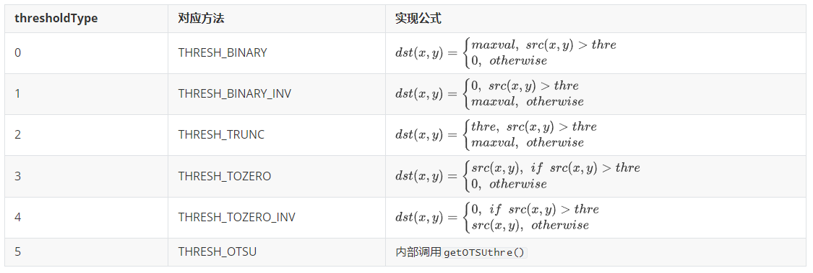

# PikaCV 图像库

PikaCV图像库实现了部分常用的图像处理算法。

## 安装

1. 在 requestment.txt 中加入 PikaCV的依赖。

   ```
   PikaCV==latest
   ```

2. 运行 pikaPackage.exe

## 导入

在 main.py 中加入：

```python
#main.py
import PikaCV as cv
```

## class Image():

Image类是PikaCV库的基础，后续的图像处理算法都基于Image类。使用Image类可以创建一个空图像，如：

```python
import PikaCV
img = cv.Image()
```

### 图像读写

目前，PikaCV可以读取Jpeg格式文件与写入bmp格式文件。

```python
    def read(self, path: str):
        """Read the image from the specified path, 
        Need implement the   `__platform_fopen()`, `__platform_fread()`
          and `__platform_fclose()`"""
        ...

    def write(self, path: str):
        """Write the image to the specified path, 
        Need implement the   `__platform_fopen()`, `__platform_fwrite()` 
        and `__platform_fclose()`"""
        ...

    def loadJpeg(self, bytes: any):
        """Load the image from bytes"""

    def loadRGB888(self, width: int, height: int, bytes: bytes):
        """Load the image from bytes"""

    def loadRGB565(self, width: int, hight: int, bytes: bytes):
        """Load the image from bytes"""

    def loadGray(self, width: int, hight: int, bytes: bytes):
        """Load the image from bytes"""
```

### 图像属性

图像的``size``大小为``width * hight * channel``。

```python
    def width(self) -> int:
        """Get the width of the image"""

    def hight(self) -> int:
        """Get the hight of the image"""

    def format(self) -> int:
        """Get the format of the image. 
        The format is one of the `ImageFormat` enum, 
        like `ImageFormat.RGB888`"""
            def data(self) -> bytes:
        """Get the data of the image"""

    def getPixel(self, x: int, y: int, channel: int) -> int:
        """Get the pixel value of the specified channel.
        For example, if the format of image is `RGB888`, 
        the channel `0`, `1`, `2`, means `R`, `G`, `B`, 
        and for the format of `GRAY8`, the channel is `0`
        """

    def setPixel(self, x: int, y: int, channel: int, value: int):
        """Set the pixel value of the specified channel.
        For example, if the format of image is `RGB888`, 
        the channel `0`, `1`, `2`, means `R`, `G`, `B`, 
        and for the format of `GRAY8`, the channel is `0`
        """

    def size(self) -> int:
        """Get the size of the image by bytes"""
```

### 图像运算

1. ``add()`` 与``minus()``逐像素操作，当像素值超过255时归为255，低于0时归为0。
2. ``merge()``与``split()``的通道顺序均为RGB。


## class Converter():

Converter类主要实现了图像格式之间的转换，目前Converter支持以下图像存储格式及转换：

| From\To | RGB888 | RGB565 | Gray | BMP  | BGR888 |
| ------- | ------ | ------ | ---- | ---- | ------ |
| RGB888  | -      | √      | √    | *    | √      |
| RGB565  | √      | -      | √    | *    | √      |
| Gray    | √      | √      | -    | *    | √      |
| BMP     | √      | √      | √    | -    | √      |
| BGR888  | √      | √      | √    | √    | -      |

其中，``-``代表不执行任何操作，``*``代表需要经一次中间转换，`` √``代表可以直接转换。

图像格式转换操作示例如下：

```python
cv.Converter.toBMP(img)
```

## class Transforms():

Transforms类主要实现了图像变换算法,目前已经实现的变换算法有：

1. ``rotateDown(image: Image)``

   本函数可将图像旋转180度。

2. ``threshold(image:Image,thre:int,maxval:int,thresholdType:int)``

   本函数用于将图像转换为二值图像

   ``thre``:当thresholdType的取值为0-4时使用thre作为图像的分界阈值。

   ``thresholdType``:阈值类型，具体含义如下：

   
   
3. ``setROI(image:Image,x:int,y:int,w:int,h:int)``

   本函数用于从一张图像出选取一片感兴趣的区域，关于区域的定义采用xywh方法，x与y代表区域的左上顶点坐标，w代表区域的宽度，h代表区域的高度。

4. ``getOTSUthre(image:Image) -> int``

   本函数实现了[OTSU算法](https://u-aizu.ac.jp/course/bmclass/documents/otsu1979.pdf)，具体原理请参加论文，此处不过多赘述，函数的返回值为OTSU法计算得出的阈值。

5. ``setOTSU(image:Image)``

   本函数使用OTSU算法对图像进行二值化处理。

6. ``resize(image:Image,x:int,y:int,resizeType:int)``

   本函数实现了对图像的缩放，x与y是图像的目标大小。

   ``resizeType``:图像的缩放方法。0代表最近邻算法。

7. ``adaptiveThreshold(image:Image,maxval:int,subsize:int,c:int,method:int)``

   ``method``：在一个邻域内计算阈值所采用的算法。0代表均值滤波，1代表中值滤波。

   ``c``:偏移值调整量。

   ``subsize``:卷积核大小。

## class Filter

Filter类实现了常用的图像滤波算法，目前已经实现的算法有：

1. ``meanFilter(image:Image,ksizex:int,ksizey:int)``

   均值滤波，ksizex与ksizey分别为卷积核的x与y的大小。目前未支持pad，所以滤波后图片的大小为``W-F+1``（ksizex等于ksizey时）。

2. ``medianFilter(image:Image)``

   中值滤波，目前仅支持尺寸为3*3的卷积核。

   
