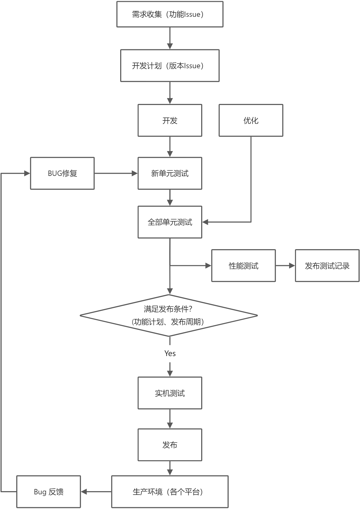

# PikaScript 内核进阶

## 大纲
一、内核开发概览
二、内核开发环境搭建
三、测试驱动开发
四、内核分发与上下游
​

## 内核开发概览
内核开发环境: linux
内核部署环境: mcu ( ARM, Risc-V, Others )
​

### 选择 linux 的原因
#### 内核本身需求：跨平台能力、稳定性
只有跨平台，才能跨平台
只有充分测试，才能稳定
​

#### 开发需求：平台主流、调试方便、测试工具齐全
使用主流平台，主流技术，一次只造一个轮子

#### 团队需求：避免依赖硬件、开发环境统一
降低新成员加入的难度，解决物理距离的阻碍（快递费很贵）
降低试错成本（全用硬件测试板子烧了怎么办）
简化开发环境搭建（你的软件在我电脑上怎么用不了啊）

#### 项目需求：易于部署自动化设施、CI-CD、易于软件分发
自动化一切可以自动化的步骤，降低维护成本

### 内核开发步骤

实机测试前占了95%的工作量
​

## 内核环境搭建

## 测试驱动开发
实现功能->编写单元测试
## 内核分发与上下游
