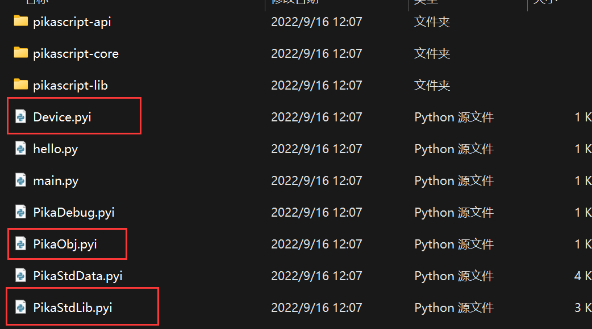
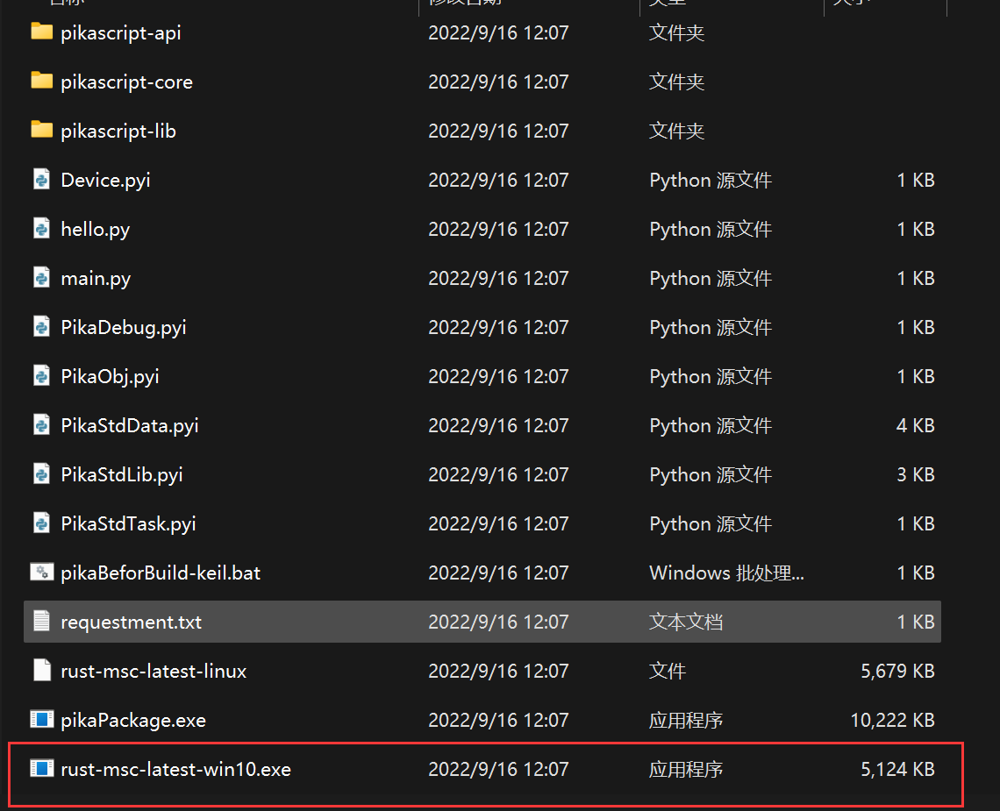
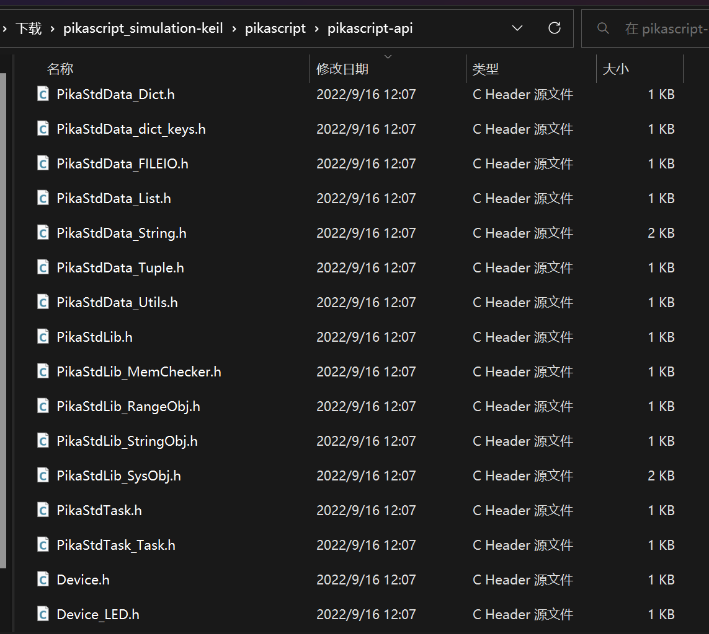
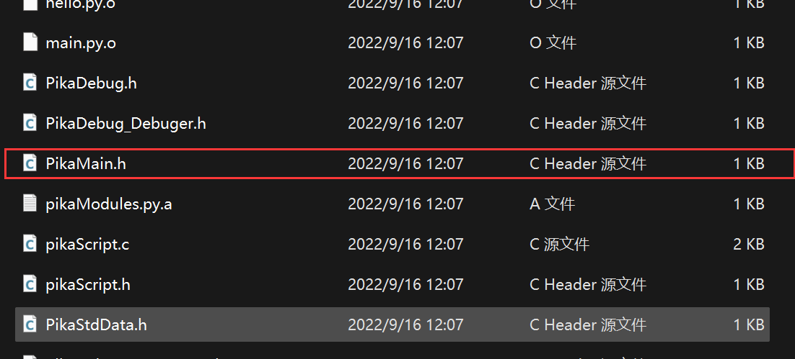
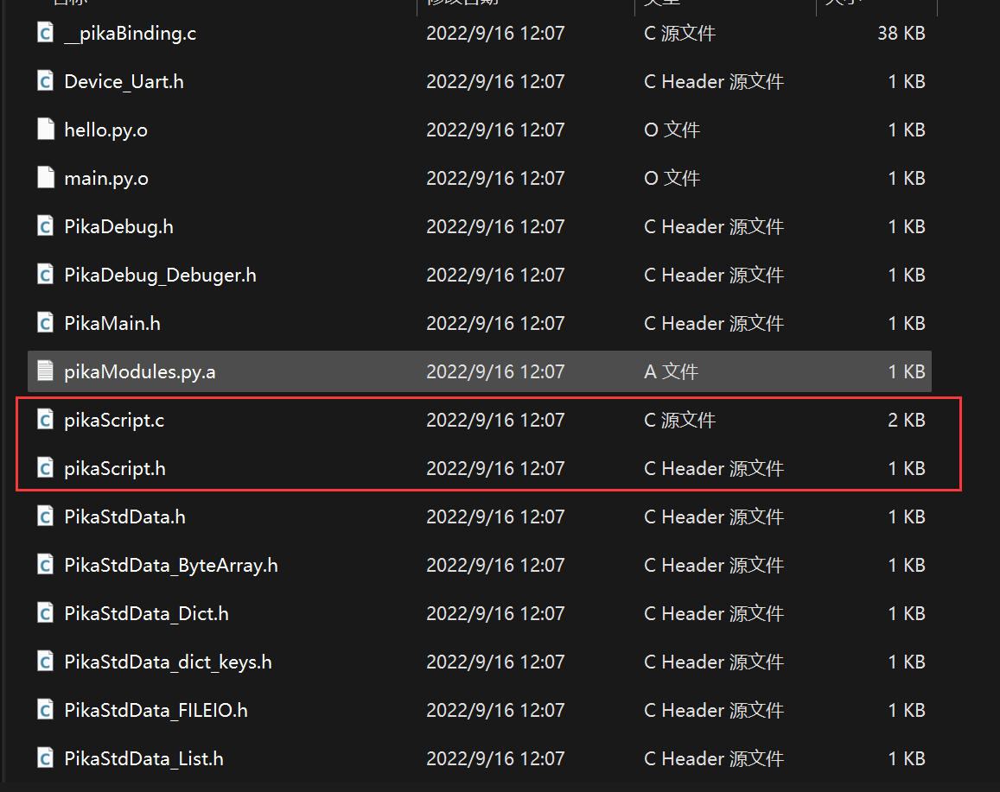

# PikaPython C模块概述

我们依然以keil的仿真工程为例，如果还没有获得仿真工程，请首先在 [快速开始 -> keil 仿真工程](Keil%20%E4%BB%BF%E7%9C%9F%E5%B7%A5%E7%A8%8B.html) 章节获取工程。

### PikaScript模块与模块接口

我们打开 pikascript 文件夹，发现文件夹根目录下除了 main.py，还有Device.pyi，PikaObj.pyi 和 PikaStdLib.pyi。

这三个 `.pyi` 文件分别对应三个PikaScript **C 模块** (class package)，每个 `.pyi` 文件本身称为 **模块接口** (package interface)。

一个C模块中可以包含若干个相关性较强的类。



每一个 PikaPython **C模块** 由 **模块接口** 和 **模块实现** (package implement)两部分组成。

我们先打开 Device.pyi 查看一下内容，在后续的文档中我们会称 Device.pyi 为 **Device 模块接口**。

以下就是 Device.pyi 的全部内容。

```python
# Device.pyi

class LED:
    def on(self):
        pass
    def off(self):
        pass

class Uart:
    def send(self, data:str):
        pass
    def setName(self, name:str):
        pass
    def printName(self):
        pass
```

可以看到，Device.pyi 中使用 pyhon 标准语法定义了两个类，分别是 `LED` 类和 `Uart` 类。

LED类中定义了两个方法，分别是 `on()` 方法和 `off()` 方法，而`Uart`类则定义了 `send(data:str)` 方法、 `setName(name:str)` 方法和 `printName()` 方法。


可以看到，这些方法都有一个特点，与其说这是方法的 **定义**，不如说是方法的 **声明**（注解），因为所有的方法实现都 pass 掉了，都没有写实现。而且方法的入口参数都是带有 **类型声明** 的。比如 `data:str` 就表示一个`data` 参数，参数类型为 `str` 即字符串类型。


这是因为这个模块的模块实现是由 C 语言编写的，也就是说，PikaPython 的 C 模块，都是使用 python 语法编写声明，而使用 C 语言编写实现。PikaPython 的模块开发是一种 **面向接口** 编程的 **混合编程** 技术。


然而在使用已有的模块时，是不需要了解模块实现的，只需要了解模块接口，即可使用这个模块。


### 导入并调用模块


下面我们看一下如何使用这个模块。


我们打开工程中的 main.py，见名知意，这个文件是 PikaPython 的入口文件。


main.py 的内容如下


```python
# main.py
import Device
import PikaStdLib 

led = Device.LED()
uart = Device.Uart()
mem = PikaStdLib.MemChecker()

print('hello wrold')
uart.setName('com1')
uart.send('My name is:')
uart.printName()
print('mem used max:')
mem.max()
print('mem used now:')
mem.now()
```

导入一个已经编写好的 C 模块是非常简单的，比如导入 Device 模块，只需要 `import Device` 即可，要注意的是所有的 `.py` 和 `.pyi` 件应当放在 pikascript 文件架的根目录下。

调用方法则使用 `uart.setName('com')` 这种形式，这都是 Python 的标准语法，不需要过多介绍。

在 main.py 中写好模块的调用后，双击 rust-msc-v0.5.0.exe 即可预编译 PikaPython 工程，预编译的输出文件在 pikascrip-api 文件夹内。



pika 预编译器会为导入的模块生成 .h 声明文件。文件名以模块名开头，每个类对应一个 .h 文件。



而 PikaMain.h 则是对应了一个特殊的类，这个类是 PikaPython 的主类，由 main.py 编译而成。



pikaScript.c 和 pikaScript.h 则是根据 main.py 编译出的初始化函数，运行初始化函数时，会自动执行启动脚本。



在现在的 main.py 中，启动脚本是写在最外层的方法调用，也就是:

```python
led = Device.LED()
uart = Device.Uart()
mem = PikaStdLib.MemChecker()

print('hello wrold')
uart.setName('com1')
uart.send('My name is:')
uart.printName()
print('mem used max:')
mem.max()
print('mem used now:')
mem.now()
```

编译出的 pikaScriptInit() 初始化函数对应的是:

```c
PikaObj * pikaScriptInit(){
    PikaObj * pikaMain = newRootObj("pikaMain", New_PikaMain);
    obj_run(pikaMain,
            "\n"
            "led = Device.LED()\n"
            "uart = Device.Uart()\n"
            "mem = PikaStdLib.MemChecker()\n"
            "\n"
            "print('hello wrold')\n"
            "uart.setName('com1')\n"
            "uart.send('My name is:')\n"
            "uart.printName()\n"
            "print('mem used max:')\n"
            "mem.max()\n"
            "print('mem used now:')\n"
            "mem.now()\n"
            "\n"
            "\n");
    return pikaMain;
}
```
