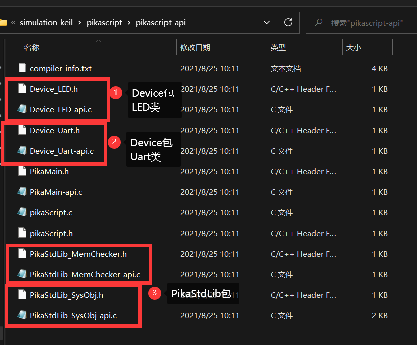

# PikaScript 模块概述

我们依然以keil的仿真工程为例，如果还没有获得仿真工程，请参考[1.三分钟快速上手](https://pikadoc.readthedocs.io/zh/latest/Keil%20%E4%BB%BF%E7%9C%9F%E5%B7%A5%E7%A8%8B.html)
### PikaScript模块与模块接口
我们打开pikascript文件夹，发现文件夹根目录下除了main.py，还有Device.py，PikaObj.py和PikaStdLib.py，这三个.py文件分别对应三个PikaScript **模块** (class package)，简称 **包** (package)，每个.py文件本身称为 **模块接口** (package interface)。一个模块中可以包含若干个相关性较强的类。


每一个 PikaScript **模块** 由 **模块接口** 和 **模块实现** (package implement)两部分组成。
我们先打开 Device.py 查看一下内容，在后续的文档中我们会称 Device.py 为 **Device模块接口**。
以下就是 Device.py 的全部内容。

```python
# Device.py
from PikaObj import *

class LED(TinyObj):
    def on(self):
        pass
    def off(self):
        pass

class Uart(TinyObj):
    def send(self, data:str):
        pass
    def setName(self, name:str):
        pass
    def printName(self):
        pass
```


可以看到，Device.py 中使用 pyhon 标准语法定义了两个类，分别是 `LED` 类和 `Uart` 类，这两个类都继承自`TinyObj`。


LED类中定义了两个方法，分别是 `on()` 方法和 `off()` 方法，而`Uart`类则定义了 `send(data:str)` 方法、 `setName(name:str)` 方法和 `printName()` 方法。


可以看到，这些方法都有一个特点，与其说这是方法的 **定义**，不如说是方法的 **声明**（注解），因为所有的方法实现都pass 掉了，都没有写实现。而且方法的入口参数都是带有 **类型声明** 的。比如`data:str`就表示一个`data` 参数，参数类型为 `str` 即字符串类型。


这是因为这个模块的模块实现是由 C 语言编写的，也就是说，PikaScript的所有模块，都是使用 python 语法编写声明，而使用 C 语言编写实现。PikaScript 的模块开发是一种 **面向接口** 编程的 **混合编程** 技术。


然而在使用已有的模块时，是不需要了解模块实现的，只需要了解模块接口，即可使用这个模块。


### 导入并调用模块


下面我们看一下如何使用这个模块。


我们打开工程中的main.py，见名知意，这个文件是PikaScript的入口文件。


main.py的内容如下


```python
# main.py
from PikaObj import  *
import Device
import PikaStdLib 

led = Device.LED()
uart = Device.Uart()
mem = PikaStdLib.MemChecker()

print('hello wrold')
uart.setName('com1')
uart.send('My name is:')
uart.printName()
print('mem used max:')
mem.max()
print('mem used now:')
mem.now()
```


导入一个已经编写好的模块是非常简单的，比如导入Device模块，只需要`import Device`即可，要注意的是所有的.py文件应当放在pikascript文件架的根目录下。


调用方法则使用`uart.setName('com')`这种形式，这都是Python的标准语法，不需要过多介绍。


在main.py中写好模块的调用后，双击rust-msc-v0.5.0.exe即可预编译PikaScript工程，预编译的输出文件在pikascrip-api文件夹内。


pika预编译器会为导入的模块生成.h声明文件和-api.c构造器文件。文件名以模块名开头，每个类对应一个.h文件和一个-api.c文件。





而PikaMain-api.c和PikaMain.h则是对应了一个特殊的类，这个类是PikaScript的主类，由main.py编译而成。


pikaScript.c和pikaScript.h则是根据main.py编译出的初始化函数，运行初始化函数时，会自动执行启动脚本。


在现在的main.py中，启动脚本是写在最外层的方法调用，也就是:


```python
led = Device.LED()
uart = Device.Uart()
mem = PikaStdLib.MemChecker()

print('hello wrold')
uart.setName('com1')
uart.send('My name is:')
uart.printName()
print('mem used max:')
mem.max()
print('mem used now:')
mem.now()
```


编译出的pikaScriptInit()初始化函数对应的是:


```c
PikaObj * pikaScriptInit(){
    PikaObj * pikaMain = newRootObj("pikaMain", New_PikaMain);
    obj_run(pikaMain,
            "\n"
            "led = Device.LED()\n"
            "uart = Device.Uart()\n"
            "mem = PikaStdLib.MemChecker()\n"
            "\n"
            "print('hello wrold')\n"
            "uart.setName('com1')\n"
            "uart.send('My name is:')\n"
            "uart.printName()\n"
            "print('mem used max:')\n"
            "mem.max()\n"
            "print('mem used now:')\n"
            "mem.now()\n"
            "\n"
            "\n");
    return pikaMain;
}
```
