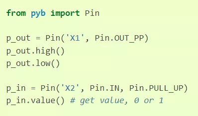
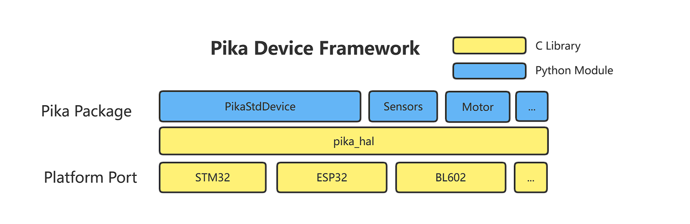
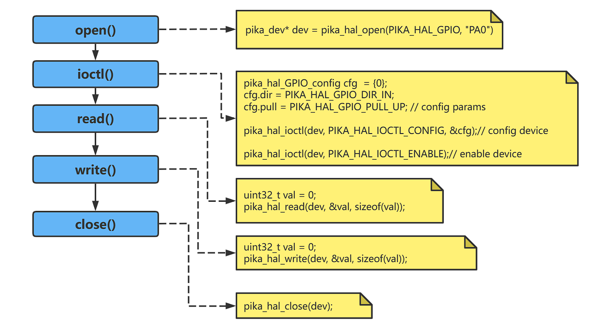

# PikaStdDevice 标准设备

PikaStdDevice 是一个抽象的设备模型，提供了跨平台的统一外设 API 。
## 安装

- 在 requestment.txt 中加入 PikaStdDevice 的依赖。
```
PikaStdDevice
```

- 运行 pikaPackage.exe
## 为什么要有标准设备模块
什么是标准设备模块呢？我们先从其他的脚本技术说起，比如 MicroPython，并没有统一的外设调用 API，这使得用户在使用不同的平台时，都需要重新学习 API，比如下面这个是 MicroPython 在 STM32F4 平台驱动 GPIO 的代码。



这个是 ESP8266 的


可以明显看到在选择 pin 的管脚时，一个用的是字符串，而另一个用的是整型数，控制电平时，一个使用 `high()`，`low()`方法，而另一个使用`on()`，`off()`方法，总之驱动的API标准很混乱。
有没有什么办法，能够统一外设的 API，使得用户只需要熟悉一套 API，就能够在任意平台通用呢？
方法是有的，就是 PikaStdDevice 标准设备驱动模块。

## 模块结构



- `PikaStdDevice` 模块提供了 `GPIO`、`IIC`、`PWM` 等基础的外设 Python 模块。
- `PikaStdDevice` 基于 `pika_hal` 设备抽象层，`pika_hal`是一个纯 `c` 语言的设备抽象层，将不同平台的外设操作都统一为相同的 `API` 供 `PikaStdDevice` 调用，这样不同的平台 (STM32、ESP32、BL602) 等都可以使用通用的 `Python` 代码来控制设备了。
- `pika_hal` 设备抽象层需要在不同的平台进行适配 (Platform Port)，通过在不同的平台重写形如 `pika_hal_platform_xxxx()`  的 `WEAK` 函数，就可以为不同的平台提供支持。
- 除了 `PikaStdDevice` 模块之外，还有一些 `sensor` / `motor` 等 `Python` 模块，也基于 `pika_hal` 开发，这些模块使用的是 `pika_hal` 的 `GPIO`、`IIC`、`PWM` 等适配好的功能，所以不需要除了 `pika_hal` 之外额外的适配就可以使用。

## `PikaStdDevice` 模块示例

以 GPIO 模块为例，以下是 PikaStdDevice 定义的用户 API

``` python
class GPIO:
    def __init__(self):
        pass

    def init(self):
        pass

    def setPin(self, pinName: str):
        pass

    def setId(self, id: int):
        pass

    def getId(self) -> int:
        pass

    def getPin(self) -> str:
        pass

    def setMode(self, mode: str):
        pass

    def getMode(self) -> str:
        pass

    def setPull(self, pull: str):
        pass

    def enable(self):
        pass

    def disable(self):
        pass

    def high(self):
        pass

    def low(self):
        pass

    def read(self) -> int:
        pass

```

`PikaStdDevice` 模块的示例代码在 [https://gitee.com/Lyon1998/pikascript/tree/master/examples/Device](https://gitee.com/Lyon1998/pikascript/tree/master/examples/Device) 路径下，示例中的 `machine` 模块是 `PikaStdDevice` 模块的简单重命名。

## `pika_hal` 设备抽象层

### 设计理念

- 高效。纯 C 语言实现，内部环节精简。

- 标准。采用类 `linux` 的设计，所有类型的设备操作有且仅有类似于文件的 5 个标准 API： `open()`、`close()`、`write()`、`read()`、`ioctl()` 。

### 编程模型



所有设备均遵循类 linux 文件的编程模型，所有类型的设备均使用 `pika_dev` 结构体来作为设备句柄，所有类型的设备均有且只有以下五个控制 API：

### `open()`

- 概述

    `open()` 函数用于打开一个设备，最先调用。

- 函数原型

    ``` c 
    pika_dev* pika_hal_open(PIKA_HAL_DEV_TYPE dev_type, char* name);
    ```

- 参数

|参数|类型|功能|备注|
|---|---|---|---|
| dev_type | PIKA_HAL_DEV_TYPE  | 设备类型 |如 PIKA_HAL_GPIO 为 GPIO 设备，PIKA_HAL_SPI 为 SPI 设备。|
| name| char* |  设备名   |如 PA0 ，SPI2 等|
| (return)| pika_dev| 设备句柄 |如果成功打开设备，将会返回设备句柄 pika_dev 的指针，如果打开失败会返回 NULL。|

### `close()`

- 概述

    `close()` 函数用于关闭一个设备，最后调用，关闭设备时需要调用 `pika_hal_close()` 避免出现内存泄漏。

- 函数原型

  ```c
  int pika_hal_close(pika_dev* dev);
  ```
- 参数

|参数|类型|功能|备注|
|---|---|---|---|
| dev| pika_dev*  | 设备句柄 |要操作的设备句柄。|
|(return)| int| 错误值|错误值为 0 表示操作成功，其他返回值表示操作失败，返回值为错误码。|

### `ioctl()`

- 概述

    `ioctl()` 函数用于对设备进行控制，包括：

    - 配置 - config
    - 使能 - enable
    - 失能 - disable

- 函数原型

  ```c
  int pika_hal_ioctl(pika_dev* dev, PIKA_HAL_IOCTL_CMD cmd, ...);
  ```

- 参数

|参数|类型|功能|备注|
|---|---|---|---|
| dev| pika_dev*| 设备句柄 |要操作的设备句柄。|
| cmd| PIKA_HAL_IOCTL_CMD|控制命令| |
| ...| (None)/pika_hal_config_XXXX * | 控制参数 |该参数可填可不填，根据 cmd 的取值而定。当 cmd 为 PIKA_HAL_IOCTL_ENABLE、PIKA_HAL_IOCTL_DISABLE 时，该参数不填。当 cmd 为 PIKA_HAL_IOCTL_CONFIG 时，该参数为 pika_hal_config_XXXX \*cfg，其中  XXXX 是设备的类型，如 pika_hal_config_GPIO 、pika_hal_config_SPI 等，应和 pika_hal_open() 中使用的设备的类型相同。|
| (return)| int |错误值|错误值为 0 表示操作成功，其他返回值表示操作失败，返回值为错误码。|

### `read()`

- 概述

    `read()` 函数用于从设备中读取数据。

- 函数原型

  ```c
  int pika_hal_read(pika_dev* dev, void* buf, size_t len);
  ```
- 参数

|参数|类型|功能|备注|
|---|---|---|---|
| dev      | pika_dev*  | 设备句柄     | 要操作的设备句柄。                                           |
| buf      | void*      | 读取缓冲区   | 对于 GPIO、ADC 这样只能读取单个数据的设备，缓冲区使用 uint32_t。 |
| len      | size_t     | 读取的字节数 | 对于 GPIO、ADC 这样只能读取单个数据的设备，长度为 sizeof(uint32_t)。 |
| (return) | int        | 错误值       | 错误值为 0 表示操作成功，其他返回值表示操作失败，返回值为错误码。 |

### `write()`

- 概述

    `write()` 函数用于向设备写入数据。

- 函数原型

  ```c
  int pika_hal_write(pika_dev* dev, void* buf, size_t len);
  ```
- 参数

|参数|类型|功能|备注|
|---|---|---|---|
| dev      | pika_dev*  | 设备句柄     | 要操作的设备句柄。                                           |
| buf      | void*      | 写入缓冲区   | 对于 GPIO、DAC 这样只能写入单个数据的设备，缓冲区使用 uint32_t。 |
| len      | size_t     | 写入的字节数 | 对于 GPIO、DAC 这样只能读取单个数据的设备，长度为 sizeof(uint32_t)。 |
| (return) | int        | 错误值       | 错误值为 0 表示操作成功，其他返回值表示操作失败，返回值为错误码。 |

### 驱动适配

为平台适配 `pika_hal`，就是为设备重写以下的 `pika_hal_platform_XXXX` 为前缀的 `WEAK` 函数，其中`XXXX` 为设备类型名，如 `GPIO`、`PWM` 等。

```c
PIKA_WEAK int pika_hal_platform_XXXX_open(pika_dev* dev, char* name);
PIKA_WEAK int pika_hal_platform_XXXX_close(pika_dev* dev);
PIKA_WEAK int pika_hal_platform_XXXX_read(pika_dev* dev, void* buf, size_t count);
PIKA_WEAK int pika_hal_platform_XXXX_write(pika_dev* dev, void* buf, size_t count);
PIKA_WEAK int pika_hal_platform_XXXX_ioctl_enable(pika_dev* dev);
PIKA_WEAK int pika_hal_platform_XXXX_ioctl_disable(pika_dev* dev);
PIKA_WEAK int pika_hal_platform_XXXX_ioctl_config(pika_dev* dev, pika_hal_XXXX_config* cfg);
```

参考适配代码：

[https://gitee.com/Lyon1998/pikascript/tree/master/package/BLIOT](https://gitee.com/Lyon1998/pikascript/tree/master/package/BLIOT)

## 参与贡献

请参考 [参与社区贡献->贡献模块](https://pikadoc.readthedocs.io/zh/latest/%E5%A6%82%E4%BD%95%E8%B4%A1%E7%8C%AE%20PikaScript%20%E6%A8%A1%E5%9D%97.html) 部分的文档发布你编写的模块。
