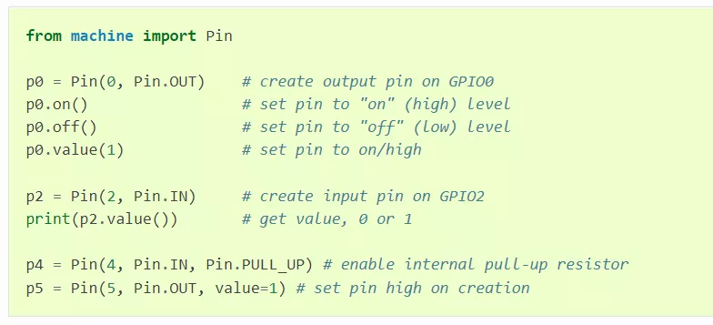

# PikaStdDevice 标准设备

PikaStdDevice 是一个抽象的设备模型，提供了跨平台的统一外设 API 。
## 安装

- 在 requestment.txt 中加入 PikaStdDevice 的依赖。
```
PikaStdDevice
```

- 运行 pikaPackage.exe
## 为什么要有标准设备模块
什么是标准设备模块呢？我们先从其他的脚本技术说起，比如 MicroPython，并没有统一的外设调用 API，这使得用户在使用不同的平台时，都需要重新学习 API，比如下面这个是 MicroPython 在 STM32F4 平台驱动 GPIO 的代码。


这个是 ESP8266 的



可以明显看到在选择 pin 的管脚时，一个用的是字符串，而另一个用的是整型数，控制电平时，一个使用 `high()`，`low()`方法，而另一个使用`on()`，`off()`方法，总之驱动的API标准很混乱。
有没有什么办法，能够统一外设的 API，使得用户只需要熟悉一套 API，就能够在任意平台通用呢？
方法是有的，就是 PikaStdDevice 标准设备驱动模块。

## 模块结构


- `PikaStdDevice` 模块提供了 `GPIO`、`IIC`、`PWM` 等基础的外设 Python 模块。
- `PikaStdDevice` 基于 `pika_hal` 设备抽象层，`pika_hal`是一个纯 `c` 语言的设备抽象层，将不同平台的外设操作都统一为相同的 `API` 供 `PikaStdDevice` 调用，这样不同的平台 (STM32、ESP32、BL602) 等都可以使用通用的 `Python` 代码来控制设备了。
- `pika_hal` 设备抽象层需要在不同的平台进行适配 (Platform Port)，通过在不同的平台重写形如 `pika_hal_platform_xxxx()`  的 `WEAK` 函数，就可以为不同的平台提供支持。
- 除了 `PikaStdDevice` 模块之外，还有一些 `sensor` / `motor` 等 `Python` 模块，也基于 `pika_hal` 开发，这些模块使用的是 `pika_hal` 的 `GPIO`、`IIC`、`PWM` 等适配好的功能，所以不需要除了 `pika_hal` 之外额外的适配就可以使用。

## `PikaStdDevice` 模块示例

以 GPIO 模块为例，以下是 PikaStdDevice 定义的用户 API

``` python
class GPIO:
    def __init__(self):
        pass

    def init(self):
        pass

    def setPin(self, pinName: str):
        pass

    def setId(self, id: int):
        pass

    def getId(self) -> int:
        pass

    def getPin(self) -> str:
        pass

    def setMode(self, mode: str):
        pass

    def getMode(self) -> str:
        pass

    def setPull(self, pull: str):
        pass

    def enable(self):
        pass

    def disable(self):
        pass

    def high(self):
        pass

    def low(self):
        pass

    def read(self) -> int:
        pass

```

`PikaStdDevice` 模块的示例代码在 [https://gitee.com/Lyon1998/pikapython/tree/master/examples/Device](https://gitee.com/Lyon1998/pikapython/tree/master/examples/Device) 路径下，示例中的 `machine` 模块是 `PikaStdDevice` 模块的简单重命名。

## `pika_hal` 设备抽象层

### 讲解视频

[【Pika Python 设备抽象层】pika_hal](https://space.bilibili.com/5365336/channel/collectiondetail?sid=1033930)

### 设计理念

- 高效。纯 C 语言实现，内部环节精简。

- 标准。采用类 `linux` 的设计，所有类型的设备操作有且仅有类似于文件的 5 个标准 API： `open()`、`close()`、`write()`、`read()`、`ioctl()` 。

### 编程模型


所有设备均遵循类 linux 文件的编程模型，所有类型的设备均使用 `pika_dev` 结构体来作为设备句柄，所有类型的设备均有且只有以下五个控制 API：

### `open()`

- 概述

    `open()` 函数用于打开一个设备，最先调用。

- 函数原型

    ``` c 
    pika_dev* pika_hal_open(PIKA_HAL_DEV_TYPE dev_type, char* name);
    ```

- 参数

|参数|类型|功能|备注|
|---|---|---|---|
| dev_type | PIKA_HAL_DEV_TYPE  | 设备类型 |如 PIKA_HAL_GPIO 为 GPIO 设备，PIKA_HAL_SPI 为 SPI 设备。|
| name| char* |  设备名   |如 PA0 ，SPI2 等|
| (return)| pika_dev| 设备句柄 |如果成功打开设备，将会返回设备句柄 pika_dev 的指针，如果打开失败会返回 NULL。|

### `close()`

- 概述

    `close()` 函数用于关闭一个设备，最后调用，关闭设备时需要调用 `pika_hal_close()` 避免出现内存泄漏。

- 函数原型

  ```c
  int pika_hal_close(pika_dev* dev);
  ```
- 参数

|参数|类型|功能|备注|
|---|---|---|---|
| dev| pika_dev*  | 设备句柄 |要操作的设备句柄。|
|(return)| int| 错误值|错误值为 0 表示操作成功，其他返回值表示操作失败，返回值为错误码。|

### `ioctl()`

- 概述

    `ioctl()` 函数用于对设备进行控制，包括：

    - 配置 - config
    - 使能 - enable
    - 失能 - disable

- 函数原型

  ```c
  int pika_hal_ioctl(pika_dev* dev, PIKA_HAL_IOCTL_CMD cmd, ...);
  ```

- 参数

|参数|类型|功能|备注|
|---|---|---|---|
| dev| pika_dev*| 设备句柄 |要操作的设备句柄。|
| cmd| PIKA_HAL_IOCTL_CMD|控制命令| 可填 PIKA_HAL_IOCTL_ENABLE，PIKA_HAL_IOCTL_DISABLE，PIKA_HAL_IOCTL_CONFIG 三个命名，分别对应使能、失能和配置。 |
| ...| (None)/pika_hal_config_XXXX * | 控制参数 |该参数可填可不填，根据 cmd 的取值而定。当 cmd 为 PIKA_HAL_IOCTL_ENABLE、PIKA_HAL_IOCTL_DISABLE 时，该参数不填。当 cmd 为 PIKA_HAL_IOCTL_CONFIG 时，该参数为 pika_hal_config_XXXX \*cfg，其中  XXXX 是设备的类型，如 pika_hal_config_GPIO 、pika_hal_config_SPI 等，应和 pika_hal_open() 中使用的设备的类型相同。|
| (return)| int |错误值|错误值为 0 表示操作成功，其他返回值表示操作失败，返回值为错误码。|

### `read()`

- 概述

    `read()` 函数用于从设备中读取数据。

- 函数原型

  ```c
  int pika_hal_read(pika_dev* dev, void* buf, size_t len);
  ```
- 参数

|参数|类型|功能|备注|
|---|---|---|---|
| dev      | pika_dev*  | 设备句柄     | 要操作的设备句柄。                                           |
| buf      | void*      | 读取缓冲区   | 对于 GPIO、ADC 这样只能读取单个数据的设备，缓冲区使用 uint32_t。 |
| len      | size_t     | 读取的字节数 | 对于 GPIO、ADC 这样只能读取单个数据的设备，长度为 sizeof(uint32_t)。 |
| (return) | int        | 错误值       | 错误值为 0 表示操作成功，其他返回值表示操作失败，返回值为错误码。 |

### `write()`

- 概述

    `write()` 函数用于向设备写入数据。

- 函数原型

  ```c
  int pika_hal_write(pika_dev* dev, void* buf, size_t len);
  ```
- 参数

|参数|类型|功能|备注|
|---|---|---|---|
| dev      | pika_dev*  | 设备句柄     | 要操作的设备句柄。                                           |
| buf      | void*      | 写入缓冲区   | 对于 GPIO、DAC 这样只能写入单个数据的设备，缓冲区使用 uint32_t。 |
| len      | size_t     | 写入的字节数 | 对于 GPIO、DAC 这样只能读取单个数据的设备，长度为 sizeof(uint32_t)。 |
| (return) | int        | 错误值       | 错误值为 0 表示操作成功，其他返回值表示操作失败，返回值为错误码。 |


### ioctl config

`pika_hal_ioctl()` 的 `cmd` 参数填入 `PIKA_HAL_IOCTL_CONFIG` 时对设备进行配置，这一部分在设备驱动中是最关键的，因此单独说明。

当 `cmd` 为 `PIKA_HAL_IOCTL_CONFIG` 时，`pika_hal_ioctl()` 的第三个参数为配置结构体的指针 `pika_hal_config_XXXX *cfg`，其中  `XXXX` 是设备的类型，如 `pika_hal_config_GPIO` 、`pika_hal_config_SPI` 等。

#### 配置结构体

创建配置结构体时，应确保结构体被清零，避免未定义行为。推荐写法：

```c
pika_hal_config_XXXX cfg = {0};
```

配置结构体在 `pika_hal.h` 中定义，如 `GPIO` 的配置结构体：

```c
typedef struct {
    PIKA_HAL_GPIO_DIR dir;
    PIKA_HAL_GPIO_PULL pull;
    PIKA_HAL_GPIO_SPEED speed;
    void (*event_callback_rising)(pika_dev* dev);
    void (*event_callback_falling)(pika_dev* dev);
} pika_hal_GPIO_config;
```

#### 配置项

配置结构体中的配置项的取值通常由 `enum` 定义，如 `PIKA_HAL_GPIO_DIR` 代表的 `GPIO` 的方向，其取值由以下的 `enum` 来决定：

```c
typedef enum {
    _PIKA_HAL_GPIO_DIR_UNUSED = 0,
    PIKA_HAL_GPIO_DIR_IN,
    PIKA_HAL_GPIO_DIR_OUT,
} PIKA_HAL_GPIO_DIR;
```

`PIKA_HAL_GPIO_DIR_IN` 和 `PIKA_HAL_GPIO_DIR_OUT` 表示 `GPIO` 的方向为输入或者输出，是常规的取值。而 `_PIKA_HAL_GPIO_DIR_UNUSED` 是一个特殊的取值，这个取值表示不在配置结构体中使用 `PIKA_HAL_GPIO_DIR` 这个配置项。

当 `_PIKA_HAL_GPIO_DIR_UNUSED` 被指定时，实际的配置操作会进行下面的处理：

- 如果没有配置过该配置项，那么该配置项会被自动赋予默认值。（默认配置）

- 如果已经配置过该配置项，那么该配置项会维持原先的状态。（配置差分修改）

#### 默认配置

这样设计的好处在于，在使用 `ioctl config` 对设备进行初次配置时，不必填写所有的配置项，只需要填写实际关心的配置项即可，这降低了填写配置项的心智负担。

比如，如果在应用中不关心 `GPIO` 的翻转速度，那么可以这样填写配置结构体：

```c
pika_hal_config_GPIO cfg = {0};
cfg.dir = PIKA_HAL_GPIO_DIR_OUT;
cfg.pull = PIKA_HAL_GPIO_PULL_UP;
```

这时 `cfg.speed` 取值为 `_PIKA_HAL_GPIO_SPEED_UNUSED` (创建清零的结构体后，所有配置项均为 `0`，而 `_PIKA_HAL_XXXX_UNUSED` 的数值总是 `0`)

在运行 `ioct config` 后，实际设备接收到的配置值如下：

``` c
cfg.dir = PIKA_HAL_GPIO_DIR_OUT;
cfg.pull = PIKA_HAL_GPIO_PULL_UP;
cfg.speed = PIKA_HAL_GPIO_SPEED_10M;
cfg.event_callback_rising = NULL;
cfg.event_callback_falling = NULL;
```

这时 `cfg.speed` 会自动被设置为默认值 `PIKA_HAL_GPIO_SPEED_10M`。

#### 配置差分修改

在对设备进行再次配置时，通常只想要对设备的某几个值进行修改，而不是修改全部值，因此不想修改的值可以填写为 `_PIKA_HAL_XXXX_UNUSED`。

例如：

```c
pika_hal_config_GPIO cfg2 = {0};
cfg2.dir = PIKA_HAL_GPIO_DIR_IN;
```

在运行 `ioct config` 后，实际设备接收到的配置值如下：

``` c
cfg.dir = PIKA_HAL_GPIO_DIR_IN;
cfg.pull = PIKA_HAL_GPIO_PULL_UP;
cfg.speed = PIKA_HAL_GPIO_SPEED_10M;
cfg.event_callback_rising = NULL;
cfg.event_callback_falling = NULL;
```

只有被指定了的 `dir` 配置项被修改了，其他的配置项均维持原状。

#### 配置合并策略

配置的默认值和合并策略（新的配置结构体如何合并进旧的配置值）在 `pika_hal.c` 中的 `pika_hal_XXXX_ioctl_merge_config()` 函数可以看到，例如 `GPIO` 的配置合并策略：

```c
int pika_hal_GPIO_ioctl_merge_config(pika_hal_GPIO_config* dst,
                                     pika_hal_GPIO_config* src) {
    _IOCTL_CONFIG_USE_DEFAULT(dir, PIKA_HAL_GPIO_DIR_IN);
    _IOCTL_CONFIG_USE_DEFAULT(pull, PIKA_HAL_GPIO_PULL_NONE);
    _IOCTL_CONFIG_USE_DEFAULT(speed, PIKA_HAL_GPIO_SPEED_10M);
    _IOCTL_CONFIG_USE_DEFAULT(event_callback_rising, NULL);
    _IOCTL_CONFIG_USE_DEFAULT(event_callback_falling, NULL);
    return 0;
}
```

`_IOCTL_CONFIG_USE_DEFAULT` 宏指定了配置项的默认值，例如 `speed` 配置项的 `_PIKA_HAL_XXXX_UNUSED` 默认值为 `PIKA_HAL_GPIO_SPEED_10M`。

也有例外的合并策略，例如 `PWM` 的配置中 `duty` 配置项的合并：

```c
int pika_hal_PWM_ioctl_merge_config(pika_hal_PWM_config* dst,
                                    pika_hal_PWM_config* src) {
    _IOCTL_CONFIG_USE_DEFAULT(period, PIKA_HAL_PWM_PERIOD_1MS * 10);
    dst->duty = src->duty;
    return 0;
}
```

其中 `duty` 配置项就是直接使用新配置结构体的配置值，而没有使用默认值（因为 duty 为 0 时也是有意义的，不能认为是 `_PIKA_HAL_XXXX_UNUSED`)。

### 驱动适配

为平台适配 `pika_hal`，就是为设备重写以下的 `pika_hal_platform_XXXX` 为前缀的 `WEAK` 函数，其中`XXXX` 为设备类型名，如 `GPIO`、`PWM` 等。

```c
PIKA_WEAK int pika_hal_platform_XXXX_open(pika_dev* dev, char* name);
PIKA_WEAK int pika_hal_platform_XXXX_close(pika_dev* dev);
PIKA_WEAK int pika_hal_platform_XXXX_read(pika_dev* dev, void* buf, size_t count);
PIKA_WEAK int pika_hal_platform_XXXX_write(pika_dev* dev, void* buf, size_t count);
PIKA_WEAK int pika_hal_platform_XXXX_ioctl_enable(pika_dev* dev);
PIKA_WEAK int pika_hal_platform_XXXX_ioctl_disable(pika_dev* dev);
PIKA_WEAK int pika_hal_platform_XXXX_ioctl_config(pika_dev* dev, pika_hal_XXXX_config* cfg);
```

示例适配代码：

[https://gitee.com/Lyon1998/pikapython/tree/master/package/BLIOT](https://gitee.com/Lyon1998/pikapython/tree/master/package/BLIOT)

[https://gitee.com/Lyon1998/pikapython/tree/master/package/STM32G0](https://gitee.com/Lyon1998/pikapython/tree/master/package/STM32G0)

[https://gitee.com/Lyon1998/pikapython/tree/master/package/ESP32](https://gitee.com/Lyon1998/pikapython/tree/master/package/ESP32)

### 案例教程1 - ESP32 上对 WIFI 设备的适配

[源码链接](https://gitee.com/Lyon1998/pikapython/blob/master/package/ESP32/pika_hal_ESP32_WIFI.c)

首先，我们需要包含一些必要的头文件，如 pika_hal.h、esp_wifi.h、esp_event.h 等。这些头文件提供了 pika_hal 和 esp32 的相关定义和函数。

```c
#include "../pikascript-lib/pikastddevice/pika_hal.h"
#include "esp_event.h"
#include "esp_mac.h"
#include "esp_netif.h"
#include "esp_wifi.h"
#include "freertos/freertos.h"
#include "freertos/event_groups.h"
#include "freertos/task.h"
#include "nvs_flash.h"
```

然后，我们定义了一些全局变量和常量，用于记录 WIFI 的状态和配置信息。例如，wifi_started 表示 WIFI 是否已经启动，wifi_sta_connect_requested 表示是否请求连接到某个 WIFI 热点，wifi_sta_disconn_reason 表示连接失败的原因等。

```c
static volatile pika_bool wifi_started = pika_false;
static volatile pika_bool wifi_sta_connect_requested = pika_false;
static volatile pika_bool wifi_sta_connected = pika_false;
static volatile pika_hal_wifi_status wifi_sta_disconn_reason =
    pika_hal_wifi_status_idle;
static eventgrouphandle_t wifi_event_group;
static esp_netif_t* sta_netif = null;
static esp_netif_t* ap_netif = null;
```

接下来，我们定义了一个辅助函数 _ip_str2u32 ，用于将字符串形式的 IP 地址转换为 uint32_t 类型的数值。这个函数会遍历字符串中的每个数字，并将其存储到一个 uint8_t 类型的数组中，然后返回这个数组所代表的 uint32_t 值。

```c
uint32_t _ip_str2u32(char* ip_str) {
    uint32_t ip = 0;
    uint8_t* ip_u8 = (uint8_t*)&ip;
    char* p = ip_str;
    for (int i = 0; i < 4; i++) {
        ip_u8[i] = atoi(p);
        p = strchr(p, '.');
        if (p == null) {
            break;
        }
        p++;
    }
    return ip;
}
```

紧接着，我们定义了一个事件处理函数 event_handler ，用于响应不同类型和 ID 的事件，并根据事件数据进行相应的操作。例如，在 WIFI_EVENT_STA_START 事件中，如果请求连接到某个热点，则调用 esp_wifi_connect 函数；在 IP_EVENT_STA_GOT_IP 事件中，则设置 wifi_sta_connected 为 PIKA_TRUE 并设置 wifi_sta_disconn_reason 为 PIKA_HAL_WIFI_STATUS_GOT_IP 等。

```c
static void event_handler(void* event_handler_arg,
                          esp_event_base_t event_base,
                          int32_t event_id,
                          void* event_data) {
    // ...
}
```

然后，我们实现了几个主要的设备操作函数，分别对应于打开、关闭、配置和控制 WIFI 设备。这些函数都需要传入一个指向设备对象（pika_dev）的指针，并根据不同情况返回相应的结果或错误码。

- `pika_hal_platform_WIFI_open` 函数用于初始化 NVS（非易失性存储）、网络接口和事件循环，并创建一个事件组（event group）。

- `pika_hal_platform_WIFI_close` 函数用于反初始化 NVS、网络接口和事件循环，并删除事件组。
- `pika_hal_platform_WIFI_ioctl_config` 函数用于根据设备对象中的 ioctl_config 字段（pika_hal_WIFI_config 类型）来配置 WIFI 的模式、热点信息等。如果是 STA 模式，则不支持配置；如果是 AP 模式，则调用 esp_wifi_set_config 函数来设置热点的 SSID、密码、信道、认证模式和最大连接数等。
- `pika_hal_platform_WIFI_ioctl_enable` 函数用于启动或停止 WIFI。首先，根据 ioctl_config 字段中的 mode 字段来确定 WIFI 的模式，然后调用 esp_wifi_set_mode 函数来设置模式。如果 WIFI 还没有启动，则还需要注册事件处理函数，创建默认的网络接口，以及调用 esp_wifi_start 函数来启动 WIFI，并设置 wifi_started 为 PIKA_TRUE；否则，只需要设置模式即可。
- `pika_hal_platform_WIFI_ioctl_disable` 函数用于停止或反初始化 WIFI。如果 WIFI 已经启动，则调用 esp_wifi_stop 和 esp_wifi_deinit 函数来停止和反初始化 WIFI，并设置 wifi_started 为 PIKA_FALSE；否则，返回 -1 表示错误。
- `pika_hal_platform_WIFI_ioctl_others` 函数用于处理其他类型的控制命令，如获取 WIFI 的状态、是否激活、扫描附近的热点等。这些命令都通过 cmd 参数来指定，并通过 arg 参数来传递或返回数据。例如，在 PIKA_HAL_IOCTL_WIFI_GET_STATUS 命令中，根据 wifi_sta_connect_requested 和 wifi_sta_connected 等变量来判断当前的连接状态，并将其赋值给 arg 指向的 pika_hal_wifi_status 类型变量。

## 参与贡献

请参考 [参与社区贡献->贡献模块](%E5%A6%82%E4%BD%95%E8%B4%A1%E7%8C%AE%20PikaScript%20%E6%A8%A1%E5%9D%97.html) 部分的文档发布你编写的模块。
