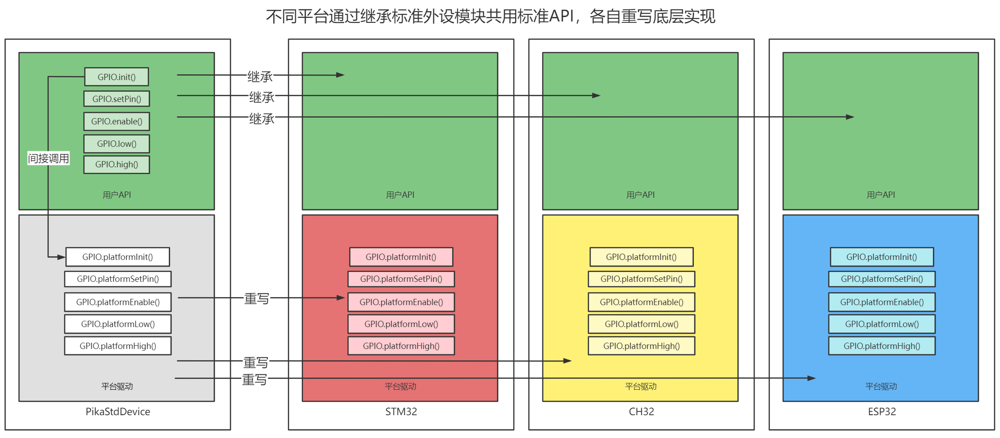

# PikaStdDevice 标准设备

PikaStdDevice 是一个抽象的设备模型，提供了跨平台的统一外设 API 。
## 安装

- 在 requestment.txt 中加入 PikaStdDevice 的依赖。
```
PikaStdDevice
```

- 运行 pikaPackage.exe
## 为什么要有标准设备模块
什么是标准设备模块呢？我们先从其他的脚本技术说起，比如 MicroPython，并没有统一的外设调用 API，这使得用户在使用不同的平台时，都需要重新学习 API，比如下面这个是 MicroPython 在 STM32F4 平台驱动 GPIO 的代码。


这个是 ESP8266 的


可以明显看到在选择 pin 的管脚时，一个用的是字符串，而另一个用的是整型数，控制电平时，一个使用 `high()`，`low()`方法，而另一个使用`on()`，`off()`方法，总之驱动的API标准很混乱。
有没有什么办法，能够统一外设的 API，使得用户只需要熟悉一套 API，就能够在任意平台通用呢？
方法是有的，就是 PikaStdDevice 标准设备驱动模块。

## 模块结构




PikaStdDevice 是一个抽象的设备驱动模块，定义了所有的用户 API，各个平台的驱动模块只要从PikaStdDevice 继承，就能够获得一模一样的用户 API，而 PikaStdDevice 内部会间接调用平台驱动，通过多态特性重写底层的平台驱动，就可以在不同的平台工作了。

## 模块示例

以 GPIO 模块为例，以下是 PikaStdDevice 定义的用户 API

``` python
class GPIO:
    def __init__(self):
        pass

    def init(self):
        pass

    def setPin(self, pinName: str):
        pass

    def setId(self, id: int):
        pass

    def getId(self) -> int:
        pass

    def getPin(self) -> str:
        pass

    def setMode(self, mode: str):
        pass

    def getMode(self) -> str:
        pass

    def setPull(self, pull: str):
        pass

    def enable(self):
        pass

    def disable(self):
        pass

    def high(self):
        pass

    def low(self):
        pass

    def read(self) -> int:
        pass

```


以下是 PikaStdDevice 需要重写的平台驱动

``` python
    # need be overrid
    def platformHigh(self):
        pass

    # need override
    def platformLow(self):
        pass

    # need override
    def platformEnable(self):
        pass

    # need override
    def platformDisable(self):
        pass

    # need override
    def platformSetMode(self):
        pass

    # need override
    def platformRead(self):
        pass
```

而我们要制作的 CH32V103 的 GPIO 模块，就从标准驱动模块中继承。

``` python
class GPIO(PikaStdDevice.GPIO):
    # override
    def platformHigh(self):
        pass

    # override
    def platformLow(self):
        pass

    # override
    def platformEnable(self):
        pass

    # override
    def platformDisable(self):
        pass

    # override
    def platformSetMode(self):
        pass

    # override
    def platformRead(self):
        pass
```

通过这个方法，我们就可以让 STM32 的驱动模块、CH32 的驱动模块、ESP32 的驱动模块有着一模一样的用户 API。用户只要熟悉了一套 API，就可以轻松使用支持了 PikaScript 标准驱动模块的所有平台。
下面是部分被注册在驱动模块里面 C 原生驱动函数

``` C
void CH32V103_GPIO_platformEnable(PikaObj *self){
    char *pin = obj_getStr(self, "pin");
    char *mode = obj_getStr(self, "mode");
    GPIO_TypeDef *GPIO_group = get_GPIO_group(pin);
    uint16_t GPIO_pin = get_GPIO_pin(pin);
    GPIOMode_TypeDef GPIO_mode = get_GPIO_mode(mode);
    uint32_t GPIO_clock_group = get_GPIO_Clock_group(pin);

    GPIO_InitTypeDef  GPIO_InitStructure;
    RCC_APB2PeriphClockCmd(GPIO_clock_group,ENABLE);
    GPIO_InitStructure.GPIO_Pin = GPIO_pin;
    GPIO_InitStructure.GPIO_Mode = GPIO_mode;
    GPIO_InitStructure.GPIO_Speed=GPIO_Speed_50MHz;
    GPIO_Init(GPIO_group, &GPIO_InitStructure);
}

void CH32V103_GPIO_platformHigh(PikaObj *self){
    char *pin = obj_getStr(self, "pin");
    GPIO_TypeDef *GPIO_group = get_GPIO_group(pin);
    uint16_t GPIO_pin = get_GPIO_pin(pin);

    GPIO_WriteBit(GPIO_group, GPIO_pin, Bit_SET);
}
```

请参考 [参与社区贡献->贡献模块](https://pikadoc.readthedocs.io/zh/latest/%E5%A6%82%E4%BD%95%E8%B4%A1%E7%8C%AE%20PikaScript%20%E6%A8%A1%E5%9D%97.html) 部分的文档发布你编写的模块。
