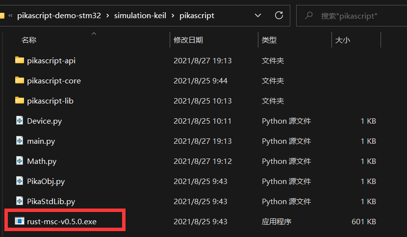
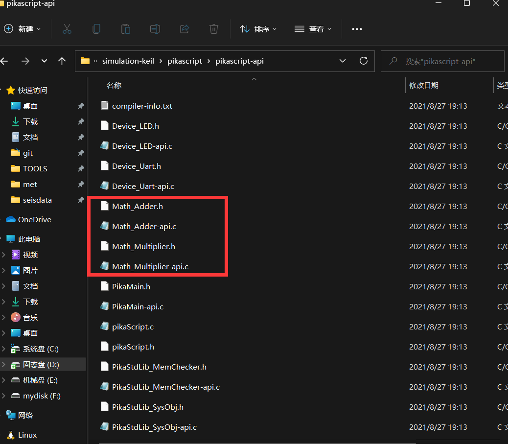
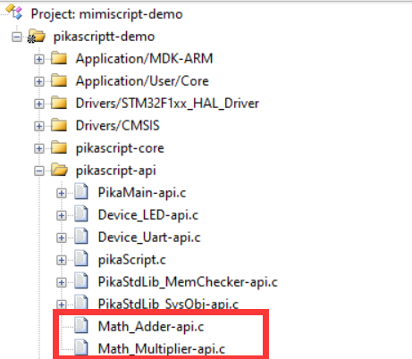
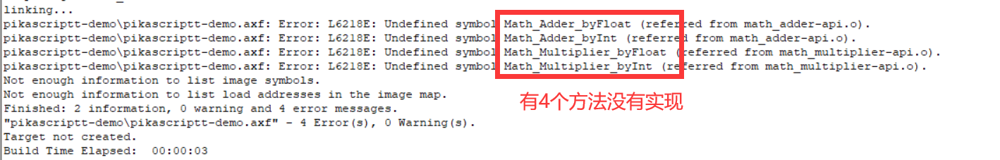
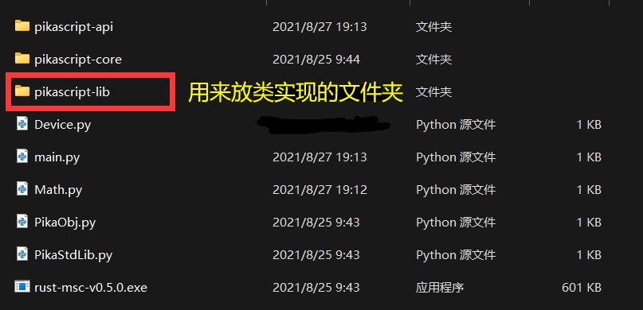
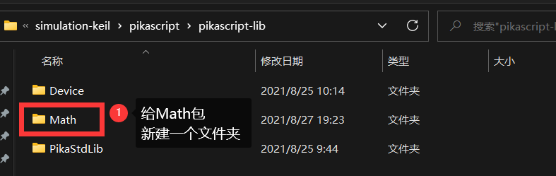
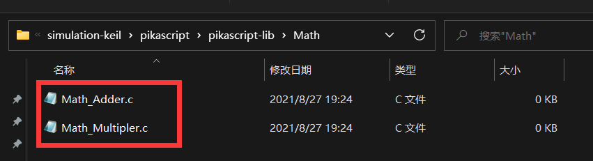
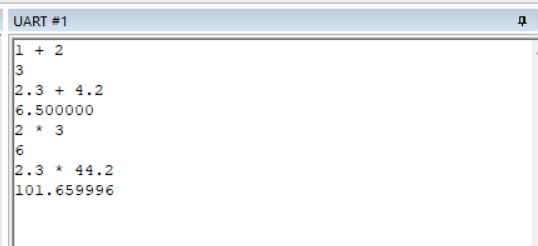
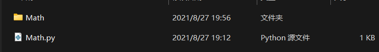

# PikaScript 拓展模块开发流程

我们依然以keil的仿真工程为例，如果还没有获得仿真工程，请参考[1.三分钟快速上手](https://pikadoc.readthedocs.io/zh/latest/Keil%20%E4%BB%BF%E7%9C%9F%E5%B7%A5%E7%A8%8B.html)


### 新建模块接口


编写一个新的模块，首先需要编写模块接口文件，比如编写一个数学计算模块Math，第一步是编写Math.py。


如果要从PikaScript基本类中创建新的类，则需要import PikaObj模块，导入PikaObj模块应使用`from PikaObj import *`的引入方式，实际上Pika预编译器是不会编译使用`from`语法导入的模块的，这样写只是为了获得python编辑器的智能语法提示，PikaObj是内置于Pika运行时内核的。


```python
# Math.py
from PikaObj import *
```


我们可以打开PikaObj.py文件查看里面的类接口
```python
# PikaObj.py
class TinyObj:
    pass
class BaseObj(TinyObj):
    pass
def print(val: any):
    pass
def set(argPath: str, val: any):
    pass
```
可以看到里面有 `TinyObj` 和 `BaseObj` 两个类，这两个类是由 PikaScript 内核实现的基本类，TinyObj 是没有任何功能的最基本的类，内存占用最少。

`print(val: any)` 表示输入参数为泛型的函数，`set(argPath:str, val:any)` 也是泛型函数，这两个函数由内核实现。

### 编写类接口

现在我们可以在 Math.py 里面新建类了，比如我们要新建一个 `Adder` 类来实现相关的加法运算，我们就可以在 Math.py 里面添加 Adder 类，为了节省内存，Adder 类从 TinyObj 基类中继承。

然后我们希望 Adder 可以为整形、浮点型数据提供加法运算，那么就可以添加 byInt 方法和 byFloat 方法。

```python
# Math.py
class Adder(TinyObj):
    def byInt(self, a:int, b:int)->int:
        pass
    def byFloat(self, a:float, b:float)->float:
        pass
```

上面的一段代码中我们定义了`Adder`类，并添加了两个方法的声明，```byInt(self, a:int, b:int)->int``` 表示方法名为 ```byInt ```,输入参数为 `a` 和 `b` ， `a` 和 `b` 的类型都是 `int` 型，而返回值也是 `int` 型，返回值由 `->int` 来确定，这都是 python 的标准语法，是带类型声明的写法。

python 中类的方法的第一个参数都是 `self` 这是 python 的语法所要求的。

我们再向 math.py 里面添加一个 Multiplier 类，用来实现乘法，Multiplier 的写法如下所示，Multiplier 类同样从 `TinyObj` 基类中继承：

```python
# Math.py
class Multiplier(TinyObj):
    def byInt(self, a:int, b:int)->int:
        pass
    def byFloat(self, a:float, b:float)->float:
        pass
```

到此类接口就编写完成了。我们在 main.py 中引入 Math 模块，这样 Pika 预编译器就会去预编译 Math 模块了。

```python
# main.py
import Math
```

双击运行pika预编译器。

打开pikascript-api文件夹可以发现，我们新编写的模块接口已经可以被编译出来了。





### 编写类的实现


我们把刚刚新编译出的两个-api.c文件添加到工程，然后编译一下试试。





发现编译报错了，提示是有四个函数没有找到定义。





这是正常的，因为我们之前并没有为Math模块的类编写实现，下面我们就来编写这些类的实现。


为了模块管理的方便，我们把实现文件都放在pikascript-lib文件夹下，





在pikascript-lib文件夹下，新建一个Math文件夹，用来放Math模块的实现代码。





然后在Math文件夹下新建.c文件，建议用"模块名_类名.c"的命名方式为每一个类新建一个.c文件，提高代码的清晰性。





然后我们在这两个.c文件里面编写类的方法实现。那么问题来了，我们如何知道应当编写哪些实现呢？


这个很简单，我们打开Math_Multiplier.h和Math_Adder.h就可以发现，我们需要编写的实现函数已经被声明好了。


```c
/* Math_Multiplier.h */
/* ******************************** */
/* Warning! Don't modify this file! */
/* ******************************** */
#ifndef __Math_Multiplier__H
#define __Math_Multiplier__H
#include <stdio.h>
#include <stdlib.h>
#include "PikaObj.h"

PikaObj *New_Math_Multiplier(Args *args);

float Math_Multiplier_byFloat(PikaObj *self, float a, float b);
int Math_Multiplier_byInt(PikaObj *self, int a, int b);

#endif
```


```c
/* Math_Adder.h */
/* ******************************** */
/* Warning! Don't modify this file! */
/* ******************************** */
#ifndef __Math_Adder__H
#define __Math_Adder__H
#include <stdio.h>
#include <stdlib.h>
#include "PikaObj.h"

PikaObj *New_Math_Adder(Args *args);

float Math_Adder_byFloat(PikaObj *self, float a, float b);
int Math_Adder_byInt(PikaObj *self, int a, int b);

#endif
```


然后我们直接在 Math_Adder.c 和 Math_Multipler.c 里面去实现这四个函数就 ok 了。


```c
/* Math_Adder.c */
#include "pikaScript.h"

float Math_Adder_byFloat(PikaObj *self, float a, float b)
{
	return a + b;
}

int Math_Adder_byInt(PikaObj *self, int a, int b)
{
	return a + b;
}
```


```c
/* Math_Multipler.c */
#include "pikaScript.h"

float Math_Multiplier_byFloat(PikaObj *self, float a, float b)
{
	return a * b;
}

int Math_Multiplier_byInt(PikaObj *self, int a, int b)
{
	return a * b;
}
```


这时,再编译项目，就可以通过了。


### 测试一下效果


我们用下面的main.py来测试一下我们新编写的模块


```python
# main.py
import Math

adder = Math.Adder()
muler = Math.Multiplier()

res1 = adder.byInt(1, 2)
print('1 + 2')
print(res1)

res2 = adder.byFloat(2.3, 4.2)
print('2.3 + 4.2')
print(res2)

res3 = muler.byInt(2, 3)
print('2 * 3')
print(res3)

res4 = muler.byFloat(2.3, 44.2)
print('2.3 * 44.2')
print(res4)
```


运行的效果如下：





这说明我们编写的模块工作正常了。
### 发布模块


出于开源的精神，发布你自己的模块是一件非常酷且激动人心的事情。


发布模块只需要发布类接口和类实现文件即可。


比如发布刚刚新编写的Math模块，就是发布 Math.py 文件和 pikascript-lib/Math 文件夹。





请参考 **参与社区贡献** 部分的文档发布你编写的模块。
