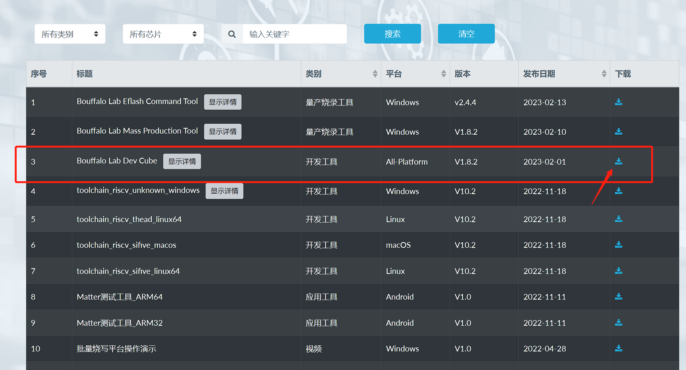
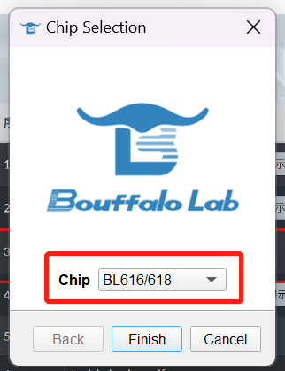
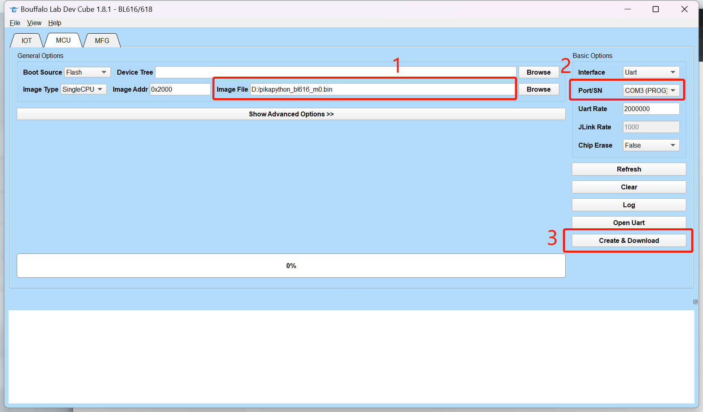
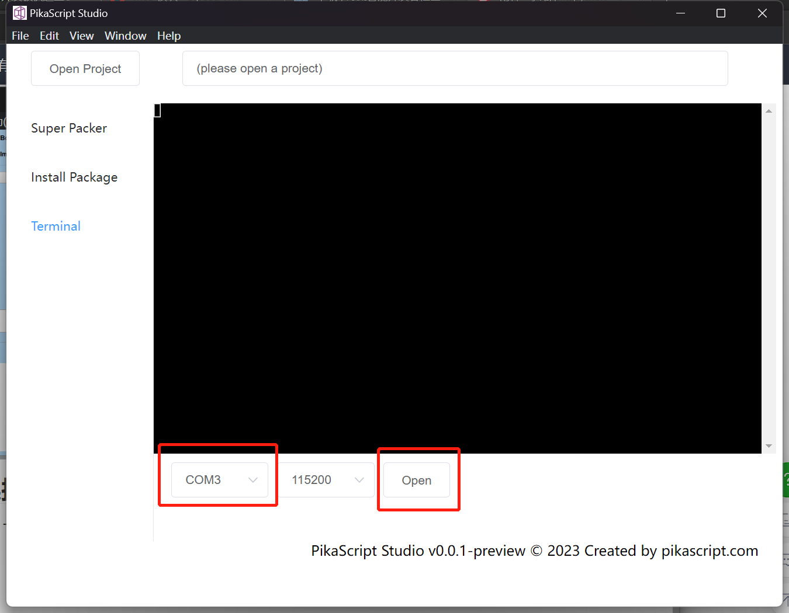
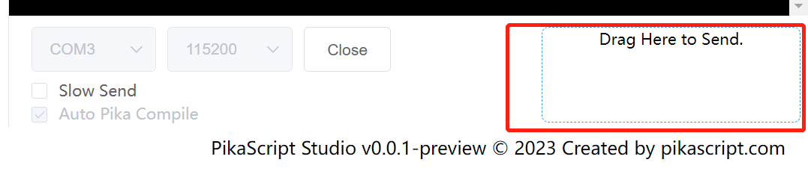

# 开发板 - Sipeed M0P DOCK

## 开发板概述

Sipeed M0P DOCK 是基于[博流智能科技](http://www.bouffalolab.com/)的 BL618 芯片所设计的一款适用于超低功耗应用 IOT 开发板，支持 Wifi6、蓝牙 5.2 和 zigbee 等无线协议，默认最高主频 320MHz，芯片多种低功耗模式和多种唤醒源满足不同的低功耗场景。

## 固件烧录

- [下载烧录工具 Bouffalo Lab Dev Cube](https://dev.bouffalolab.com/download)

下载固件：[pikapython_bl616_m0.bin](https://gitee.com/Lyon1998/pikapython/attach_files/1319192/download)

选择 Chip: BL616/618

- 按住开发板的 BOOT 键不松开，然后按 RST 进入下载模式，连接 USB，Image File 选择固件，Port/SN 端口（没有的话点 Refresh，然后点 Create & Download 烧录固件。

## 连接 Python 终端

- 下载终端软件：[pikaStudio.exe](https://gitee.com/Lyon1998/pikapython/attach_files/1285327/download)
- 选择端口，然后打开终端

## 运行单个脚本文件（临时）

将 Python 文件拖拽到框内运行（或点击框选择文件），这个运行是临时的，重启后不会保存。

## 烧录多个脚本文件

- 克隆代码仓库 [https://github.com/pikasTech/bl_mcu_sdk](https://github.com/pikasTech/bl_mcu_sdk)

- 发送打包后的 Python 软件包: 
  
  bl_mcu_sdk/examples/pikapython/pikapython/pikascript-api/pikaModules.py.a

- 入口文件是:

  bl_mcu_sdk/examples/pikapython/pikapython/main.py

- pikaStudio 会在每次发送软件包之前把多脚本文件自动打包，每次编辑 Python 文件后直接发送即可

## 擦除脚本文件

- 按住 BOOT 键，持续 2s，会自动擦除脚本文件。
