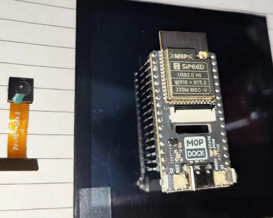

# 开发板 - Sipeed M0P DOCK

## 开发板概述

想要用 Python 语言开发 IOT 应用吗？那就赶快来试试 Sipeed M0P DOCK 吧！它是一款基于博流智能科技的 BL618 芯片的超低功耗 IOT 开发板，内置了 PikaPython 解释器，让你用 Python 语言轻松编程。

它还支持 Wifi6、蓝牙 5.2 和 zigbee 等无线协议，让你的设备随时随地接入互联网和智能家居。

它最高主频可达 320MHz，性能强劲，可以应对各种复杂的场景和数据。它还有多种低功耗模式和多种唤醒源，让你的设备在不影响性能的情况下省电省心。

Sipeed M0P DOCK 是一款集成了 PikaPython 解释器的超低功耗 IOT 开发板，无论是智能穿戴、环境监测、远程控制还是物联网教育，它都能让你用 Python 语言玩转 IOT！



[购买店铺](https://shop362018057.taobao.com/) (暂未上架，敬请期待)

## 固件烧录

- 下载烧录工具: [Bouffalo Lab Dev Cube](https://gitee.com/Lyon1998/pikapython/attach_files/1322074/download)

- 下载固件：[pikapython_bl616_m0.bin](https://gitee.com/Lyon1998/pikapython/attach_files/1319192/download)

选择 Chip: BL616/618


- 连接 USB，按住开发板的 BOOT 键不松开，然后按 RST 进入下载模式，Image File 选择固件，Port/SN 端口（没有的话点 Refresh，然后点 Create & Download 烧录固件。


## 连接 Python 终端

- 使用 TTL 转串口工具连接开发板的串口
  - TTL 转串口: TX <--------> 开发板: GPIO22
  - TTL 转串口: RX <--------> 开发板: GPIO21
- 下载终端软件：[pikaStudio.exe](https://gitee.com/Lyon1998/pikapython/attach_files/1285327/download)
- 选择端口，然后打开终端，波特率 115200


## 运行单个脚本文件（临时）


将 Python 文件拖拽到框内运行（或点击选择文件），这个运行是临时的，重启后不会保存。

## 烧录多个脚本文件

- 克隆代码仓库 [https://gitee.com/lyon1998/bl_mcu_sdk](https://gitee.com/lyon1998/bl_mcu_sdk)

- 运行 `bl_mcu_sdk/examples/pikapython/pikapython/rust-msc-latest-win10.exe` 将 Python 脚本打包

- 发送打包后的 Python 软件包: 
  
  `bl_mcu_sdk/examples/pikapython/pikapython/pikascript-api/pikaModules.py.a`

- 入口文件是:

  `bl_mcu_sdk/examples/pikapython/pikapython/main.py`

- pikaStudio 会在每次发送软件包之前把多脚本文件自动打包，后续编辑 Python 文件后直接发送即可

## 擦除脚本文件

- 按住 BOOT 键，持续 2s，会自动擦除脚本文件。

## 支持的模块

参考 [main.py](https://gitee.com/lyon1998/bl_mcu_sdk/blob/master/examples/pikapython/pikapython/main.py) 中 `import` 的模块

例如 (注意，可能不是最新的)
``` python
import PikaStdLib
import random
import PikaStdData
import configparser
import pika_cjson
import PikaMath
import unittest
import re
import binascii
import modbus
import time
import pika_lvgl
import _thread
import machine
import example
import json
print('hello PikaPython!')
```

## 支持的外设

参考 [machine.py](https://gitee.com/lyon1998/bl_mcu_sdk/blob/master/examples/pikapython/pikapython/machine.py) 中的外设类

例如 (注意，可能不是最新的)
``` python
import PikaStdDevice


class UART(PikaStdDevice.UART):
    pass


class GPIO(PikaStdDevice.GPIO):
    pass


class LED(GPIO):
    pin: str = None

    def __init__(self, id: int):
        super().__init__()
        if id == 0:
            self.pin = 'P27'
        elif id == 1:
            self.pin = 'P28'
        self.setMode('out')
        self.enable()
        self.high()

    def on(self):
        self.low()

    def off(self):
        self.high()
```

## 示例代码

[PikaPython - Example](https://gitee.com/Lyon1998/pikapython/tree/master/examples)


## （进阶） 自己编译固件

克隆固件仓库（需要安装 git）

```bat
git clone https://gitee.com/lyon1998/bl_mcu_sdk
```

进入 `pikapython` 目录

```
cd bl_mcu_sdk/example/pikapython
```

编译固件

```
make_bl618.bat
```

编译后的固件在`bl_mcu_sdk/example/pikapython/build/buildout/pikapython_bl616_m0.bin`
