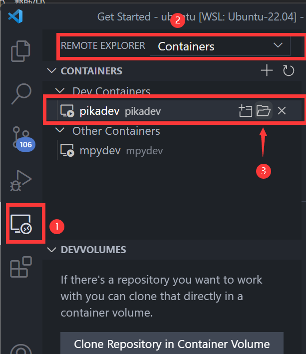
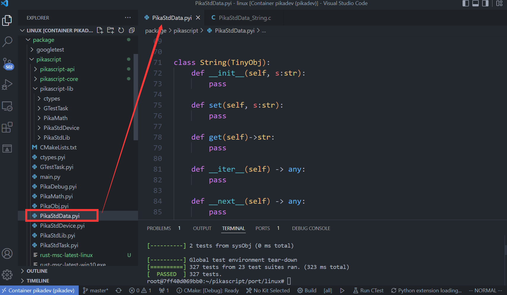

# 如何贡献标准库

## PikaScript 标准库是什么？

PikaScript 标准库是一系列跨平台的常用工具库，比如 string, time 等等，这些库有一些提供了和 CPython 一致或者类似的 API, 有些提供了 MCU 开发的常用工具。


## PikaScript 标准库的开发环境搭建

PikaScript 标准库是跨平台的，所以不能够使用平台（比如 stm32）专有的资源，为了确保这一点，标准库都是在 linux 的平台开发的。

如何确保标准库的可用性呢？PikaScript 在 linux 平台部署了 GoogleTest 单元测试框架，可以为这些标准库提供测例，GoogleTest 可以在开发者的本地机器运行，也会在每次提交到 github 的 master 分支后自动在云端运行（基于Github Actions）。

PikaScript 的 linux 开发平台需要安装 go，rust，GoogleTest，GoogleBenchmark，valgrind 等等工具，比较繁琐，为了简化开发平台的搭建，PikaScript 提供了基于 Docker 的开发环境，基于 Docker 的开发环境可以一键安装，并保证所有开发者的开发环境都是一致的。

在 Docker 的构建脚本中已经完成了换源操作，所以不需要使用 vpn，即可在中国大陆顺利的搭建 Docker 开发环境。


### 构建 Docker 容器

请确认已经在宿主机安装好了 Docker:

- Linux 平台直接安装 Docker
- Windows 平台安装 Docker-Desktop
  - Docker-Desktop 需要安装 wsl2 [安装手册](https://smartide.cn/zh/docs/install/docker/windows/)

（如果是 windows 平台，可以在 wsl 中使用下面的命令，不要使用 PowerShell）

step1: 克隆仓库

``` shell
git clone https://gitee.com/lyon1998/pikascript
cd pikascript/docker 
```

step2: 构建 Docker 镜像，然后启动容器
```
bash build.sh
bash run.sh
```

step3: 初始化 port/linux

``` shell	
cd port/linux
bash pull-core.sh
bash init.sh
```

step4: 运行 GoogleTest 和 BenchMark 
``` shell
bash gtest.sh
bash ci_benchmark.sh
```

step5: 运行 REPL
``` shell
bash run.sh
```

## 使用 VSCODE 连接到容器进行开发

### 启动

VSCODE 提供了连接到容器进行开发的工具，连接后开发体验就和在容器外部一样好。

在 VSCODE 侧边栏选择远程，Containers，pikadev，然后点击打开目录，即可在 VSCODE 中连接到 Dockder 内部。



初次打开需要等待一些插件自动安装，以后再打开就可以直接启动了。


 cd 到 ~/pikascript/port/linux, 然后输入 `code .`，切换工作路径到 pikascript/port/linux


### 开发

标准库的 pyi 声明文件在 package/pikascript 目录下，标准库包括了 PikaStdLib.pyi, PikaStdData.pyi, PikaDebug.pyi, PikaStdTask.pyi 等，实现文件在 PikaStdLib 文件夹下。



然后可以为标准库增加类，或者函数，例如，为 `PikaStdData.String` 类增加一个 `startswith()` 方法，首先在 PikaStdData.pyi 中的 `String` 类下面新增 ` startswith() ` 方法的声明。


然后运行：

```
bash init.sh
```

进行预编译和重新配置 CMake。

再打开 `PikaStdData_String.h`，会发现自动生成的 startswith 方法的 c 函数声明。


接着在 PikaStdData_String.c 中实现这个函数。


### 调试

调试已经被配置好了，直接在 vscode 中打断点，然后 F5 即可进入调试。


### 测试

然后可以运行 GoogleTest，查看是否破坏了原有的代码。

```
bash gtest.sh 
```


如果测试都通过了，就可以编写功能测试的代码了。

测试代码在 test 目录下。


标准库的测试可以放在 pikaMain-test.cpp 下。

一个测例的内容如下，首先是用 TEST 宏声明一个测例，然后填入测试组的名字，和测例的名字，测试组的名字和当前文件的其他测例一致即可，测试名字需要和其他测例不同。

```C
TEST(<test group>, <test name>){

    /* do something */

    /* assert */
    
    /* deinit */
}
```

测例主要分为三个部分：

- 运行

- 判定

- 析构

  下面是一个典型的测例，我们复制这个测例，然后修改测例名。

  ``` C
  TEST(pikaMain, a_signed) {
      /* init */
      pikaMemInfo.heapUsedMax = 0;
      PikaObj* pikaMain = newRootObj("pikaMain", New_PikaMain);
      /* run */
      obj_run(pikaMain, "a = -1\n");
      /* collect */
      int a = obj_getInt(pikaMain, "a");
  
      /* assert */
      EXPECT_EQ(-1, a);
  
      /* deinit */
      obj_deinit(pikaMain);
      EXPECT_EQ(pikaMemNow(), 0);
  }
  ```

我们修改 `obj_run()` 的部分，运行一段 python 脚本，然后取出结果使用 EXPECT_EQ 宏对结果进行判定。

``` C
TEST(pikaMain, string_startswith) {
    /* init */
    pikaMemInfo.heapUsedMax = 0;
    PikaObj* pikaMain = newRootObj("pikaMain", New_PikaMain);
    /* run */
    obj_run(pikaMain, 
    "a = PikaStdData.String('test')\n"
    "res1 = a.startswith('te')\n"
    "res2 = a.startswith('st')\n"
    );
    /* collect */
    int res1 = obj_getInt(pikaMain, "res1");
    int res2 = obj_getInt(pikaMain, "res2");

    /* assert */
    EXPECT_EQ(res1, 1);
    EXPECT_EQ(res2, 0);

    /* deinit */
    obj_deinit(pikaMain);
    EXPECT_EQ(pikaMemNow(), 0);
}
```

`EXPECT_EQ`  宏是由 GoogleTest 提供的，作用是判定两个值是否相等，如果不相等，则 GoogleTest 会抛出错误，可以查看 GoogleTest 的文档了解更多。

然后我们再运行 GoogleTest

```
sh gtest.sh
```

可以看到，测例个数为 331，比之前的 330 多了一个，而且都通过了，这说明测试是成功的。


### 提交

测试通过后，就可以提交这个修改了，在提交修改之前，你需要先 fork PikaScript 的仓库，Gitee 和 Github 均可。

第一次提交时，需要修改你的提交信息，包括你的用户名，email，和 fork 后的仓库地址。

```
git config --global user.name < your user name >
git config --global user.email < your email >
git config remote.origin.url < your forked git repo url >
```

运行

```
sh push-core.sh
```

将修改后的代码提交到 ~/pikascript/package/PikaStdLib。

然后运行

```
git commit -a
```

输入 commit 信息，如果你不熟悉 vim，请自行了解 vim 的基础使用方法。


接下来就可以提交了

``` 
git push
```

如果出现冲突，可以先

```
git pull --rebase
```

然后再 `git push` 提交，更多 git 的用法请参考 git 使用手册。


然后在 gitee / github 中发起 Pull Request


