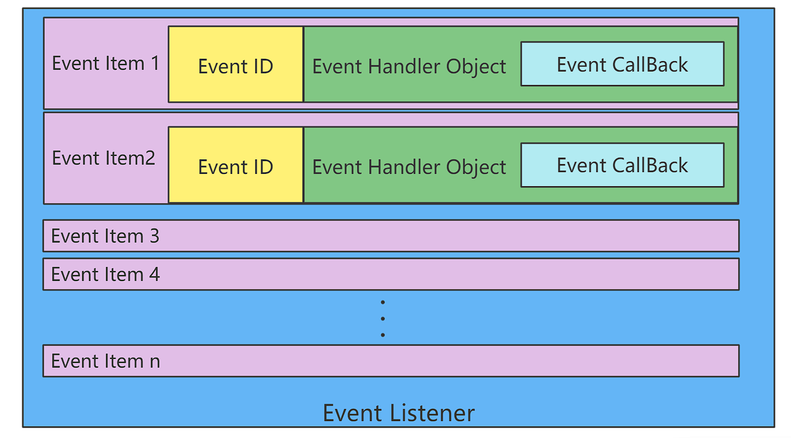
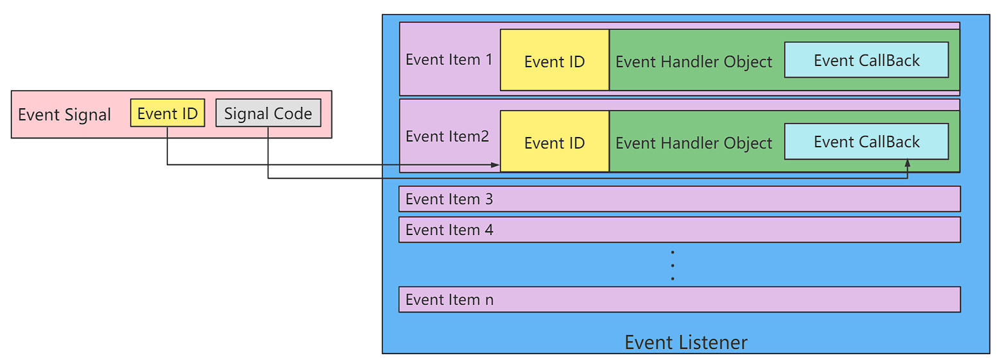

# 事件回调机制

## 概述

PikaScript 内核中提供了事件回调机制，可以支持在 C 的事件/中断中触发 Python 定义的回调函数。

注意：需要内核版本不低于: v1.8.7

## 头文件

``` C
#include "PikaObj.h"
```

## 数据类型

```c
typedef PikaObj PikaEventListener;
```

事件回调机制主要依靠 `PikaEventListener` 事件监听器，事件监听器中记录了每个被注册的事件 ID，当有信号发送至事件监听器时，事件监听器将根据 事件 ID 将调用相应的 Python 回调函数，并传递信号量。

## 事件模型

事件模型的核心是 `PikaEventListener` 事件监听器。



`PikaEventListener` 的模型如上图所示，向事件监听器中注册事件后，将会在 `PikaEventListener` 内部记录下一个事件项 `Event Item`，包括：

- `Event ID` 事件的唯一 ID
- `Event Handler Object ` 事件对象，记录了事件项的全部信息

  - `Event CallBack` 事件回调函数 ( Python 函数 )


当 `Event Signal` 事件信号到来时，事件监听器将会匹配 `Event ID` 找到相应的事件项，然后再将信号代码`Event Code`传递给 `Event CallBak` 然后触发回调函数。



## 事件注册

- 定义一个 C 模块的 Python 接口，接收传入的事件回调函数。

例如：

https://gitee.com/Lyon1998/pikascript/blob/master/package/PikaStdDevice/PikaStdDevice.pyi

```python
class BaseDev(TinyObj):
    def addEventCallBack(self, eventCallback: any): ...
```

事件回调函数的类型注解是 `any`。

- 在 C 模块的实现中注册事件

例如：https://gitee.com/Lyon1998/pikascript/blob/master/package/PikaStdDevice/PikaStdDevice_BaseDev.c

```c
PikaEventListener* g_pika_device_event_listener;

void PikaStdDevice_BaseDev_addEventCallBack(PikaObj* self, Arg* eventCallBack) {
    obj_setArg(self, "eventCallBack", eventCallBack);
    /* init event_listener for the first time */
    if (NULL == g_pika_device_event_listener) {
        pks_eventLisener_init(&g_pika_device_event_listener);
    }
    if (PIKA_RES_OK != obj_runNativeMethod(self, "platformGetEventId", NULL)) {
        obj_setErrorCode(self, 1);
        __platform_printf("Error: Method %s no found.\r\n",
                          "platformGetEventId");
    }
    uint32_t eventId = obj_getInt(self, "eventId");
    pks_eventLicener_registEvent(g_pika_device_event_listener, eventId, self);
}
```

- 创建一个全局的 `PikaEventListener`：`g_pika_device_event_listener`。
- 将 `self` 作为 `Event Handler Object`，将 `evnetCallBack` 传入 `self`。
- 获取 `evnetID`
  - 这个例子中通过调用 `platformGetEventId()` 平台函数来获得 `eventID`，需要 `BaseDev` 继承，然后重写 `platformGetEventId()`，在重写后的 `platformGetEventId()` 中设置 `self.eventId`。
  - 例如：https://gitee.com/Lyon1998/pikascript/blob/master/package/TemplateDevice/TemplateDevice_GPIO.c
- 调用 `pks_eventLicener_registEvent`，将 `eventId` 和 `self` 注册进事件监听器。

## 信号触发

在需要触发事件回调时向 `PikaEventListener` 发送信号。

例如：https://gitee.com/Lyon1998/pikascript/blob/master/port/linux/test/event-test.cpp

```c
extern PikaEventListener* g_pika_device_event_listener;
TEST(event, gpio) {
    /* init */
    PikaObj* pikaMain = newRootObj("pikaMain", New_PikaMain);
    /* run */
    pikaVM_runFile(pikaMain, "../../examples/TemplateDevice/gpio_cb.py");

    #define EVENT_SIGAL_IO_RISING_EDGE 0x01
    #define EVENT_SIGAL_IO_FALLING_EDGE 0x02
    #define GPIO_PA8_EVENT_ID 0x08

    /* simulate run in the call back */
    pks_eventLisener_sendSignal(g_pika_device_event_listener, GPIO_PA8_EVENT_ID,
                            EVENT_SIGAL_IO_RISING_EDGE);
    pks_eventLisener_sendSignal(g_pika_device_event_listener, GPIO_PA8_EVENT_ID,
                            EVENT_SIGAL_IO_FALLING_EDGE);
    /* collect */
    /* assert */
    EXPECT_STREQ(log_buff[1], "get rising edge!\r\n");
    EXPECT_STREQ(log_buff[0], "get falling edge!\r\n");
    /* deinit */
    obj_deinit(pikaMain);

    EXPECT_EQ(pikaMemNow(), 0);
}
```

通过 `pks_eventLisener_sendSignal` 发送 `eventID` 和 `signal code`。 

## Python 案例

https://gitee.com/Lyon1998/pikascript/blob/master/examples/TemplateDevice/gpio_cb.py

``` python
import TemplateDevice

io1 = TemplateDevice.GPIO()
io1.setPin('PA8')
io1.setMode('in')
io1.enable()

EVENT_SIGAL_IO_RISING_EDGE = 0x01
EVENT_SIGAL_IO_FALLING_EDGE = 0x02

def callBack1(signal):
    if signal == EVENT_SIGAL_IO_RISING_EDGE:
        print('get rising edge!')
    elif signal == EVENT_SIGAL_IO_FALLING_EDGE:
        print('get falling edge!')

io1.addEventCallBack(callBack1)
```

- 定义一个回调函数 `callBack1`，接收一个输入参数 `signal`，`signal`能够接收传入的信号码。

## PikaStdDevice 支持事件回调

继承 PikaStdDevice 是支持事件回调的最简单方式。

- `PikaStdDevice` 中的设备类（如 GPIO）都继承了 `BaseDev`，因此都获得了 `addEventCallBack` 的方法，能够注册回调。

https://gitee.com/Lyon1998/pikascript/blob/master/package/PikaStdDevice/PikaStdDevice.pyi

``` python
class BaseDev(TinyObj):
    def addEventCallBack(self, eventCallback: any): ...

    # need override
    def platformGetEventId(self):...


class GPIO(BaseDev):
    def __init__(self):
        pass

    def init(self):
        pass

    def setPin(self, pinName: str):
        pass

...
```
平台驱动从 `PikaStdDevice.GPIO` 继承后，也获得了 `addEventCallBack` 方法，只需要重写 `platformGetEventId` 平台方法，就能够支持回调。

https://gitee.com/Lyon1998/pikascript/blob/master/package/TemplateDevice/TemplateDevice.pyi

```python
# TemplateDevice.pyi
class GPIO(PikaStdDevice.GPIO):
    # overrid
    def platformHigh(self): ...
    def platformLow(self): ...
    def platformEnable(self): ...
    def platformDisable(self): ...
    def platformSetMode(self): ...
    def platformRead(self): ...
    def platformGetEventId(self): ...
```

例如：

https://gitee.com/Lyon1998/pikascript/blob/master/package/TemplateDevice/TemplateDevice_GPIO.c

``` c
const uint32_t GPIO_PA8_EVENT_ID = 0x08;
void TemplateDevice_GPIO_platformGetEventId(PikaObj* self) {
    char* pin = obj_getStr(self, "pin");
    if (strEqu(pin, "PA8")) {
        obj_setInt(self, "eventId", GPIO_PA8_EVENT_ID);
    }
}
```

