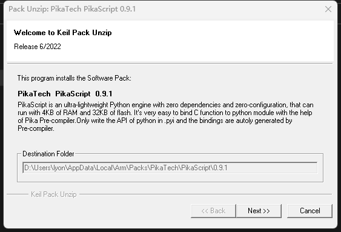
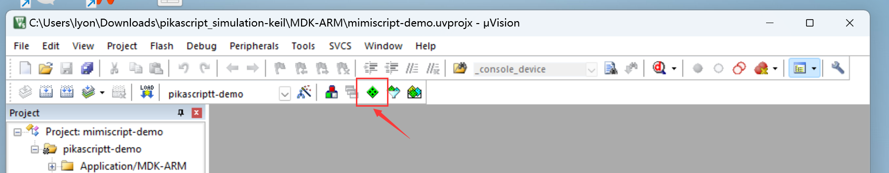
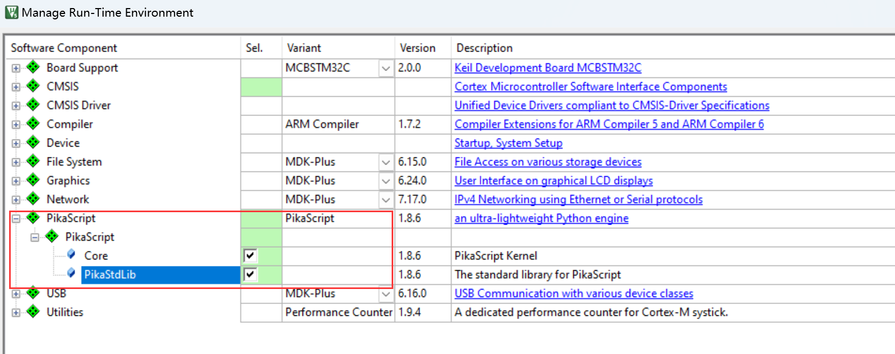
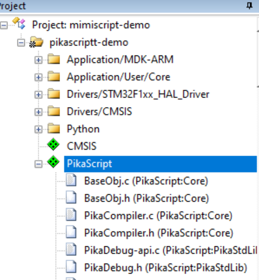
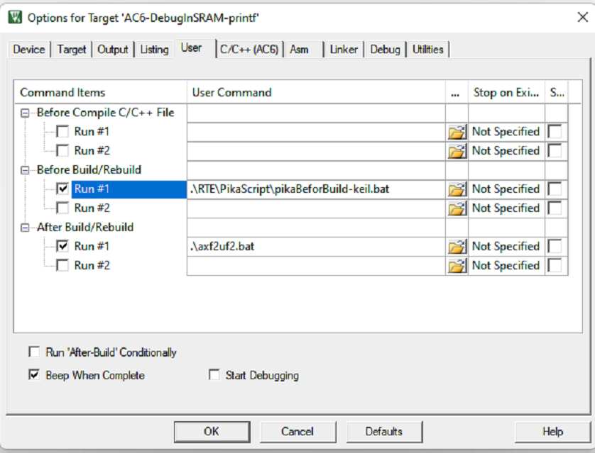
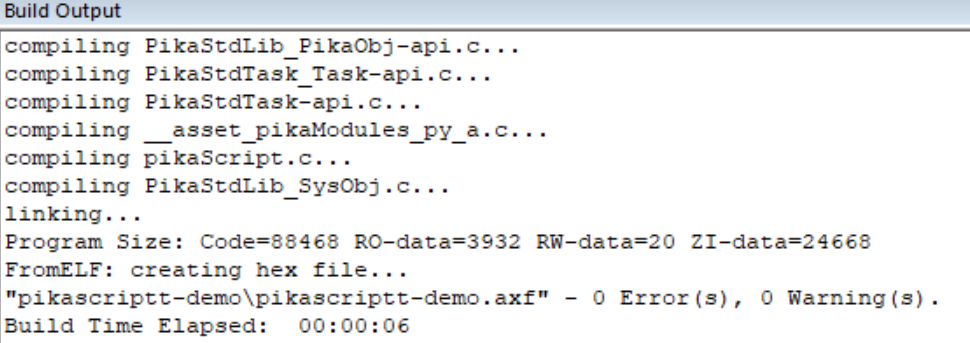
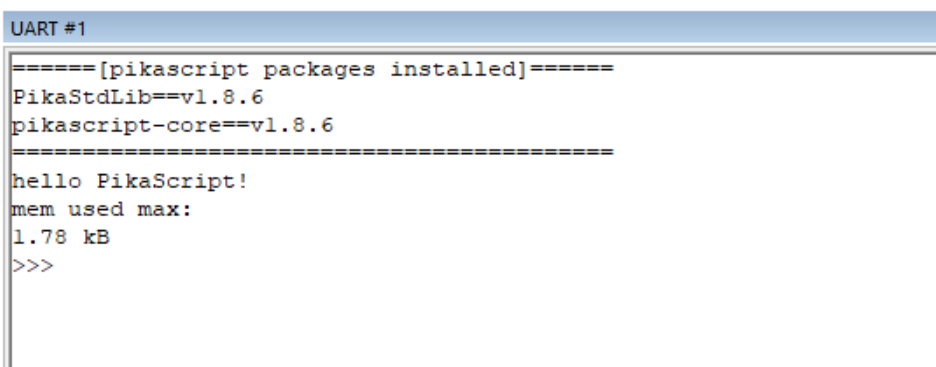

# 从 CMSIS-PACK 开始

使用 Keil 开发的用户可以使用 CMSIS-PACK 一键安装 PikaScript。

## 安装 PikaTech.PikaScript.x.x.x.pack

[ 点击下载 ](https://gitee.com/Lyon1998/pikascript/attach_files/1151246/download)

一路 Next 安装即可



## 在工程中设置



勾选 PikaScript，包括 Core 和 PikaStdLib



这是可以看到 PikaScript 已经被添加进来了



在 Before Build 加入

```
.\RTE\PikaScript\pikaBeforBuild-keil.bat
```



然后在 main.c 引入

``` c
#include "pikaScript.h"
```

在初始化系统和 printf 后启动 PikaScript

``` c
PikaObj *pikaMain = pikaScriptInit();
```

编译成功：



运行成功：



更多用法请参考 [移植指南](https://pikadoc.readthedocs.io/zh/latest/index_porting.html)
