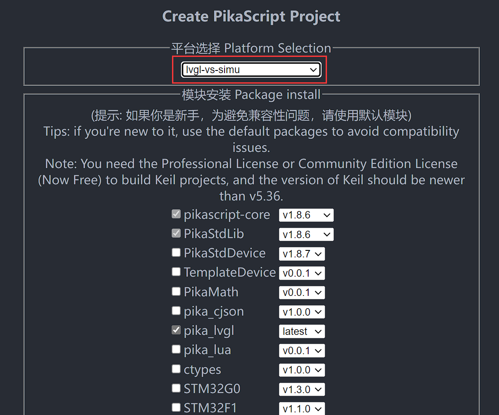
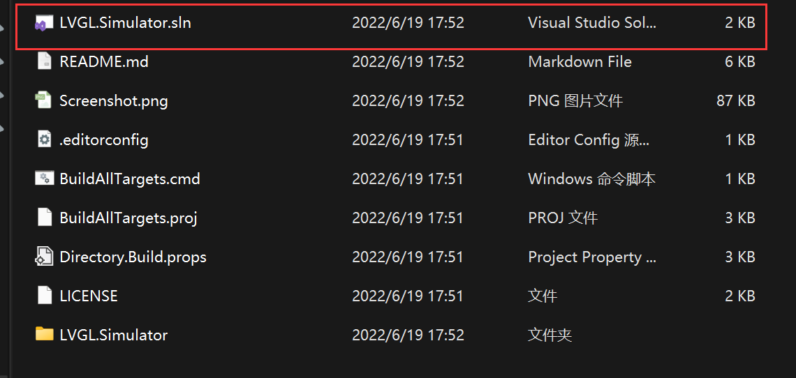
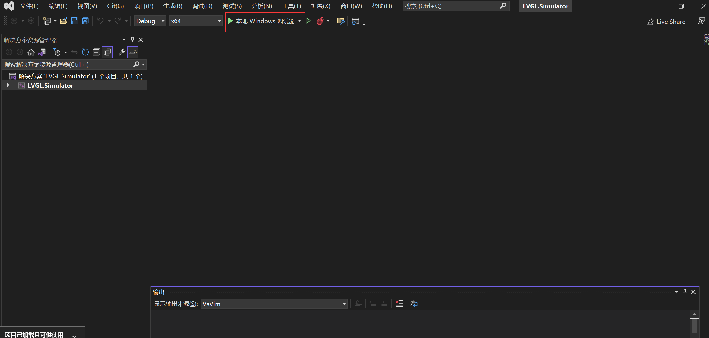
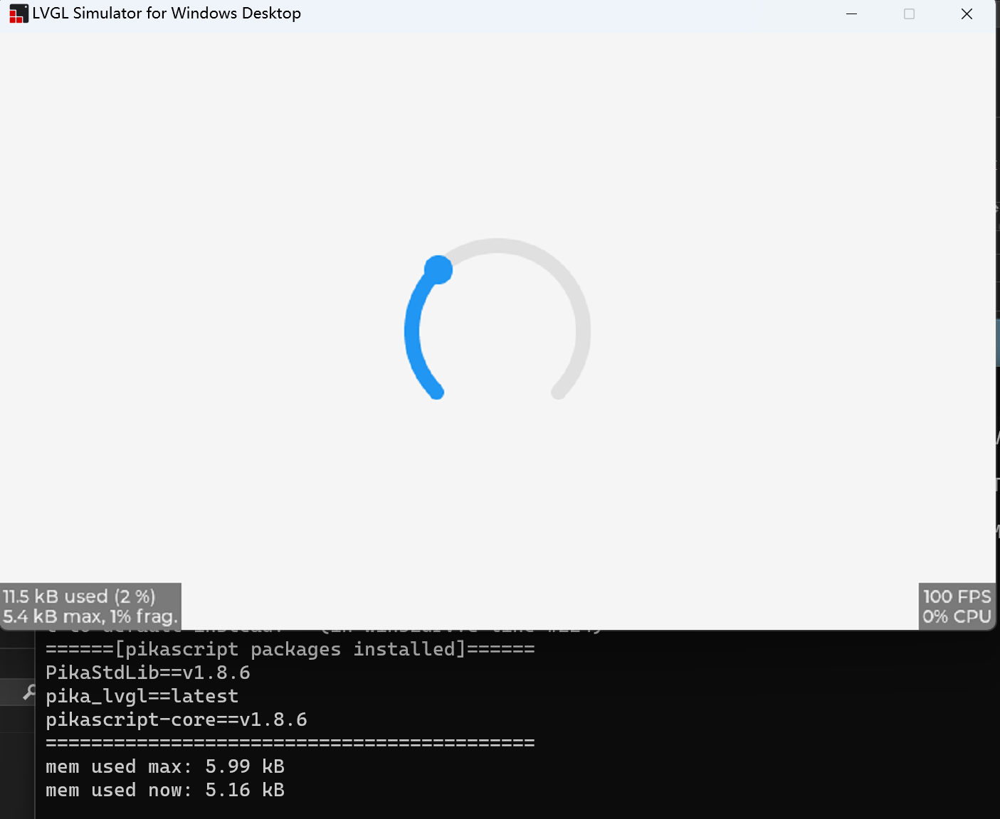
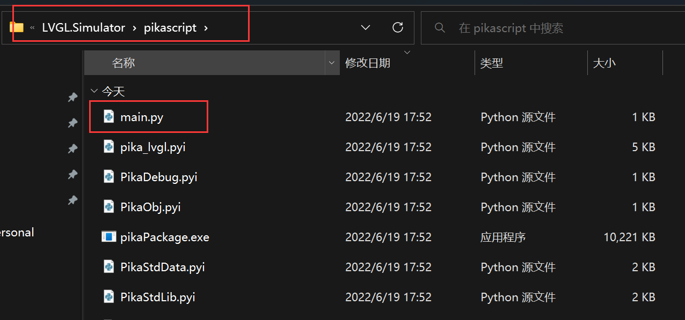
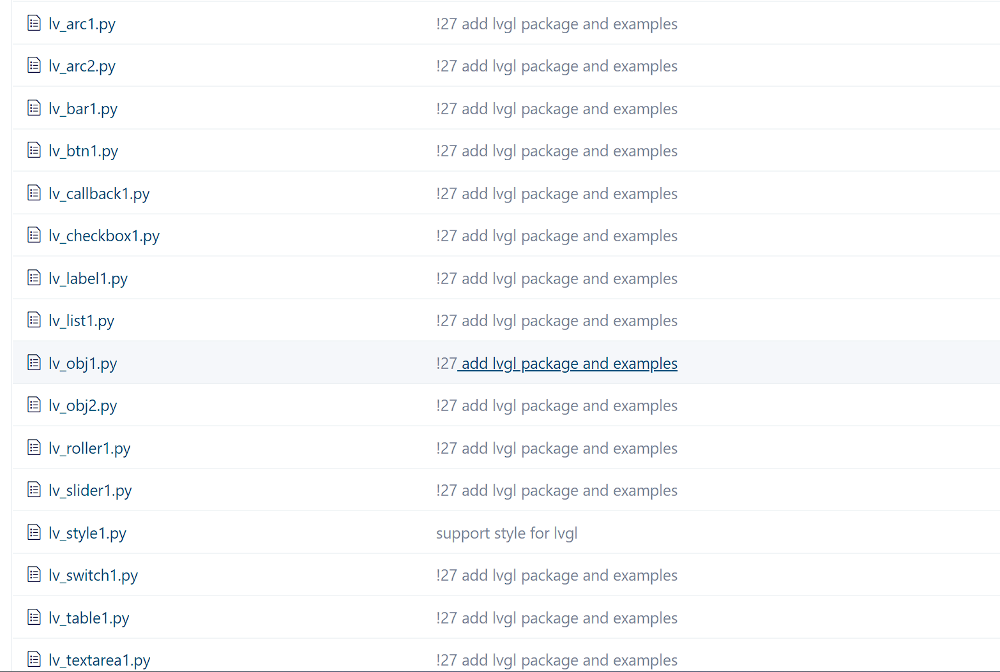
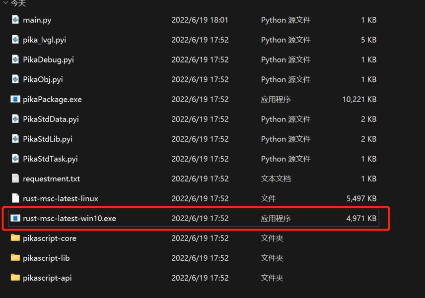
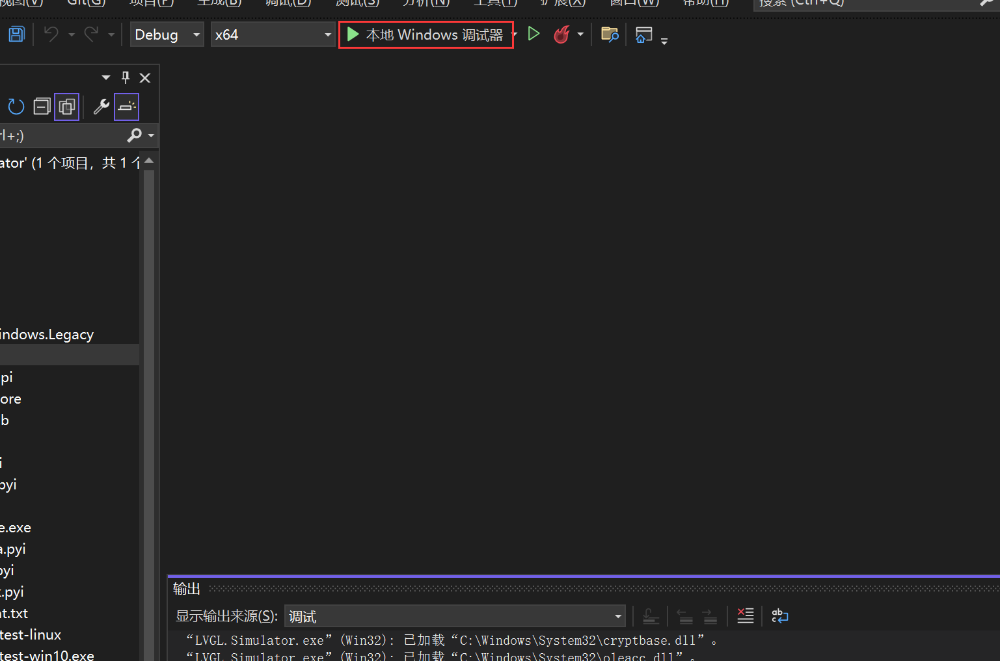
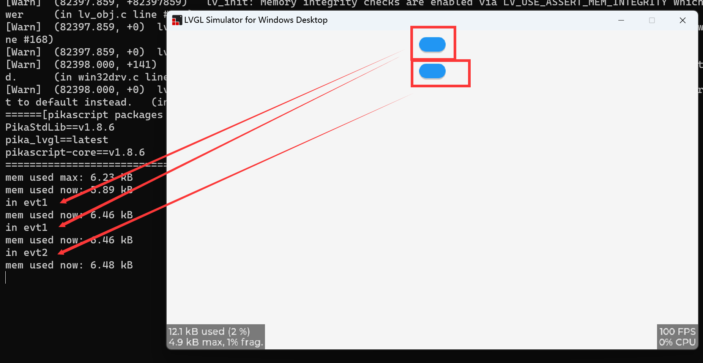
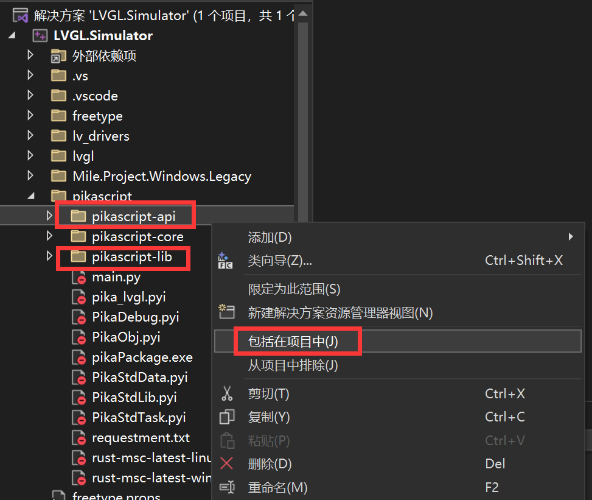

# 从 LVGL GUI 仿真工程开始

LVGL GUI 仿真工程提供了 PikaScript 和 LVGL 进行联合仿真的实验环境。

可以在 PC 上，使用 Visual Studio 进行 GUI 的仿真。

## 获取工程

[http://pikascript.com/](http://pikascript.com/)

在 PikaScript 官网的工程生成器中选择 lvgl-vs-simu，这是一个 Visual Studio 的仿真工程。

这个工程是从 [LVGL 官方的 Visual Studio 仿真工程](https://github.com/lvgl/lv_port_win_visual_studio) 中分支而来的。



点击生成工程，等待大概 1 分钟左右。


解压工程后打开 LVGL.Simulator.sln



直接开始编译运行



可以看到已经成功启动了 lvgl 的模拟器



## 使用 Python 编程

工程运行的 Python 文件在 LVGL.Simulator/pikascript/main.py 中，建议用 VSCode 编辑 Python 文件。



main.py 中的代码如下所示，工程在启动后就会运行这个 main.py

```python
# main.py
import pika_lvgl as lv
import PikaStdLib
mem = PikaStdLib.MemChecker()

# Create an Arc
arc = lv.arc(lv.scr_act())
arc.set_end_angle(200)
arc.set_size(150, 150)
arc.center()

print('mem used max: %0.2f kB' % (mem.getMax()))
print('mem used now: %0.2f kB' % (mem.getNow()))
```

更多示例代码

可以在 [/pikascript/examples/lvgl](https://gitee.com/Lyon1998/pikascript/tree/master/examples/lvgl) 文件夹中看到更多的示例代码。



比如可以将 lv_callback1.py 复制到 main.py 中。

```python
# lv_callback1.py
import pika_lvgl as lv
import PikaStdLib
mem = PikaStdLib.MemChecker()


def event_cb_1(evt):
    print('in evt1')
    print('mem used now: %0.2f kB' % (mem.getNow()))


def event_cb_2(evt):
    print('in evt2')
    print('mem used now: %0.2f kB' % (mem.getNow()))


btn1 = lv.btn(lv.scr_act())
btn1.align(lv.ALIGN.TOP_MID, 0, 10)
btn2 = lv.btn(lv.scr_act())
btn2.align(lv.ALIGN.TOP_MID, 0, 50)
btn1.add_event_cb(event_cb_1, lv.EVENT.CLICKED, 0)
btn2.add_event_cb(event_cb_2, lv.EVENT.CLICKED, 0)

print('mem used max: %0.2f kB' % (mem.getMax()))
print('mem used now: %0.2f kB' % (mem.getNow()))
```

在替换 main.py 后，运行 PikaScript 的预编译器



然后再开始运行



这个例子中可以点击按钮然后查看输出。



## 常见问题

如果提示缺少一些函数，则需要手动添加一下参与编译的文件

对 pikascript/pikascript-api 和 pikascript/pikascript-lib 右键然后点击 “包括在项目中”，再重新编译即可。


