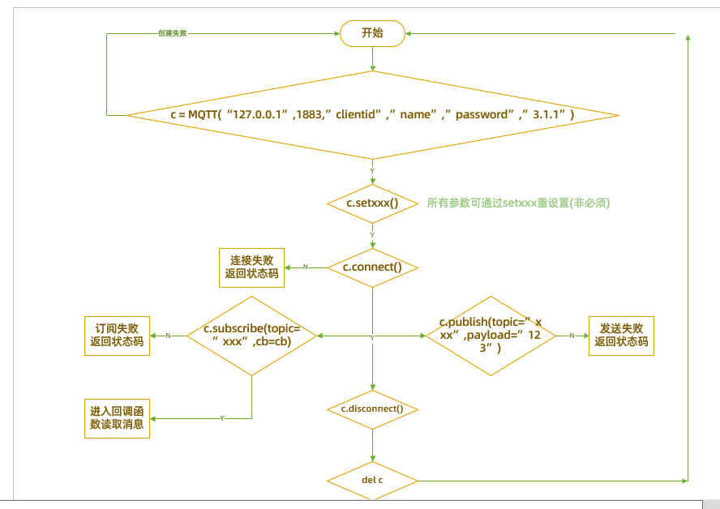

# PIKA-MQTT 库

### `__init__()`

**介绍：**

实例化一个MQTT Client

**参数：**

| 序号 | 功能      | 变量类型 | 备注                   |
| ---- | --------- | -------- | ---------------------- |
| 1    | ip        | string   | 必填                   |
| 2    | port      | int      | 非必填，默认1883       |
| 3    | clientID  | string   | 非必填，默认mac地址    |
| 4    | username  | string   | 非必填，默认空         |
| 5    | password  | string   | 非必填，默认空         |
| 6    | version   | string   | 非必填，默认MQTT-3.1.1 |
| 7    | ca        | string   | 非必填，默认空         |
| 8    | keepalive | int      | 非必填，默认60s        |

**返回值：**

| 功能     | 变量类型 |
| -------- | -------- |
| mqtt对象 | MQTT     |

**示例：**

```python
# 最简创建
c = MQTT("broker-cn.emqx.io")
# 自定义端口的创建
c = MQTT("broker-cn.emqx.io", 1111)
# 自定义clientID的创建
c = MQTT("broker-cn.emqx.io", clientID="pikascript")
# 需要用户名密码的创建
c = MQTT("broker-cn.emqx.io", username="pikascript123", password="123456")
# 加密mqtt的创建
c = MQTT("broker-cn.emqx.io", 8883, username="pikascript123", password="123456", ca=open(cert_file).read())
```

------

### `setClientID()`

**介绍：**

设置clientID,会覆盖实例化时的参数

**参数：**

| 序号 | 功能     | 变量类型 | 备注 |
| ---- | -------- | -------- | ---- |
| 1    | clientid | string   | 必填 |

**返回值：**

| 功能                  | 变量类型 |
| --------------------- | -------- |
| 成功:true  失败:false | bool     |

**示例：**

```python
c.setClientID("pikascript")
```

------

### `setUsername()`

**介绍：**

设置usrname,会覆盖实例化时的参数

**参数：**

| 序号 | 功能     | 变量类型 | 备注 |
| ---- | -------- | -------- | ---- |
| 1    | username | string   | 必填 |

**返回值：**

| 功能                  | 变量类型 |
| --------------------- | -------- |
| 成功:true  失败:false | bool     |

**示例：**

```python
c.setUsername("pikascript")
```

------

### `setPassword()`

**介绍：**

设置password,会覆盖实例化时的参数

**参数：**

| 序号 | 功能     | 变量类型 | 备注 |
| ---- | -------- | -------- | ---- |
| 1    | password | string   | 必填 |

**返回值：**

| 功能                  | 变量类型 |
| --------------------- | -------- |
| 成功:true  失败:false | bool     |

**示例：**

```python
c.setPassword("pikascript")
```

------

### `setVersion()`

**介绍：**

设置mqtt版本,会覆盖实例化时的参数

**参数：**

| 序号 | 功能    | 变量类型 | 备注 |
| ---- | ------- | -------- | ---- |
| 1    | version | string   | 必填 |

**返回值：**

| 功能                  | 变量类型 |
| --------------------- | -------- |
| 成功:true  失败:false | bool     |

**示例：**

```python
# 可选"3.1" "3.1.1"
c.setVersion("3.1")
```

------

### `setCa()`

**介绍：**

设置ssl证书,会覆盖实例化时的参数

此参数一旦生效,会强制进行ssl连接

**参数：**

| 序号 | 功能 | 变量类型 | 备注 |
| ---- | ---- | -------- | ---- |
| 1    | ca   | string   | 必填 |

**返回值：**

| 功能                  | 变量类型 |
| --------------------- | -------- |
| 成功:true  失败:false | bool     |

**示例：**

```python
c.setCa(open(cert_file).read())
```

------

### `setKeepAlive()`

**介绍：**

设置保活时间,会覆盖实例化时的参数

**参数：**

| 序号 | 功能 | 变量类型 | 备注 |
| ---- | ---- | -------- | ---- |
| 1    | time | int      | 必填 |

**返回值：**

| 功能                  | 变量类型 |
| --------------------- | -------- |
| 成功:true  失败:false | bool     |

**示例：**

```python
# 单位 秒
c.setKeepAlive(120)
```

------

### `setWill()`

**介绍：**

设置遗嘱

**参数：**

| 序号 | 功能    | 变量类型 | 备注              |
| ---- | ------- | -------- | ----------------- |
| 1    | topic   | string   | 必填              |
| 2    | payload | string   | 必填              |
| 3    | qos     | int      | 非必填，默认QOS0  |
| 4    | retain  | bool     | 非必填，默认False |

**返回值：**

| 功能                  | 变量类型 |
| --------------------- | -------- |
| 成功:true  失败:false | bool     |

**示例：**

```python
c.setWill("/device/will", "{"name":"pikascript"}")
```

------

### `setDisconnectHandler()`

**介绍：**

设置断连回调

**参数：**

| 序号 | 功能     | 变量类型 | 备注          |
| ---- | -------- | -------- | ------------- |
| 1    | callback | any      | 必填 回调函数 |

**返回值：**

| 功能                  | 变量类型 |
| --------------------- | -------- |
| 成功:true  失败:false | bool     |

**示例：**

```python
def disconnect_cb():
    print("mqtt disconnect")

c.setDisconnectHandler(disconnect_cb)
```

------

### `connect()`

**介绍：**

连接服务器

**参数：**

无

**返回值：**

| 功能                | 变量类型 |
| ------------------- | -------- |
| 成功:0  错误码:附一 | int      |

**示例：**

```python
c.connect()
```

------

### `disconnect()`

**介绍：**

断开服务器

**参数：**

无

**返回值：**

| 功能                | 变量类型 |
| ------------------- | -------- |
| 成功:0  错误码:附一 | int      |

**示例：**

```python
c.disconnect()
```

------

### `subscribe()`

**介绍：**

订阅主题

**参数：**

| 序号 | 功能     | 变量类型 | 备注             |
| ---- | -------- | -------- | ---------------- |
| 1    | topic    | string   | 必填             |
| 2    | callback | any      | 必填，回调函数   |
| 3    | qos      | int      | 非必填，默认QOS0 |

**返回值：**

| 功能                | 变量类型 |
| ------------------- | -------- |
| 成功:0  错误码:附一 | int      |

**示例：**

```python
def sub_cb(evt):
    print(evt.msg, evt.topic)

c.subscribe("/topic/sub", sub_cb)
```

------

### `unsubscribe()`

**介绍：**

取消订阅主题

**参数：**

| 序号 | 功能  | 变量类型 | 备注 |
| ---- | ----- | -------- | ---- |
| 1    | topic | string   | 必填 |

**返回值：**

| 功能                | 变量类型 |
| ------------------- | -------- |
| 成功:0  错误码:附一 | int      |

**示例：**

```python
c.unsubscribe("/topic/sub")
```

------

### `listSubscribeTopics()`

**介绍：**

列出当前订阅的主题

**参数：**

无

**返回值：**

| 功能     | 变量类型 |
| -------- | -------- |
| 主题列表 | tuple    |

**示例：**

```python
t = c.listSubscribeTopics()
print(t)
```

------

### `publish()`

**介绍：**

发布消息

**参数：**

| 序号 | 功能    | 变量类型 | 备注             |
| ---- | ------- | -------- | ---------------- |
| 1    | topic   | string   | 必填             |
| 2    | payload | string   | 必填             |
| 3    | qos     | int      | 非必填，默认QOS0 |

**返回值：**

| 功能                | 变量类型 |
| ------------------- | -------- |
| 成功:0  错误码:附一 | int      |

**示例：**

```python
c.publish("/topic/pub", 0, "{"msg":"hello pikascript"}")
```

------

### 附一：错误码

| 错误码 | 解释                       | 备注                                     |
| ------ | -------------------------- | ---------------------------------------- |
| 0      | STATE_SUCCESS              | 成功                                     |
| 1      | STATE_FAIL_UNKONW          | 失败 未知原因                            |
| 2      | STATE_FAIL_BAD_NAME_PASSWD | 失败 用户名密码错误                      |
| 3      | STATE_FAIL_BAD_CLINETID    | 失败 clientid错误                        |
| 4      | STATE_FAIL_BAD_PROTOCOL    | 失败 mqtt协议版本错误                    |
| 5      | STATE_FAIL_BAD_RCODE       | 失败 订阅或取消订阅时 服务端返回操作失败 |
| 6      | STATE_FAIL_PERMISSION      | 失败 订阅或发布时权限不可达              |

------

### 附二：综合示例

```python
# coding=utf-8

def sub_test1_cb(evt):
    print("sub test1 message:", evt.msg)


def sub_test2_cb(evt):
    print("sub test2 message:", evt.msg)


def sub_test3_cb(evt):
    print("sub test3 message:", evt.msg)
    
    
def disconnect_cb():
    print("mqtt disconnect")

    
def test():
    # MQTTS
    c = MQTT("broker-cn.emqx.io", 8883,  clientID="pikaone", username="pikascript123", password="123456", ca=open("/ca.crt").read())
    
    # 设置遗嘱
    c.setWill("/device/will", "{"name":"pikascript"}", 0, True)
    
	# 设置断连回调
	c.setDisconnectHandler(disconnect_cb)
    
    # 连接服务器
    result = c.connect()
    if result == 0:
        print("connect success!")
    else:
        print("connect faild id={}".format(result))
        return
    
    # 订阅主题
    c.subscribe("/pikascript/test1", sub_test1_cb, 0)
    c.subscribe("/pikascript/test2", sub_test2_cb, 1)
    c.subscribe("/pikascript/test3", sub_test3_cb, 2)

    print("list subscribe topics:")
    print(c.listSubscribeTopics())

    print("start publish")

    # 发送主题消息
    c.publish("/pikascript/test1", "{'msg'}:'hello from test1'", 0)
    c.publish("/pikascript/test2", "{'msg'}:'hello from test2'", 1)
    c.publish("/pikascript/test3", "{'msg'}:'hello from test3'", 2)

    print("end publish")

    # 断开连接
    result = c.disconnect()
    if result == 0:
        print("disconnect success!")
    else:
        print("disconnect faild id={}".format(result))
        return
    
# 运行
test()
```

流程图


