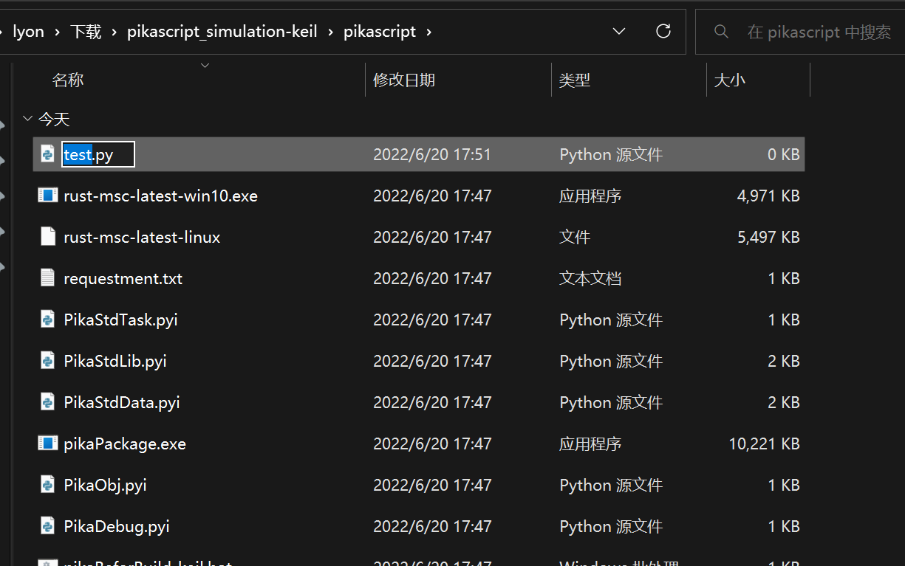
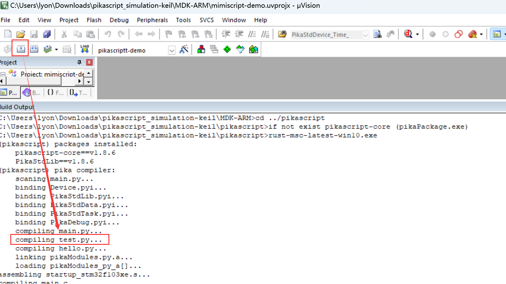
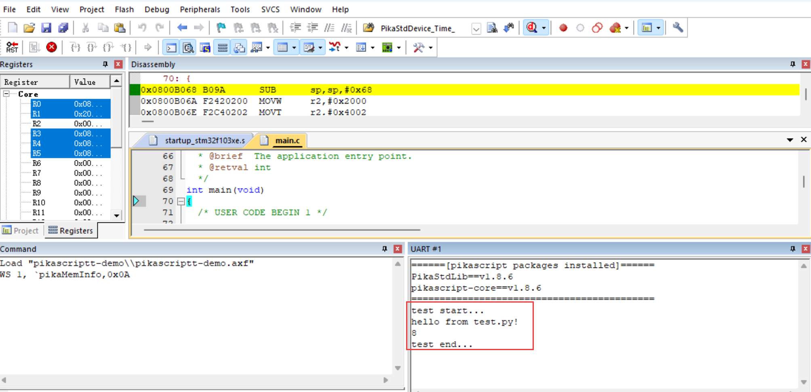
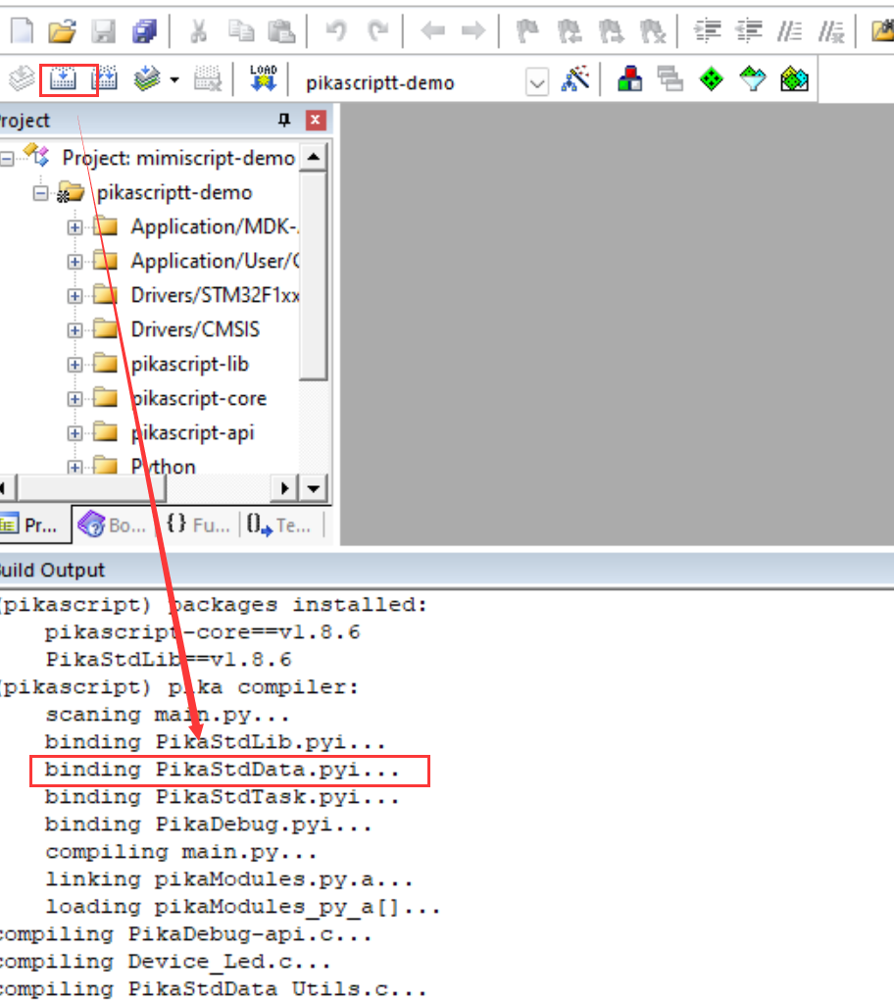
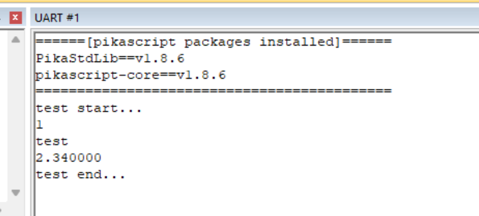

# 模块导入

嵌入式的运行环境和 PC 有明显区别，在很多的场景下，MCU 甚至没有文件系统。

不过不用担心，PikaPython 已经通过官方自带的工具帮助你轻松的导入模块，你需要做的仅仅是写一行 `import`，就像平时在 PC 使用 Python 一样。

和 PC 的 Python 不一样的地方仅在于，在用编译器编译 PikaPython 的工程之前，需要运行一次 PikaPython 提供的预编译器（没有什么复杂的参数和选项，仅仅是双击运行）。

## 导入 Python 模块

PikaPython 支持导入多个 Python 文件作为模块，而且不需要在 MCU 里面移植文件系统（如果你想基于文件系统，当然也可以）。

PikaPython 的预编译器可以将 Python 文件在 PC 开发机就转换成字节码并打包成一个库，就像是 C 一样。

这样一来，在资源很少的 MCU 里面，就可以省去文件系统的花销了 （通常需要 20kB 的 ROM）。

另一方面，如果你想快速在新平台尝试 PikaPython，也不需要先费一番功夫为新平台移植文件系统，然后再将文件系统和 PikaPython 对接。

（注意，需要内核版本不低于 v1.8.0）

### 实验

我们仍然以 keil 的仿真工程作为实验平台，这样不需要硬件即可快速实验。

首先参考 keil 的[仿真工程文档](https://pikadoc.readthedocs.io/zh/latest/Keil%20%E4%BB%BF%E7%9C%9F%E5%B7%A5%E7%A8%8B.html)，获得工程。

然后在 pikascript_simulation-keil/pikascript/ 目录下新建一个 test.py 的 Python 文件 （所有的 Python 模块都要放在这个目录）。



 然后在 test.py 里面写入测试代码：

``` python
# test.py
def mytest():
    print('hello from test.py!')

def add(a, b):
    return a + b

```

接着在 main.py 里面引入 test.py，并测试我们在 test.py 里面定义的函数 mytest() 和 add()

```python
import Device
import PikaStdLib
import PikaStdData
import hello

import test

print('test start...')

test.mytest()
print(test.add(3, 5))

print('test end...')
```

然后直接在 keil 工程里面编译，会发现在开始编译 .c 文件之前，出现了 PikaPython Compiler 的提示信息，包括编译了 test.py。



这是因为已经自动运行了 PikaPython 的预编译器，这是一项 Keil 提供的设置，能够在编译开始前执行一段脚本，包括运行 PikaPython 的预编译器。


然后我们开始调试运行，打开串口窗口就能看到结果了



如果你对原理感兴趣，可以观看 [讲解视频](https://www.bilibili.com/video/BV14t4y1x7nv?spm_id_from=333.999.0.0)。

## 导入 C 模块

C 模块指的是底层用 C 实现，却仍然可以用 Python 调用的模块。

一个名为 `<module>` 的C 模块通常由一个 `<module>.pyi` 文件 （python 的接口文件）和 pikascript-lib/\<module\> 文件夹组成。

PikaPython 导入 C 模块和导入 Python 模块的方法一样，直接 `import`，然后运行预编译即可。

C 模块还需要把使用 C 语言编写的实现部分加入编译，包括：

- 添加编译 pikascript-lib/\<module\>  文件夹下的所有 .c 文件
- 将 pikascript-lib/\<module\> 加入 include 路径

### 实验

我们仍然以 keil 的仿真工程作为实验平台。

我们在 main.py 里面引入 PikaStdData.pyi C 模块。

我们打开 PikaStdData.pyi 查看这个 C 模块提供的类和函数。

``` python
# PikaStdData.pyi
class List:
    def __init__(self): ...
    # add an arg after the end of list
    def append(self, arg: any): ...
    # get an arg by the index
    def get(self, i: int) -> any: ...
    # set an arg by the index
    def set(self, i: int, arg: any): ...
    # get the length of list
    def len(self) -> int: ...
...
```

可以看到里面有一个 `List` 类。

在 main.py 里面引入 `PikaStdData` 并通过 `List` 类新建一个对象 `list`，然后再测试一下 `List` 的`append()`方法，和 `get()` 方法。

``` python
import PikaStdLib

import PikaStdData

print('test start...')

list = PikaStdData.List()
list.append(1)
list.append('test')
list.append(2.34)

print(list.get(0))
print(list.get(1))
print(list.get(2))

print('test end...')
```

编译时可以看到 PikaPython 的预编译器将 PikaStdData C 模块绑定到了工程里面。



仿真运行可以看到结果



用户也可以自己制作 C 模块，需要做的就是编写 \<module\>.pyi Python 接口文件和 pikascript-lib/\<module\> 里面的 .c 实现文件。

具体请参考[C 模块的制作文档](https://pikadoc.readthedocs.io/zh/latest/index_cmodule.html)。
