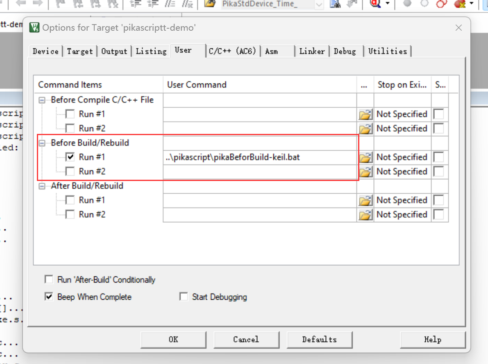

# 模块导入

嵌入式的运行环境和 PC 有明显的区别，因此 PikaScript 模块导入的内部机制和 PC 上的 python 解释器有着本质的区别。

不过不用担心，PikaScript 已经通过官方自带的工具帮助你轻松的导入模块，你需要做的仅仅是写一行 `import`，就像平时在 PC 使用 Python 一样。

和 PC 的 Python 不一样的地方仅在于，在用编译器编译 PikaScript 的工程之前，需要运行一次 PikaScript 提供的预编译器（没有什么复杂的参数和选项，仅仅是双击运行）。

## 导入 Python 模块

PikaScript 支持导入多个 Python 文件作为模块，而且不需要在 MCU 里面移植文件系统（如果你想基于文件系统，当然也可以）。

PikaScript 的预编译器可以将 Python 文件在 PC 开发机就转换成字节码并打包成一个库，就像是 C 一样。

这样一来，在资源很少的 MCU 里面，就可以省去文件系统的花销了 （通常需要 20kB 的 ROM）。

另一方面，如果你想快速在新平台尝试 PikaScript，也不需要先费一番功夫为新平台移植文件系统，然后再将文件系统和 PikaScript 对接。

（注意，需要内核版本不低于 v1.8.0）

### 实验

我们仍然以 keil 的仿真工程作为实验平台，这样不需要硬件即可快速实验。

首先参考 keil 的[仿真工程文档](https://pikadoc.readthedocs.io/zh/latest/Keil%20%E4%BB%BF%E7%9C%9F%E5%B7%A5%E7%A8%8B.html)，获得工程。

然后在 pikascript_simulation-keil/pikascript/ 目录下新建一个 test.py 的 Python 文件 （所有的 Python 模块都要放在这个目录）。


 然后在 test.py 里面写入测试代码：

``` python
# test.py
def mytest():
    print('hello from test.py!')

def add(a, b):
    return a + b

```

接着在 main.py 里面引入 test.py，并测试我们在 test.py 里面定义的函数 mytest() 和 add()

```python
import Device
import PikaStdLib
import PikaStdData
import hello

import test

print('test start...')

test.mytest()
print(test.add(3, 5))

print('test end...')
```

然后直接在 keil 工程里面编译，会发现在开始编译 .c 文件之前，出现了 PikaScript Compiler 的提示信息，包括编译了 test.py。


这是因为已经自动运行了 PikaScript 的预编译器，这是一项 Keil 提供的设置，能够在编译开始前执行一段脚本，包括运行 PikaScript 的预编译器。



然后我们开始调试运行，打开串口窗口就能看到结果了


