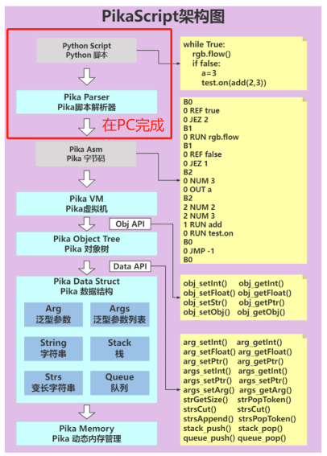

# 直接运行字节码

### 在PC解析字节码
PikaScript的运行时架构如下图所示，在默认情况下，Python脚本解析成Pika字节码的过程是放在MCU执行的，这使得MCU可以直接运行Python脚本，包括支持交互式运行。
而在资源受限的情况下，可以将Python脚本解析为字节码的过程在PC提前完成，就可以不在MCU中解析Python脚本，转而直接执行Pika字节码，这样一来**解析Python脚本的代码就可以被裁剪掉了**。

使用pikaVM_runAsm API可以直接运行多行的字节码字符串，可以参考g030中从字节码启动的用法。
[https://gitee.com/Lyon1998/pikascript/blob/master/bsp/stm32g030c8/Booter/main.c](https://gitee.com/Lyon1998/pikascript/blob/master/bsp/stm32g030c8/Booter/main.c)
避免使用obj_run执行python脚本，转而使用pikaVM_runAsm直接运行字节码，编译器就会自动优化掉Python解析的代码，降低代码体积占用。

在PC上将Python解析成字节码的工具：
[https://gitee.com/Lyon1998/pikascript/tree/master/tools/pikaByteCodeGen](https://gitee.com/Lyon1998/pikascript/tree/master/tools/pikaByteCodeGen)
