# 从 RT-Thread 软件包开始

PikaScript 已加入 [RT-Thread软件包](https://packages.rt-thread.org/detail.html?package=pikascript)，在编程语言分类下，直接添加软件包即可快速使用 PikaScript 。

PikaScript 软件包支持**全部的 RT-Thread BSP** 。
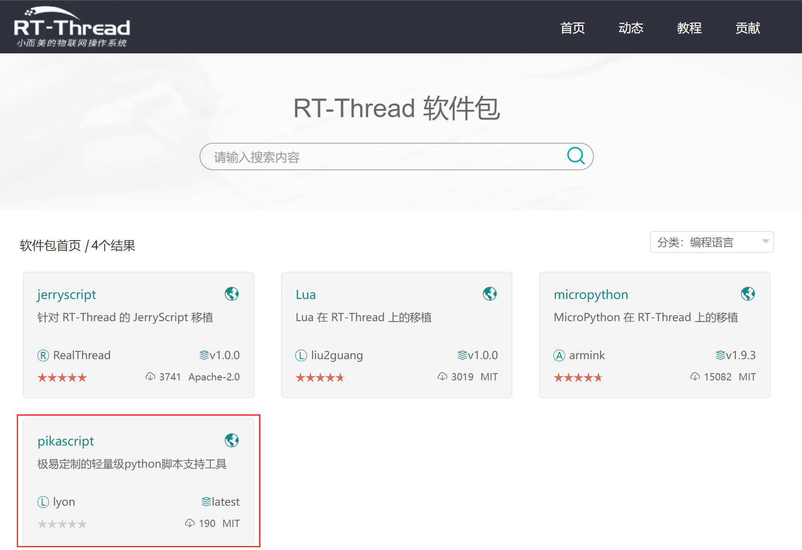
如果在使用过程中遇到兼容性问题，可以在 [gitee](https://gitee.com/Lyon1998/pikascript)，[github](https://github.com/pikasTech/pikascript) 提 issue 或者[论坛](https://whycan.com/f_55.html)提问。

## 安装

   引入 pikascript 软件包

   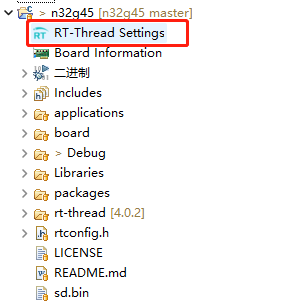

   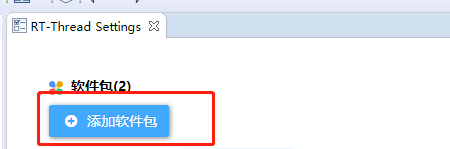

   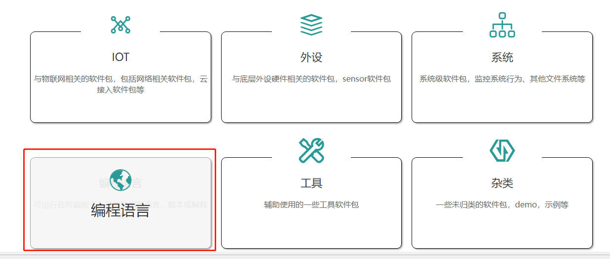

   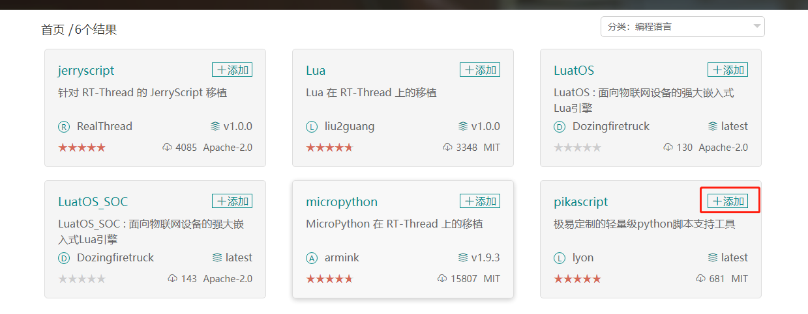

   在 rt-thread/src/kservice.c 中的 rt_vsnprintf 前添加 RT_WEAK **(只针对rt_thread 4.1.0版本以下)**

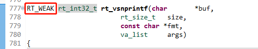

   删除 rt-thread/components/finsh/shell.c 中 finsh_getchar 的 static **(只针对rt_thread 4.1.0版本以下)**

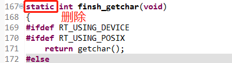

## 启动 pikascript

**方案一：使用msh启动（默认模式）**

   在 packages/pikascript-latest/requestment.txt 中使用 pikaRTThread 模块（默认已引入）。

可以在这里查看最新的默认 [requestment.txt](https://gitee.com/Lyon1998/pikascript/blob/master/port/rt-thread/requestment.txt)。

   在msh中输入 "pika" ，即可 **在一个线程中启动** PikaScript。

初次启动会执行 /pikascript-latest/main.py 初始化脚本。执行完毕后进入 pika **交互式运行** 模式，
输入 "exit()" 回到 msh，再次输入 "pika" 进入 pikascript，将**直接进入**交互式运行模式。
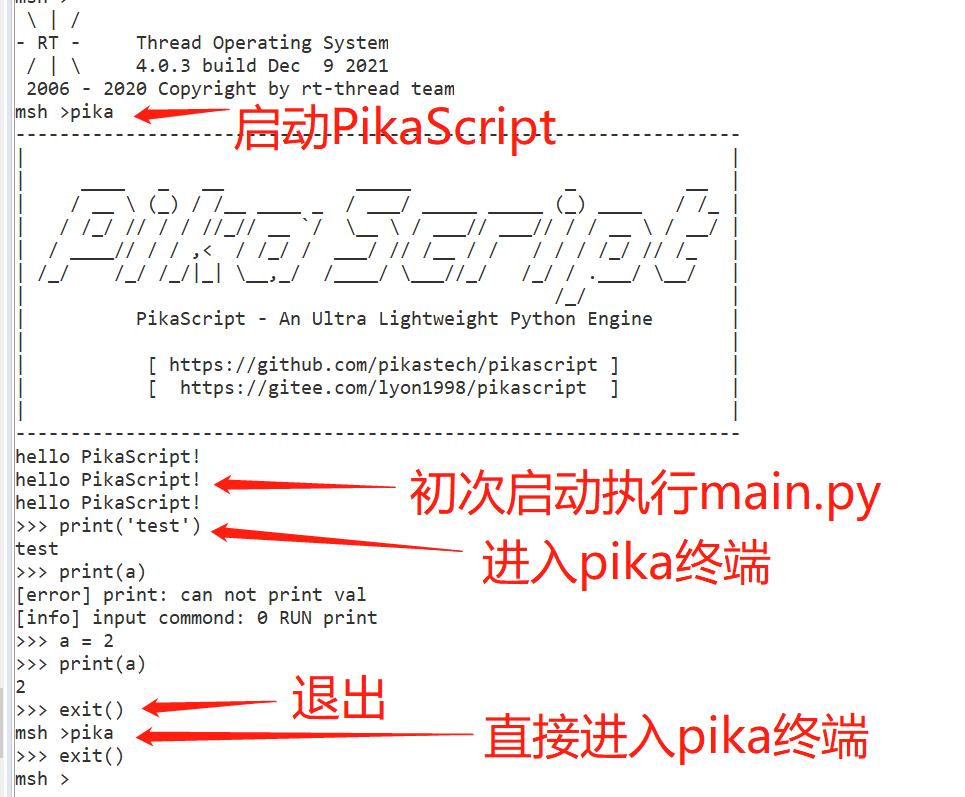
**方案二：开机自动启动**

   进入软件包详细配置

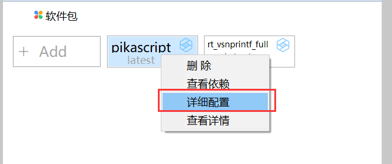

   勾选Enable auto-running PikaScript

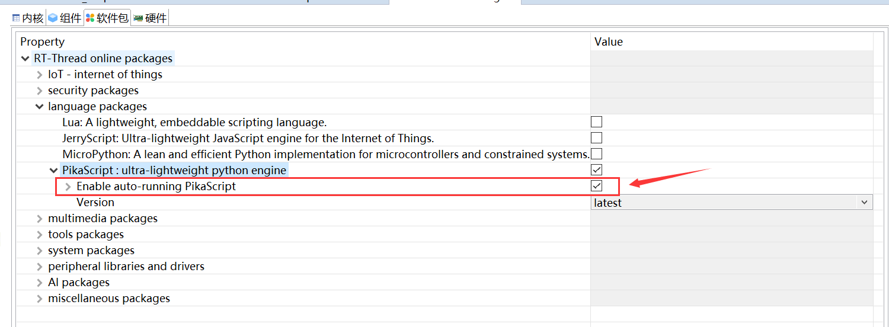

   3设置好后会自动启动 PikaScript ，运行 main.py 脚本，然后回到 msh

在 msh 输入 **pika** 进入交互式运行。

**方案三：手动启动**

如果需要 **定制启动** ，可以使用以下的方式手动启动。

   引入头文件：
```c
#include "pikaScript.h"
```
 启动 PikaScript：
```c
PikaObj * pikaMain = pikaScriptInit();
```

   交互式运行

参考**支持交互式运行**部分文档。

   串口下载 Python 脚本

参考**支持串口下载 Python** 部分文档。

### 使用 PikaScript 模块和包管理器

   修改 pikascript-latest/requestment.txt，然后右键工程，Sconscripts Update，即可安装模块/修改模块版本，并预编译。

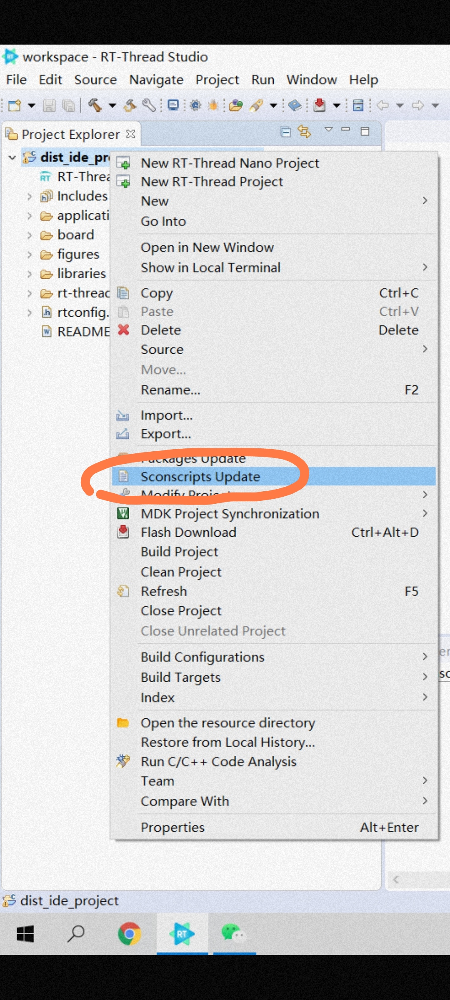


更多用法参考**包管理器**，**模块使用，模块开发**部分文档。
