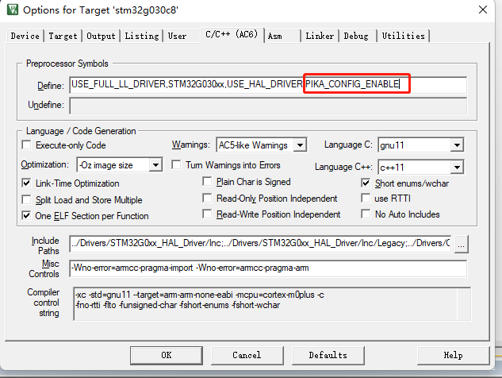

# PikaScript 配置手册

## 何时需要配置

PikaScript 本身是 **免配置** 的，所以通常情况下 **不需要** 了解这部分内容。

当你有以下的需求时，则可以考虑配置 PikaScript：

- 更快的速度
- 更小的内存占用
- 替换依赖项( libc, pinrtf 等)
- 替换内存管理算法( malloc )
- 更安全的中断保护
  
## 优化配置

类似 GCC, PikaScript 也提供了不同的优化模式，目前可以使用的优化模式有：

- ```PIKA_OPTIMIZE_SIZE``` 体积模式 最小化运行内存

- ```PIKA_OPTIMIZE_SPEED``` 性能模式 最大化运行速度
  
### 启用用户配置

默认不启用用户配置，启用用户配置的方式为添加编译时宏定义 ``` PIKA_CONFIG_ENABLE ```。然后创建 ``` pika_config.h ``` 头文件。

需要注意的是, ``` PIKA_CONFIG_ENABLE ``` 宏要添加在编译选项中，例如 keil 中:



### 配置项

可用的配置项和默认的配置在 pika_config_valid.h 头文件中。

https://gitee.com/Lyon1998/pikascript/blob/master/src/pika_config_valid.h

截取重要的部分进行说明：

``` c
/* default configuration  */
   #define PIKA_LINE_BUFF_SIZE 128
   #define PIKA_SPRINTF_BUFF_SIZE 128
   #define PIKA_STACK_BUFF_SIZE 256
   #define PIKA_NAME_BUFF_SIZE 32
   #define PIKA_PATH_BUFF_SIZE 64
   #define PIKA_ARG_ALIGN_ENABLE 1
   #define PIKA_METHOD_CACHE_ENABLE 0
          
/* optimize options */
   #define PIKA_OPTIMIZE_SIZE 0
   #define PIKA_OPTIMIZE_SPEED 1
      
/* default optimize */
   #define PIKA_OPTIMIZE PIKA_OPTIMIZE_SIZE
      
/* use user config */
   #ifdef PIKA_CONFIG_ENABLE
      #include "pika_config.h"
   #endif
```

```default configuration``` 是配置项的默认值，当 ```PIKA_CONFIG_ENABLE``` 宏被定义后，pika_config_valid.h 会引入 pika_config.h，因此用户可以在 pika_config.h中覆盖上面的默认配置。

例如，如果想要将增大 PikaScript 虚拟机的运行时栈，则可以在 pika_config.h 中写入

``` c
#undif PIKA_STACK_BUFF_SIZE
#define PIKA_STACK_BUFF_SIZE 512
```

从 pika_config_valid.h 中可以看到，PikaScript 的默认优化选项 ``` PIKA_OPTIMIZE ``` 的值是 ``` PIKA_OPTIMIZE_SIZE ```，如果需要切换到 speed 优化，则可以在 pika_config.h 中写入

``` c
#undif PIKA_OPTIMIZE
#define PIKA_OPTIMIZE PIKA_OPTIMIZE_SPEED
```

## 依赖项配置

可以通过创建 pika_config.c，重写 [PikaPlagform.h](https://gitee.com/Lyon1998/pikascript/blob/master/src/PikaPlatform.h) 里面的弱函数来配置 PikaScript 的依赖项。
``` c
/* interrupt config */
void __platform_enable_irq_handle(void);
void __platform_disable_irq_handle(void);

/* printf family config */
#ifndef __platform_printf
void __platform_printf(char* fmt, ...);
#endif
int __platform_sprintf(char* buff, char* fmt, ...);
int __platform_vsprintf(char* buff, char* fmt, va_list args);
int __platform_vsnprintf(char* buff,
                         size_t size,
                         const char* fmt,
                         va_list args);

/* libc config */
void* __platform_malloc(size_t size);
void __platform_free(void* ptr);
void* __platform_memset(void* mem, int ch, size_t size);
void* __platform_memcpy(void* dir, const void* src, size_t size);

/* pika memory pool config */
void __platform_wait(void);
uint8_t __is_locked_pikaMemory(void);

/* support shell */
char __platform_getchar(void);

/* file API */
FILE* __platform_fopen(const char* filename, const char* modes);
int __platform_fclose(FILE* stream);
size_t __platform_fwrite(const void* ptr, size_t size, size_t n, FILE* stream);

/* error */
void __platform_error_handle(void);
```
### 配置项：

- 中断保护 —— 提供中断总开关，保护PikaScript内存安全
  
- libC —— 选择libC的实现
  
- 内存管理 —— 替换 malloc free 内存管理算法
  
### 示例代码：
- [https://gitee.com/Lyon1998/pikascript/blob/master/bsp/stm32g030c8/Booter/pika_config.c](https://gitee.com/Lyon1998/pikascript/blob/master/bsp/stm32g030c8/Booter/pika_config.c)
  
- [https://gitee.com/Lyon1998/pikascript/blob/master/package/pikaRTThread/pika_config.c](https://gitee.com/Lyon1998/pikascript/blob/master/package/pikaRTThread/pika_config.c)
