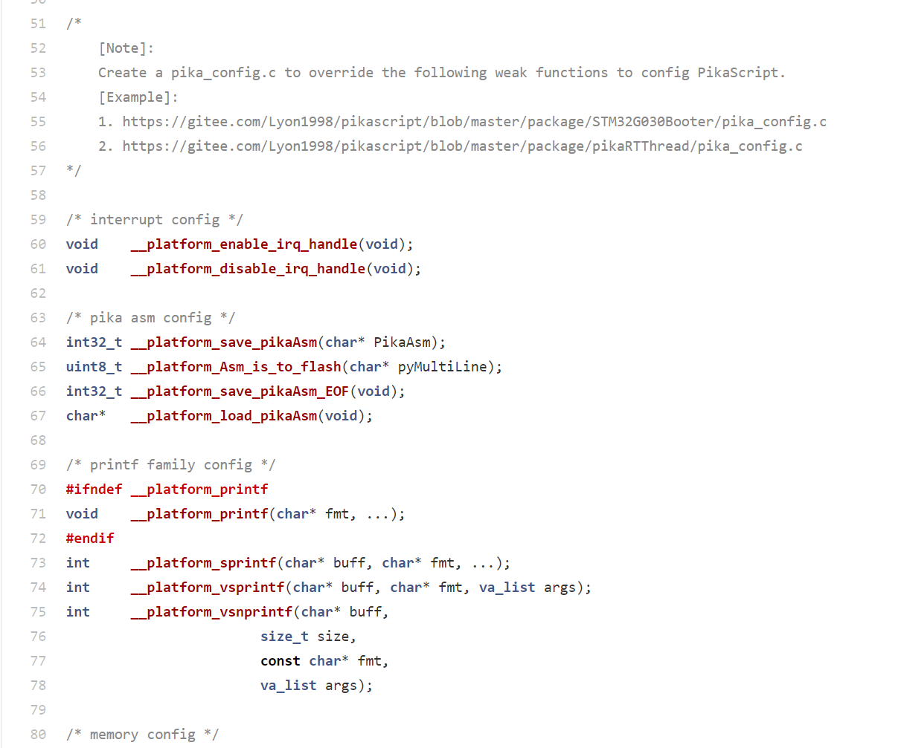

# 优化内存占用、配置libc

1. PikaScript本身是**免配置**的，所以通常情况下**不需要**了解这部分内容。
2. 可以通过创建pika_config.c，重写[PikaPlagform.h](https://gitee.com/Lyon1998/pikascript/blob/master/src/PikaPlatform.h)里面的弱函数来配置PikaScript。

3. 配置项包括：
   1. 中断保护 —— 提供中断总开关，保护PikaScript内存安全
   1. libC —— 选择libC的实现
   1. 内存池 —— 降低内存碎片
   1. 字节码存储 —— 将字节码写入flash，加速启动，降低内存占用
4. 示例代码：
   1. [https://gitee.com/Lyon1998/pikascript/blob/master/package/STM32G030Booter/pika_config.c](https://gitee.com/Lyon1998/pikascript/blob/master/package/STM32G030Booter/pika_config.c)
   1. [https://gitee.com/Lyon1998/pikascript/blob/master/package/pikaRTBooter/pika_config.c](https://gitee.com/Lyon1998/pikascript/blob/master/package/pikaRTBooter/pika_config.c)
