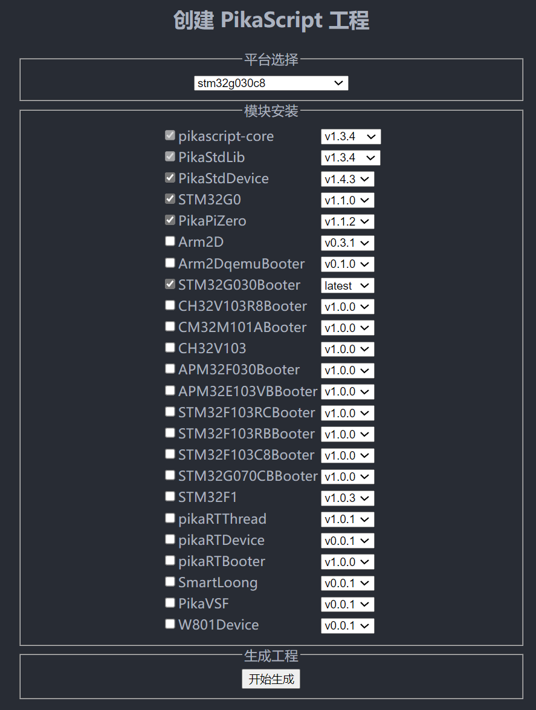
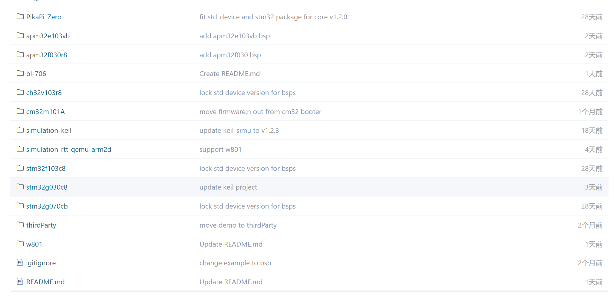
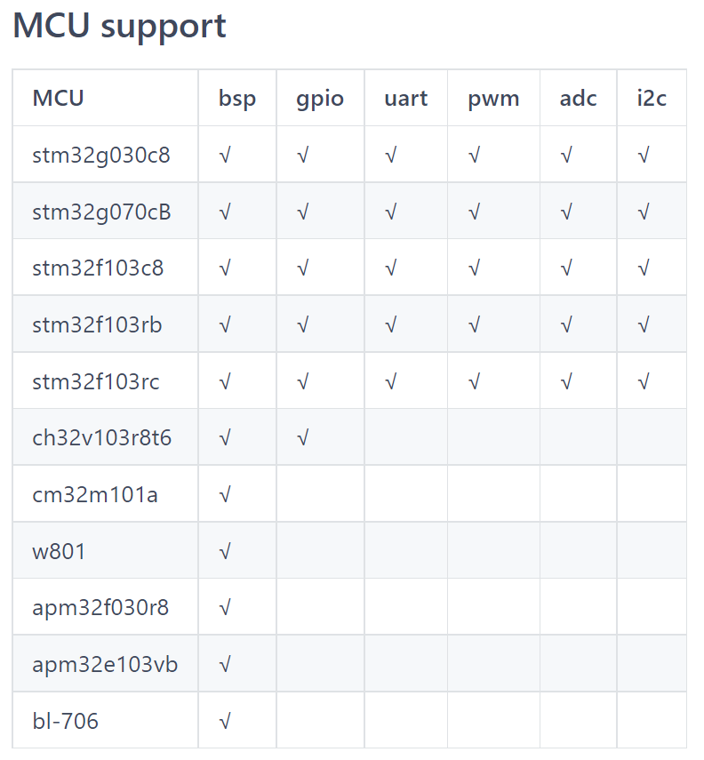
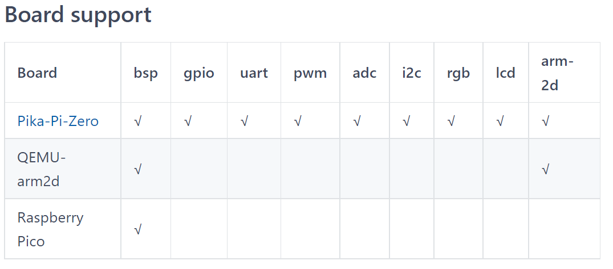
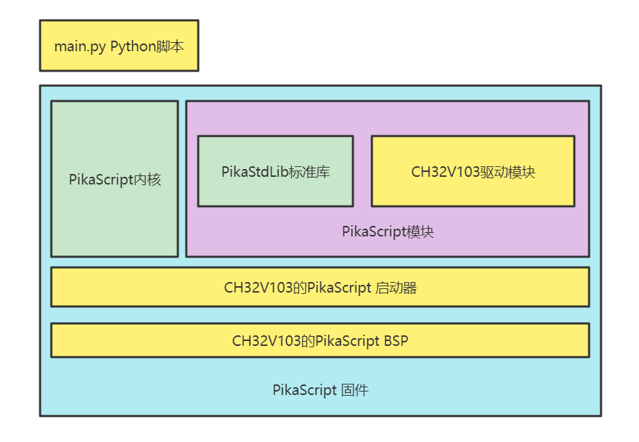
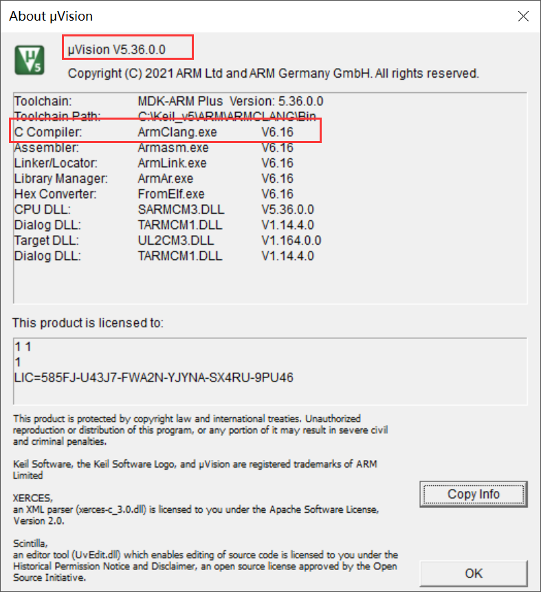

# 使用 BSP 工程
## 创建工程
进入 pikascript 官网 [http://pikascript.com](http://pikascript.com)
选择平台，模块，然后点击 "开始生成"。
（选择平台后会自动选择默认的模块)


## 工程的来源
移植好的裸机MCU工程在pikascript/bsp目录，里面的每一个文件夹都是一个移植好的裸机工程。
**每个工程都是独立的，可以拷贝出pikascript仓库单独使用。**
（simulation-keil-dev和pico是列外，这两个bsp只能在仓库里面用，是用来开发内核的。）
[https://gitee.com/Lyon1998/pikascript/tree/master/bsp](https://gitee.com/Lyon1998/pikascript/tree/master/bsp)


## 支持列表
在bsp文件夹的README.md中，标注了目前的平台支持情况和bsp的使用方法。
（以下的表格不是最新的）
[最新表格点这里](https://gitee.com/Lyon1998/pikascript#2%E5%B9%B3%E5%8F%B0%E6%94%AF%E6%8C%81%E5%88%97%E8%A1%A8)


你可以通过贡献**驱动模块**或者**bsp**来帮助PikaScript拓展这个表格，具体请参考文档中的**新平台移植指南**、**模块开发**和**包管理**部分。

## 工程结构
以CH32V103为例，一个PikaScript的工程包含以下的几个部分。


1. 首先是BSP文件夹中除了PikaScript文件夹以外的部分，这一部分是真正的BSP，包含了厂家提供的基本外设库、CMSIS等一些平台上的通用库，只需要对厂家的例程进行整理就可以得到。


2. 上面的一部分是PikaScript的启动器，包含main.c入口文件，pika_config.c配置文件，还有*.s汇编启动文件。启动器负责支持printf，堆栈设置，PikaScript的启动，以及交互式运行、串口下载Python等一些功能。

**pika_config.c是用于支持串口下载Python等一些高级功能的，没有这个文件PikaScript依然可以运行。**
​


3. 再上面就是PikaScript的主要部分了，分为内核和模块两个部分，内核就是pikascript/src中的文件，选择一个版本全部添加编译即可，**不需要任何的修改。**


4. **​**模块部分是可以自己开发，或者从仓库中拉取的，**PikaStdLib标准库模块是必选的。**其他模块是可选的。

关于如何使用模块以及如何制作模块，请参考**模块开发**部分，关于如何贡献模块到PikaScript参考，请参考**如何贡献PikaScript模块**部分。
​


5. 最上层是PikaScript工程能够支持的Python脚本，Python脚本可以直接解释运行，加载脚本的方式有多种，包括**预编译进固件、交互式运行、串口下载Python脚本**等，预编译进固件可以参考**模块开发**的部分，交互式运行和串口下载可以参考**新平台移植**的部分。

**只有在main.py中import的模块会被编译进固件，**因此main.py还可以起到**剪裁模块**的作用。
## 模块管理
**启动器、内核和模块都可以使用包管理器进行管理。**
因此BSP中的PikaScript文件夹中只包含包管理器**pikaPackage.exe**本身，**requestment.txt**模块描述文件和**main.py**示例脚本三个文件。
​

requestment.txt使用与通用python一样的模块描述语法，直接运行pikaPackage.exe就可以识别当前文件夹下的requestment.txt然后拉取相应的模块。
​

以stm32g030的bsp中的requestment.txt为例，被拉取的模块有：

1. 内核： pikascript-core
1. 标准库： PikaStdLib
1. 启动器：STM32G030Booter
1. 外设模块： STM32G0 PikaPiZero PikaStdDevice
```
pikascript-core==v1.2.6
PikaStdLib==v1.2.1
PikaStdDevice==v1.4.2
PikaPiZero==v1.1.2
STM32G030Booter==v1.2.5
STM32G0==v1.0.2
```
拉取后的模块需要预编译，直接运行rust-msc-latest-win10.exe即可。
## 注意事项

1. Keil版本**强烈建议**不低于**5.36**


