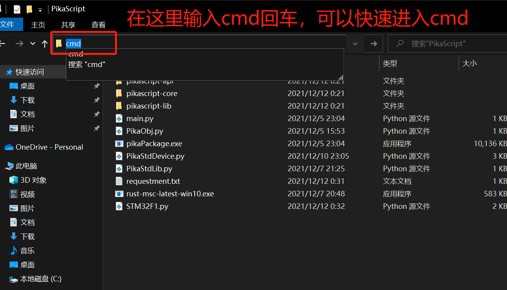
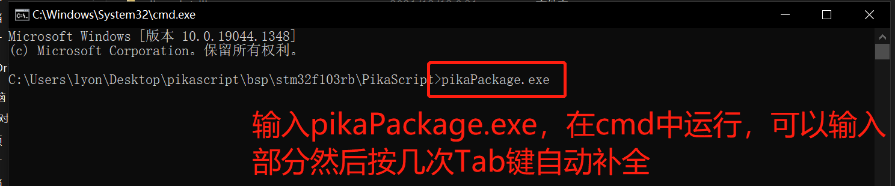

# 包管理器与模块管理

## [**点击下载**包管理器](https://gitee.com/Lyon1998/pikascript/attach_files/1103937/download)
## PikaPackage包管理器


PikaScript有官方支持的包管理器 PikaPackage ，用于模块管理，可以提供内核、模块下载、模块发布、内核、模块版本切换功能，方便分发开发好的模块，以及管理模块的版本。


PikaPackage 是一个 windows 平台的单体应用程序。基于 go 语言开发，集成了 go-git 组件，能够在不安装 git 的情况下，实现 git 仓库的拉取、更新和版本切换功能。


PikaPcakge 所在的目录是
[https://gitee.com/Lyon1998/pikascript/tree/master/tools/pikaPackageManager](https://gitee.com/Lyon1998/pikascript/tree/master/tools/pikaPackageManager)

## PikaPackage 的工作流程


pikaPackage 会自动完成上图所示的一系列流程。

- 首先是检查 /tmp/pikascript 文件夹是否存在，没有的话会先 clone 一份 pikascript 仓库。

/tmp 目录指的是 pikaPackage.exe 当前所处的磁盘的根目录里的 tmp 文件夹。
比如，如果 pikaPackage.exe 在C盘，那么 /tmp 就是 C:/tmp ，如果在 D 盘，那么 /tmp 就是 D:/tmp 。
**clone 仓库使用的是 gitee 源，所以不用担心网络连接问题，国内也非常快。**

- 更新仓库到最新状态。
- 读取当前 requestment.txt 文件中的模块。

下面是一个 requestment.txt 文件的例子，这个文件的格式与主流 python 的 pip 包管理器格式一致，填写模块名和版本号即可拉取对应的模块。目前只支持 == 符号，表示严格匹配版本号。还有一个特殊的版本是 latest ，表示拉取最新的模块，这个最新指的是 pikascript 仓库中 master 分支的最新版本。**如果你是模块的使用者而非开发者，请注意尽一切可能避免使用 latest 版本。因为 latest 版本在不断变动，新版本的模块可能导致兼容性问题。**

```
pikascript-core==v1.6.1
PikaStdLib==v1.6.1
PikaStdDevice==v1.6.0
STM32G0==v1.2.0
PikaPiZero==v1.1.3
```

- pikaPackage.exe 检查 /tmp/pikascript/packages.toml 文件，这是一个仓库中的模块描述文件，这个文件描述了所有可用的模块及其版本。下面是截取的部分 packages.toml 文件，在这个文件里，有 pikascript-core，PikaStdLib，PikaStdDevice，STM32 四个模块可供拉取，而每个模块下的 release 部分描述了可以使用的版本。

模块版本的格式为"<版本名> <commit id>"，在 requestment.txt 中填写相应的版本名即可拉取对应版本的模块。

**如果你也想发布模块，就可以仿照填写 packages.toml 文件，包管理器就可以识别到你发布的模块了。**

```toml
[[packages]]
name = "pikascript-core"
releases = [
  "v0.8.1 af42fd61884dc7048628b0d3bafaa42697f6e8ea",
  "v0.8.2 af42fd61884dc7048628b0d3bafaa42697f6e8ea",
  "v0.8.3 af42fd61884dc7048628b0d3bafaa42697f6e8ea",
  "v0.9.0 332ef8afb0692cddd194782a07e30f2688d0f813",
  "v0.10.0 c86eaefa4516dd82b1050fa74a7d85399459d5ed",
  "v1.0.0 7b816b1546ef91a03f77760d4b10806ab956d452",
  "v1.1.0 845d1fc6520237e2238087800f72608dcb81afa6",
  "v1.1.1 c77e42450ed0eb09fcd7bb2b7d7c2b7eeeb55a2e",
  "v1.1.2 f6ad2c78f49162ab3f898abc6a0a4d87777ce655",
  "v1.1.3 6539072bf7bebb242ea40f8595bfb5c9aae3de7f",
  "v1.2.0 ce3df083b68fbfc85e64e6793fe07a6736d6f29f",
  "v1.2.1 e29a77527fd753c4eb811b047899534472bfc8ec",
  "v1.2.2 5316ede928b01a20571103616a64666abbc40e0a",
  "v1.2.3 5ae86929851ff6a62342a7072b77e9cf5be85f1c",
  "v1.2.4 b7ac057d75e88736cc844de0bafb447a48f2fb6d",
  "v1.2.5 db51f0520a673074a14ef0f5c4434da0d5c3425f",
  "v1.2.6 044a2a8f0905c6ca90c633759f397323ce57eefd",
]

[[packages]]
name = "PikaStdLib"
releases = [
  "v1.0.1 af42fd61884dc7048628b0d3bafaa42697f6e8ea",
  "v1.1.0 0b3b866dbacc363c7b6b3899faa0cbcaccd59d5e",
  "v1.2.0 ca29e112687525ee7511bd30418d368754627a00",
  "v1.2.1 5ae86929851ff6a62342a7072b77e9cf5be85f1c",
  "v1.2.2 b7ac057d75e88736cc844de0bafb447a48f2fb6d",
]

[[packages]]
name = "PikaStdDevice"
releases = [
  "v1.3.0 af42fd61884dc7048628b0d3bafaa42697f6e8ea",
  "v1.4.0 29c3c5b3b0cb4d3e41e6a2a0aef9e2826bc6f7ba",
  "v1.4.1 6539072bf7bebb242ea40f8595bfb5c9aae3de7f",
  "v1.4.2 5ae86929851ff6a62342a7072b77e9cf5be85f1c",
]

[[packages]]
name = "STM32"
releases = [
  "v1.0.0 af42fd61884dc7048628b0d3bafaa42697f6e8ea",
  "v1.0.1 af42fd61884dc7048628b0d3bafaa42697f6e8ea",
  "v1.0.2 af42fd61884dc7048628b0d3bafaa42697f6e8ea",
  "v1.1.0 a18910b5dc349c64297bba3a13b7044f41d48e5f",
  "v1.1.1 91818aab0fa87b007e84866d479af5ac507339fe",
  "v1.2.0 6bd4aac6e9aba2a603da602be8583021da1272c0",
  "v1.3.0 7b816b1546ef91a03f77760d4b10806ab956d452",
  "v1.4.0 29c3c5b3b0cb4d3e41e6a2a0aef9e2826bc6f7ba",
  "v1.4.1 6539072bf7bebb242ea40f8595bfb5c9aae3de7f",
  "v1.4.2 8866710f653ad005f5c3edc5e6417ad31075b7d5",
  "v2.0.0 e29a77527fd753c4eb811b047899534472bfc8ec",
  "v2.0.1 5ae86929851ff6a62342a7072b77e9cf5be85f1c",
]
```

- pikaPackage.exe 去 /tmp/pikascript/pacakge 文件夹中寻找和 packages.toml 同名的文件夹，然后切换至指定的 commit id，再拷贝该文件夹到当前的 pikascript-lib 文件夹下。

**如果你想发布一个模块，则在 pikascript/package 目录下新建一个和模块同名的文件夹，再将该模块包含的所有文件拷贝到该文件夹内即可。提交该文件夹并获得 commit id 后，再将 commit id 填写进 packages.toml 描述文件中。**

- 模块文件夹中包含的 *.pyi 和 *.py 文件会被自动拷贝一份到当前文件夹下，这是为了能够识别到该 python 模块（python 在import模块时，只识别当前文件夹内的模块文件。）
  
## 错误排查


如果在使用中疑似遇到问题，可以在 cmd 中运行 pikaPackage.exe ，查看完整的日志信息。


