# 十分钟部署到新平台

## 如何选择可以运行 pikascript 的平台


1. PikaScript 可以在所有**支持 libc **的**裸机**和**操作系统**上运行。
1. 编译器需要能够支持 **C99 标准**。
1. 支持 **32位/64位 **内核，**不支持 8 位**内核。
1. 资源占用
   1. 如果是 **arm **内核，考虑到拓展模块的资源占用，最低应该配备 **64k flash **和 **8k ram**。
   1. 如果是 **risc-v **内核，则需要**128k flash **和 **8k ram**， 因为 risc-v 内核的 gcc 优化以及代码密度等问题，代码体积比 arm 内核大很多。
   1. 如果是 **其他内核**，可以参考 risc-v 的配置需求。
5. 如果是 PC /服务器平台，则 linux/windows 均可。
## 部署操作流程
在本篇文档中，将会介绍为新平台部署 PikaScript 的方法。PikaScript 几乎**没有全局变量和宏**，**仅依赖标准库**，因此为新平台部署 PikaScript 是非常容易的。


下面是部署 PikaScript 的具体步骤。
### 准备模板工程
你的模板工程仅需要包含一个支持 **printf **的**串口初始化**，然后就可以愉快地使用 pikascript 了。
通常的脚本解释器都依赖**操作系统**和**文件系统**，而 pikascript **不需要**这些，如果你部署过其他的脚本引擎，就会发现 PikaScrip 具有**真正的超轻量级**特性。
​

### 获取 PikaScript 源码和工具集
获取 PikaScsript 可以使用 pika 包管理器(方案1)，或者使用官网的工程生成器(方案2)。
方案2是方案1的自动化版本，推荐新手第一次部署时使用方案1，以熟悉包管理器。
#### 方案1 使用 pika 包管理器
##### (1)下载 PikaScript 包管理器
PikaScript 包管理器可以帮助你拉取 pikascript 所需要的所有**源码**和**工具**，并且提供**版本选择**功能，方便你切换版本。并且 PikaScript 包管理器使用 **gitee 源**，能够在大陆顺畅地使用，**不需要**科学上网。
​

进入 PikaScript 主仓库
[https://github.com/mimilib/pikascript](https://github.com/mimilib/pikascript)
或者：
[https://gitee.com/lyon1998/pikascript](https://gitee.com/lyon1998/pikascript)
下载 PikaScript 包管理器 PikaPackage.exe
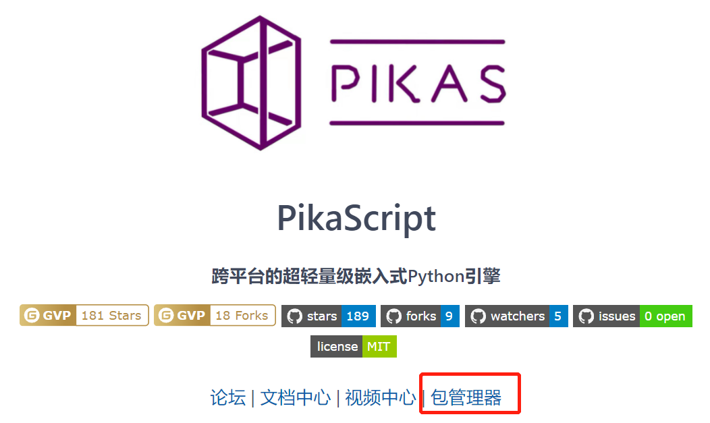
然后打开你要部署的工程，在工程的根目录下新建 pikascript 文件夹，然后把 PikaPackage.exe 复制进去。
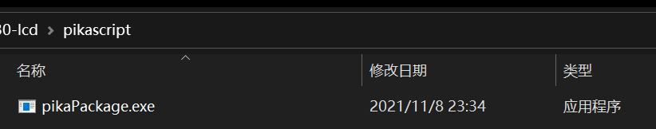


##### (2) 拉取源码
接下来，在 PikaPackage.exe 的帮助下我们可以轻松地拉取指定版本的源码和模块。拉取源码和模块通过一个requestment.txt 的文件，如果你熟悉 python 的 pip 包管理器，就会发现，pikascript 的 requestment.txt 文件格式与 pip 是一致的。
​

在项目的 pikascript 文件夹下新建一个 requestment.txt 文件，然后写入以下内容。
```
pikascript-core==v1.3.5
PikaStdLib==v1.3.5
```


requestment.txt 文件中表示表示使用 v1.3.5 版本的 pikascript 解释器内核和 v1.3.5 版本的标准库，解释器内核和标准库是必选项，这两个的版本号保持一致即可，而其他的模块可以有选择地添加，在初次部署时，应当**只添加内核和标准库**以避免遇到兼容性问题。
​

目前只支持 == 符号，表示严格匹配版本号。还有一个特殊的版本是 latest，表示拉取最新的模块，这个最新指的是 pikascript 仓库中 master 分支的最新版本。**如果你是模块的使用者而非开发者，请注意不要使用 latest 版本。因为 latest 版本在不断变动，新版本的模块可能导致兼容性问题。**


你可以照抄 stm32g030 的 [requestment.txt](https://gitee.com/Lyon1998/pikascript/blob/master/bsp/stm32g030c8/pikascript/requestment.txt) 内核和标准库版本, 这是官方支持的开发板 [Pika派—Zero](https://item.taobao.com/item.htm?spm=a1z10.3-c.w4023-23991764790.10.16f97c58fsLjVk&id=654947372034) 所使用的版本。而所有可选的版本可以在 [packages.toml](https://gitee.com/Lyon1998/pikascript/blob/master/packages.toml) 文件中查看。


lts2021 版本指的是2021年末发布的长期支持版本，支持周期为2022年内。
通常的版本号为 v1.x.x，lts2021 版本基于 v1.3.5，并带有稳定性补丁。


现在的 pikascript 文件夹就有了 pikaPackage.exe 和 requestment.txt 两个文件，双击运行 pikaPackage.exe，在 requestmemt.txt 中指定的源码和模块就会被拉取下来。


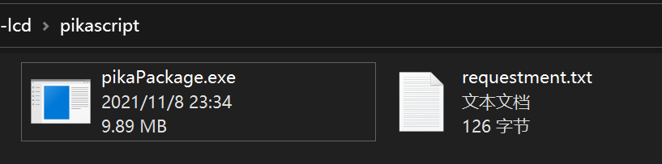


拉取后的文件如下图所示，pikascript-core 是内核源码，pikascript-lib 是模块库，pikascript-api 是模块 API ， rust-msc-latest-win10.exe 是 pikascript 专用的预编译器。


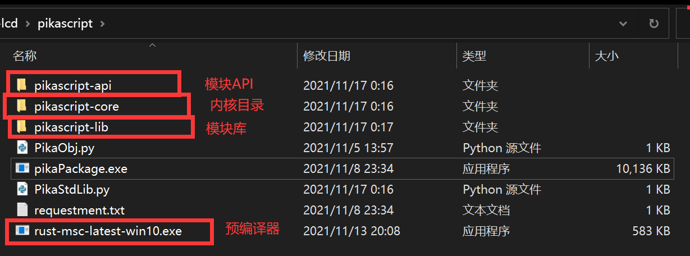


如果你想升级版本，在 requestment.txt 中修改版本号然后再次运行 pikaPackage.exe 即可，原先的版本会被覆盖。拉取完源码之后，接下来编写 pikascript 运行的 python 脚本，我们在 pikascript 文件夹新建一个 main.py 文件。
​

然后写入:


```python
import PikaStdLib

print('hello PikaScript!')
```


其中`import PikaStdLib` 表示导入标准库，标准库是必须要导入的，即使没有直接用到，而`print('hello PikaScript!')`用于测试pikascript是否正常启动。
​

#### 方案2 使用官网的工程生成器
进入官网：[http://pikascript.com/](http://pikascript.com/)
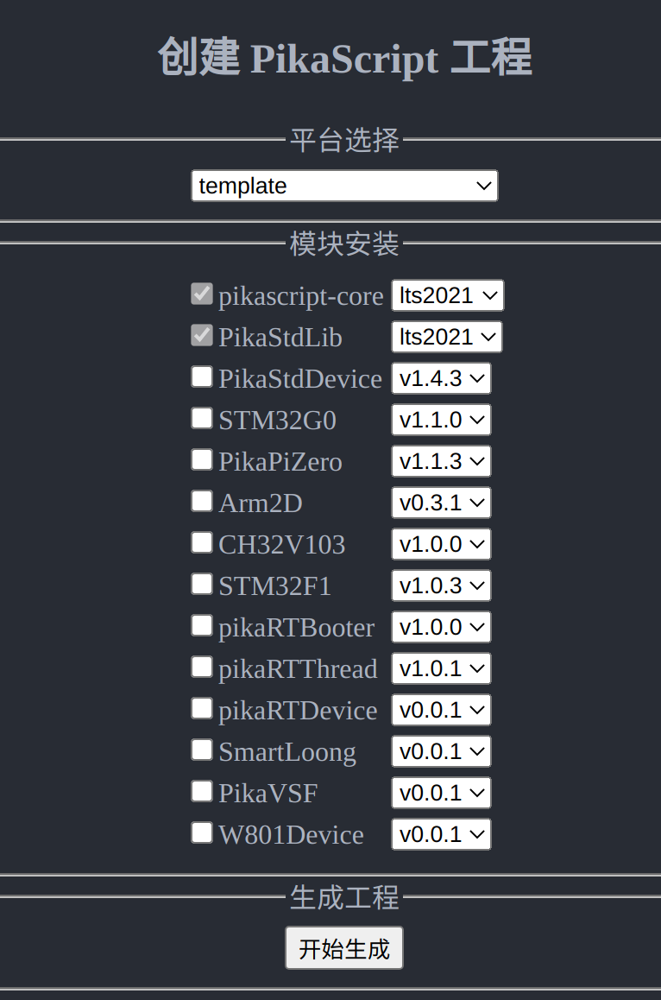
平台选择 template, 然后点击 “开始生成” 即可获取默认的 reqeustment.txt，main.py，和 pikaPackages.exe，在生成工程的同时，源码和工具就已经自动打包好了。
​

### 预编译模块
接下来运行 rust-msc-latest-win10.exe，将 main.py 和导入的模块预编译为 pikascript 的 api 文件，预编译后的文件在 pikascript-api 文件夹内。
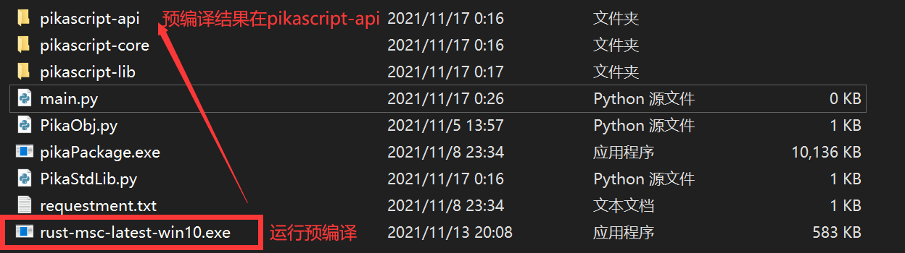
我们打开 pikascript-api 文件夹，发现里面有一些 .c 和 .h 文件，就说明预编译是成功的，pikascript 预编译器可以把 **python 模块**预编译为 .c 和 .h 文件。
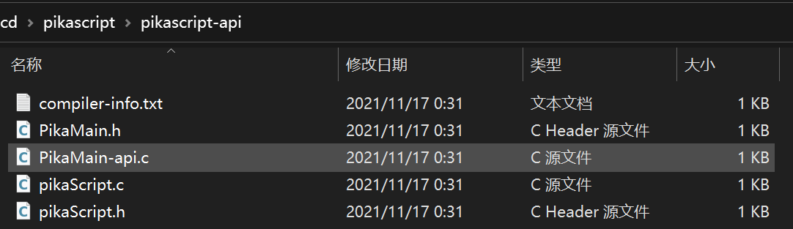

### 添加源码
在 Project 中新建三个 group ，建议命名为 pikascript-core, pikascript-api 和 pikascript-lib
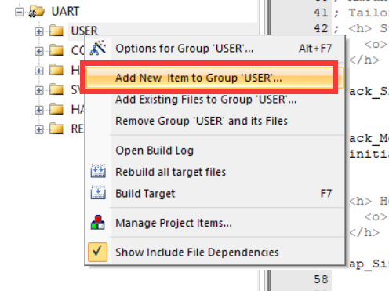
然后将 pikascript 文件夹内的三个子文件夹下的 .c 文件全部添加到 keil 工程里
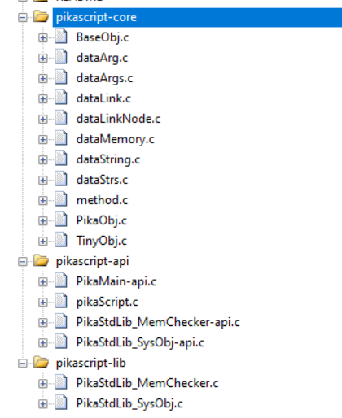
再然后为 pikascript-core 和 pikascript-api 文件夹添加 include 路径
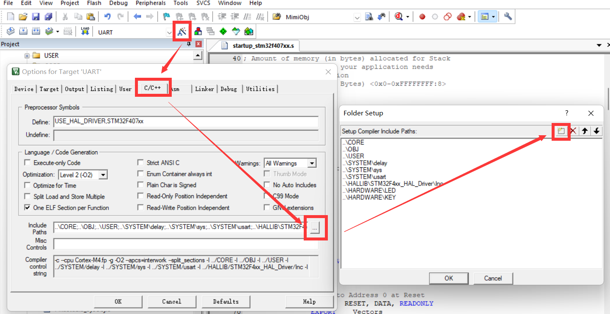
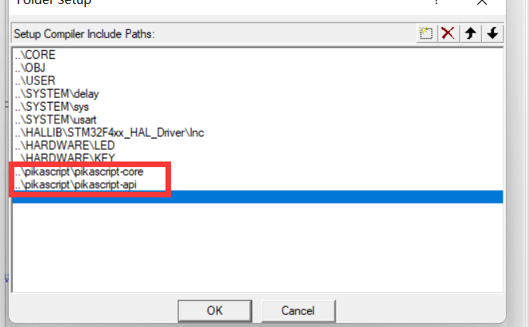

### 调整堆栈
打开工程的启动文件, 在 stm32 中, 这是一个 startup_stm32xxxx.s 的文件，而在其他平台上，你要自己弄清楚如何调整堆栈。
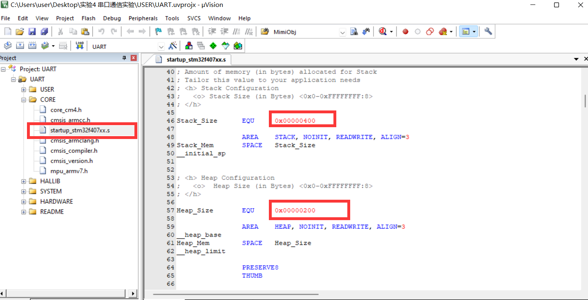
建议分配 4K 的栈空间和 16K 的堆空间，最少也需要分配 1K 的栈空间和 4K 的堆空间
4K 栈空间对应 0x1000, 16K 堆空间对应 0x4000，如下图所示
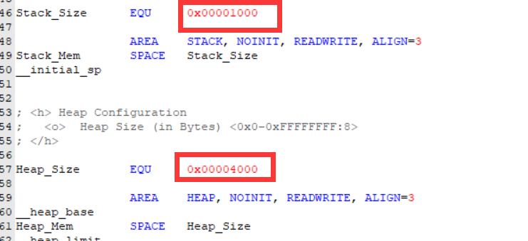

### 启动 PikaScript
在 main.c 的初始化代码中添加 PikaScript 的启动代码。

1. 添加头文件

在头文件中加入
```c
 #include "pikascript.h"
```


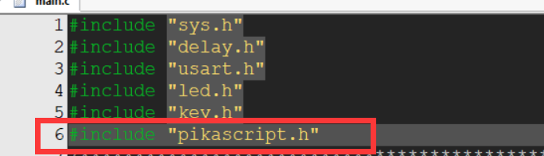

2. 初始化 pikaScript 并得到 pikascript 主对象的指针 pikaMain

在 main 函数中加入一句启动代码
```c
PikaObj* pikaMain = pikaScriptInit();
```
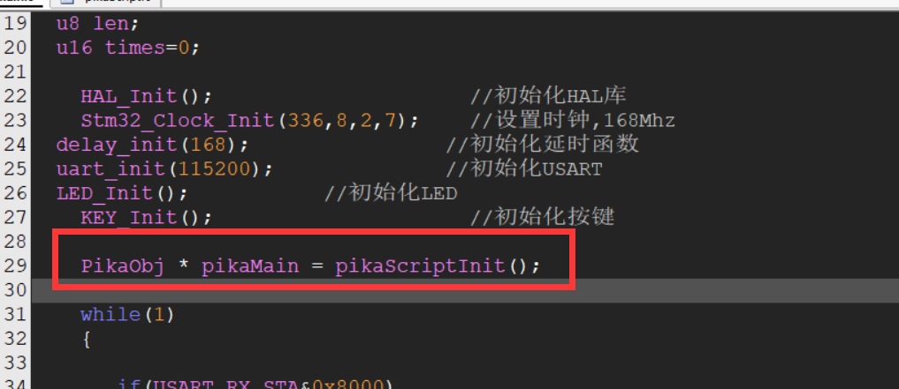
结束了？对，结束了，就这么简单，是不是很神奇。
这是因为预编译器在背后做了很多辅助工作，包括自动生成`pikaScriptInit()`函数。

### 编译源码
编译源码时需要勾选 C99 标准，而编译优化等级可以任意选择，pikascript 均支持。
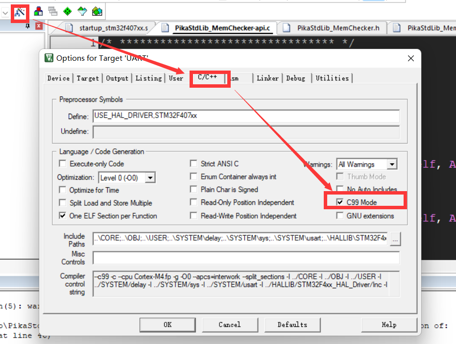
然后直接编译即可，一般来说是可以直接通过的，使用 compiler version 5 或者 compiler version 6 均可。
