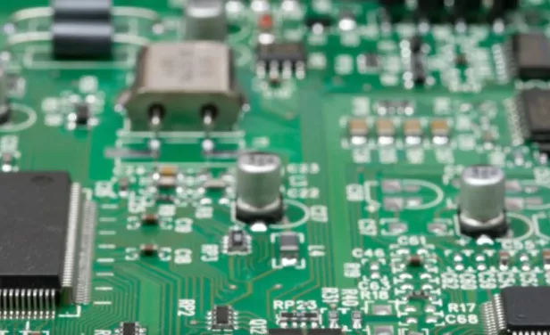
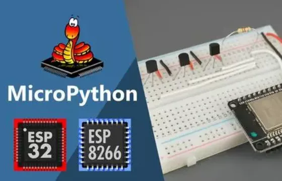
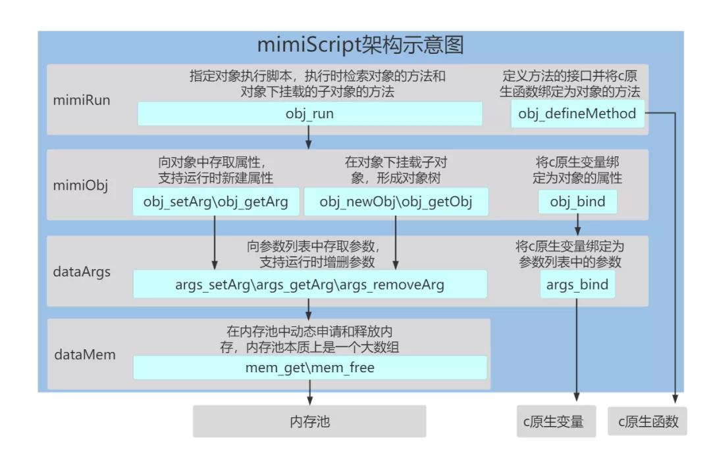
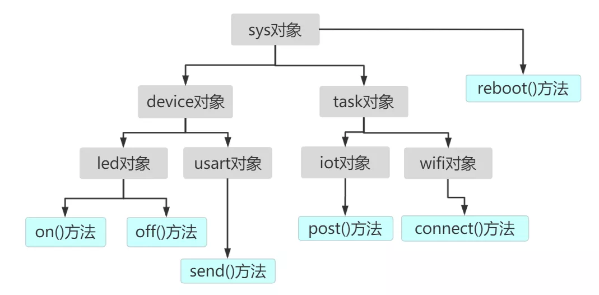
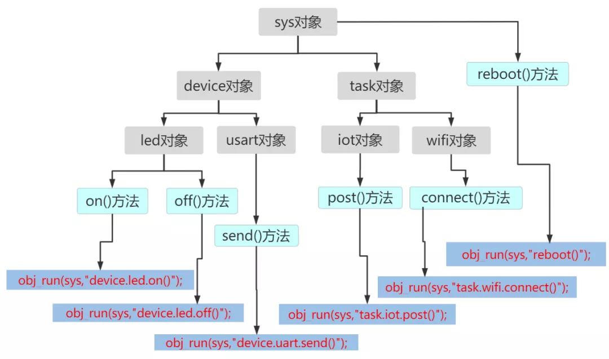
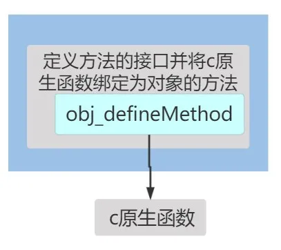
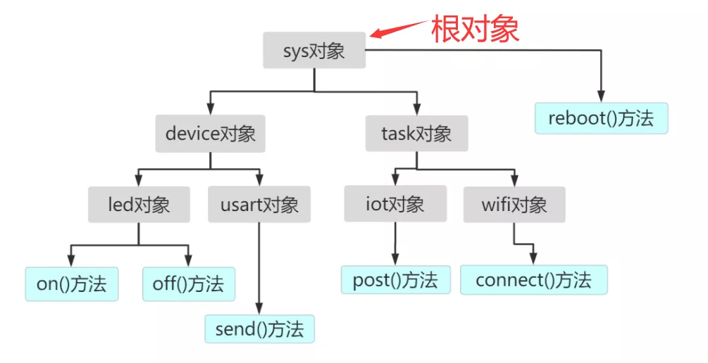

# 原理简介

**目录：**

一、引言 MCU与脚本语言

二、PikaPython 的原理解析

三、用 Pikascrip 点一个灯

四、用 PikaPython 实现一个加法函数

## 引言  MCU 与脚本语言
在 IOT、智能终端等嵌入式应用场景中，脚本开发是一个方便快捷的解决方案。



说到嵌入式使用脚本语言开发，可能首先想到的就是 micropython ， micropython 可以让工程师使用脚本语言 python 进行 mcu 开发，极大地降低了开发门槛。



但是使用 micropython 开发能够直接使用的开发板并不多，为没有现成 micropython 固件的 mcu 移植 micropython 显然也是一件工程浩大且门槛很高的工作。


而且 python 的运行效率较低，在资源紧缺的 mcu 中显得尤为明显，使用 python 开发也难以充分利用 mcu 的中断、 dma 等硬件特性。在高实时性的信号处理、数据采集、实时控制等应用中，python 难以成为真正落地于生产环境。

就目前而言，在 mcu 开发中，占 80% 左右的开发仍然是使用 c 语言，c++ 也仅占不到20%。

但是无疑脚本语言的便利性是非常明显的。服务器端的开发者往往熟悉 python 和 JavaScript 等支持面向对象的脚本语言，如果能够直接用脚本语言调用 mcu 的功能，将明显降低开发难度。

那么，如果使用 c 语言进行 mcu 嵌入式开发，又向上位机或者服务器提供面向对象的脚本语言调用接口，不就可以兼顾 mcu 运行效率和开发效率了吗？


本文介绍的 Pikasciprt 正是可以起到这样的作用。

Pikascrpit 库可以为 c 语言开发的 mcu 工程提供面向对象的脚本语言调用接口。PikaPython 有以下几个特点：

- 支持裸机运行，可运行于内存 4Kb 以上的 mcu 中，如 stm32f103 ，esp32。
- 支持跨平台，可运行于 linux, windows 环境，方便仿真开发。
- 代码可读性强，仅使用 C 标准库，尽可能的结构清晰（尽我所能），几乎不使用宏。

## PikaScript的原理解析

PikaPython 的架构示意图如下图所示。我们从上往下逐层分析。



### PikaRun 脚本运行层

PikaRun 脚本运行层是 PikaPython 的最上层调用接口，只需要调用 obj_run 就可以实现脚本运行。在调用 obj_run时，需要指定一个对象，脚本在运行时，会检索这个对象的方法和这个对象的子对象的方法。

下图所示的是一个常见的嵌入式开发中的对象结构，sys 是最上层的对象，sys 对象有 reboot() 方法，sys 对象下挂载了 device 子对象和 task 子对象，这两个对象下面又挂载了子对象，每个子对象有自己的方法。



这个时候，我们只需要在 `obj_run` 中传入最上面的 `sys` 对象的指针，就可以用如下图所示的方法调用所有对象的所有方法。其中，`reboot()` 方法直接属于 `sys` 对象，因此使用直接运行 `obj_run(sys, "reboot()")` 就可以调用，而 led 对象则通 过 `obj_run(sys, "device.led.on()")` 进行调用。



在实际开发中，我们可以让  mcu 将串口接收到的数据直接作为脚本运行。

例如：
```c
obj_run(sys, uartReciveBuff);
```

其中 uartReciveBuff 是串口接收到的数据。

这时向 mcu 的串口中发送 `"device.led.on()"` ，就可以点亮 led 灯。

### PikaObj 对象支持层

如上一节所述，我们已经知道如何使用 PikaPython 在已有的对象结构中执行脚本。那么下一个问题就是，如何构造对象，又如何为对象定义属性和方法呢？

**（1）构造器函数**

PikaPython 通过一个构造器函数来构造对象。一个构造器函数对应一个 PikaPython 中的类。如下所示的就是一个 LED 的构造器函数。在 PikaPython 中，所有的构造器函数都使用相同的入口参数和返回参数。

入口参数 args 是一个参数列表，args 内部基于链表，可以传入任意个数、任意类型的参数，此处 args 是构造器的初始化参数，在进行含参构造时将会用到。
构造器函数的返回值是一个 PikaObj 对象。

```c
PikaObj * New_LED(Args *args){
  // 继承自MimiObj基本类    
  PikaObj *self = New_PikaObj(args);    
  // 为对象定义属性    
  obj_setInt(self, "isOn", 0);    
  // 为LED1对象绑定on()方法    
  obj_defineMethod(self, "on()", onFun);    
  return self;
}
```

构造器的第一行代码用于类继承，`LED` 类继承自 `Pikaobj` 基类，`Pikaobj` 基类是所有类的源头。

`obj_setInt` 为 `LED` 类定义一个属性，属性名为`"isOn"`，初始值为`0`。



`obj_defineMethod` 为 `LED` 类绑定一个方法，绑定的方法为 `on()` 方法。`onFun` 是 `on()` 方法所绑定的 `c` 原生函数的函数指针。`onFun` 函数具体的编写方式在第三章和第四章中介绍。

**（2）构造对象**

构造对象有两种方法，一种是构造 `obj_run` 传入的对象，称为根对象，如下图中的 `sys` 对象，其他对象则是一般对象，挂载在根对象之下。

一般一个项目中只构造一个根对象。



`newRootObj` 函数用于构造根对象。构造根对象需要传入对象名 `"led"` 和构造器函数指针，`newRootObj` 的返回值是根对象的指针。

```c
PikaObj *led = newRootObj("led", New_LED);
```
一般对象的构造在父对象的构造器中完成，如果要在 `sys` 对象下挂载 `led` 子对象，就可以这样编写 `SYS` 类的构造器函数：
```c
PikaObj * New_SYS(Args *args){
    // 继承自MimiObj基本类
    PikaObj *self = New_PikaObj(args);
    // 通过LED类的构造器导入LED类
    obj_import(self, "LED", New_LED);
    // 使用LED类新建led对象，led对象作为sys对象的子对象
    obj_newObj(self, "led", "LED");
    return self;
}
```

`obj_import` 通过构造函数的函数指针导入一个类，上面代码中导入的类名为 `LED`。`obj_newObj` 通过导入的类新建对象，新建对象作为子对象挂载在当前类下。
这时，通过调用下面的函数，就可以得到一个挂载了 `led` 对象的 `sys` 根对象了。

```c
PikaObj *sys = newRootObj("sys", New_SYS);
```

### dataArgs 动态参数列表

`dataArgs` 是基于链表的动态参数列表，其结构体是 `Args`，`dataArgs` 在运行时动态地申请和释放内存，所以可以在运行时增删改查参数，`Pikaobj` 的属性和方法信息的存取均基于 `dataArgs` 参数列表实现。

`dataArgs` 支持整形、浮点型、字符串、指针类型的参数，也支持将原生的c语言变量绑定为 `dataArgs` 中的参数。

下面的例子是 `Args` 的基本使用方法。`dataArgs` 的实现原理会在后续的文章中介绍，在此文中不作重点。

```c
// 新建一个参数列表
Args *args = New_Args();
// 向参数列表中存入一个整形参数a，值为1
args_setInt(args, "a", 1);
// 取出参数a,值为1
int a = args_getInt(args, "a");
// 修改a的值为2
args_setInt(args, "a", 2);
// 再取出a,值为2
a = args_getInt(args, "a");
// 销毁参数列表
args_deinit(args);
```

### dataMemory

`dataMemory` 为 `dataArgs` 提供动态内存申请和释放，在此文中不做重点。

## 用PikaScript点一个灯

鲁迅曾说过：“点灯是嵌入式领域的hello world”。


那我们就点一点灯，看一看实际工程中 PikaPython 如何为 mcu 提供面向对象的脚本支持。

我们以 STM32 的 HAL 库为例，假设在管脚 PA8 上连接了一个 LED 灯，我们称之为 led1，PA8 拉高时灯亮，拉低时灯灭。

那么点亮灯 led1 需要使用下面的 c 语言代码：

```c
HAL_GPIO_WritePin(GPIOA,GPIO_PIN_8,SET)
```
我们希望使用如下的面向对象脚本更优雅地点灯~

```python
led1.on()
```

下面我们看看如何使用 PikaPython 实现这个需求。

### 编写一个 onFun() 函数。

```c
void onFun(MimiObj *self, Args *args){
    HAL_GPIO_WritePin(GPIOA,GPIO_PIN_8,SET);
}
```

这个函数将会被作为一个方法注册到脚本对象里面，注册之后就不会再由开发者在c语言开发中调用了，只会在脚本运行时被脚本解释器调用。

`onFun()`函数的入口参数有`self`和`args`，其中`self`是对象的指针，`args`是传入和传出的参数列表（在第四章会用到）。

在 PikaPython 中，所有被绑定为方法的函数都使用这两个入口参数。

### 编写LED1类的构造器。

```c
PikaObj * New_LED1(Args *args){
    // 继承自PikaObj基本类
    MimiObj *self = New_PikaObj(args);
    // 为LED1对象绑定on()方法
    obj_defineMethod(self, "on()", onFun);
    return self;
}
```

`obj_defineMethod` 用于将编写的 c 语言函数绑定为脚本对象的方法。这里将 c 语言的原生函数 `onFun()` 的函数指针作为参数注册进对象中，`"on()"` 字符串声明了脚本调用时的方法名和参数，此处 `"on()"` 方法没有参数，含参数的方法绑定在第四章介绍。

### 编写根对象的构造器。

```c
PikaObj * New_MYROOT(Args *args){
    // 继承自MimiObj基本类
    MimiObj *self = New_PikaObj(args);
    // 导入LED1类
    obj_import(root, "LED1", New_LED1);
    // 构造子对象"led1"，"led1"的类是"LED1"
    obj_newObj(root, "led1", "LED1");
    return self;
}
```

`obj_import` 通过构造函数的函数指针导入 `LED1` 类。
`obj_newObj` 通过导入的 `LED1` 类新建 `led1` 对象，`led1` 对象作为子对象挂载在 `MYROOT` 类下。

### 创建根对象并监听串口的输入数据。当获得整行数据后直接当作脚本执行。

```c
int uartReciveOk; //串口单行接收完成的标志位
char uartReciveBuff[256];// 串口接收到的单行数据
int main(){
    // 硬件的初始化代码略

    // 创建根对象
    PikaObj *myRoot = newRootObj("myRoot", New_MYROOT);
    while(1){
        // 串口已经接收到单行数据
        if(uartReciveOk){
            // 执行串口输入的单行数据
            obj_run(myRoot, uartReciveBuff);
            // 清除串口接收标志位
            uartReciveOk = 0;
        }
    }
}
```

这时只要向 mcu 的串口发送 `led1.on()`，灯就亮了（神奇不~）

## 用 PikaPython 实现一个加法函数。

上面的例子中的方法没有输入输出，下面的例子中，我们会定义一个 `TEST` 类，并为 `TEST` 类添加一个 `add` 方法，实现加法功能，看一看如何绑定一个带有输入输出的方法。

### 编写一个add()函数。

和上次 `onFun` 函数一样，这次被绑定的函数是 `addFun` 函数。
```c
void addFun(PikaObj *self, Args *args) {
    //取出输入参数
    int val1 = args_getInt(args, "val1");
    int val2 = args_getInt(args, "val2");
    //实现方法功能
    int res = val1 + val2;
    //将返回值传回参数列表
    method_returnInt(args, res);
}
```

`args_getInt` 用来从参数列表中取出整型参数，此处从参数列表中取出输入参数 `val1` 和 `val2`。参数列表还支持 `float` 类型、字符串类型和指针类型。

`method_returnInt` 用来传递方法的返回值，同样可以返回 `float` 类型、字符串类型和指针类型。

### 定义测试类的构造器

```c
PikaObj *New_PikaObj_test(Args *args){ 
    //继承MimiObj基本类
    MimiObj *self = New_PikaObj(args);
    //绑定方法
    obj_defineMethod(self, "add(val1:int, val2:int)->int", addFun); 
    return self;
}
```

这次用 `obj_defineMethod` 绑定一个带有输入输出参数的方法。

`"add(val1:int,val2:int)->int"` 是python的带类型函数声明语法，表示 `add` 方法有 `int` 类型的 `val1`、`val2` 两个输入参数，输出参数也是 `int` 类型。同样，传入 `addFun` 函数的函数指针。

### 编写根对象的构造器。

```c
PikaObj * New_MYROOT(Args *args){
    // 继承自PikaObj基本类
    PikaObj *self = New_PikaObj(args);
    // 导入TEST类
    obj_import(self, "TEST", New_PikaObj_test);
    // 构造子对象"test"，"test"的类是"TEST"
    obj_newObj(self, "test", "TEST");
    return self;
}
```

在根对象中挂载 `test` 子对象。

### 创建对象并测试运行脚本

```c
void main(){
    //新建根对象
    PikaObj *root = newRootObj("root", New_MYROOT);
    //运行脚本(也支持 "res = test.add(val1 = 1, val2= 2)"的调用方式)
    obj_run(root , "res = test.add(1, 2)");
    //从root 对象中取出属性值res
    int res = obj_getInt(root, "res");
    //销毁根对象
    obj_deinit(root);
    /* 打印返回值 res = 3*/
    printf("%d\r\n", res);    
}
```

`obj_run` 运行脚本后会动态新建 `res` 属性，该属性属于 `root` 对象。`obj_deinit` 用于销毁对象，所有挂载在 `root` 对象下的子对象都会被自动销毁。

本例中`root`对象挂载了`test`对象，因此在销毁`root`对象前，`test`对象会被自动销毁。

## 更方便的构造 class 和对象

通过编写构造器函数的方式实现一个 `class` 在还是略显麻烦，在实际开发中，PikaPython 提供了自动生成构造器函数的工具：**PikScript 预编译器**。

只要用 Python 的语法声明一个 `class` 就能自动连接到 C 的函数，详情请看 [C 模块-> 将 C 库制作为 Python 库](index_cmodule.html)
