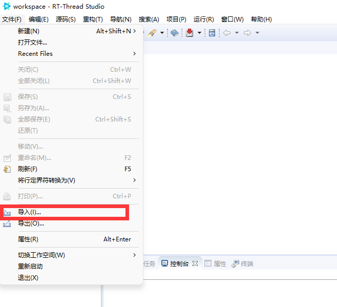
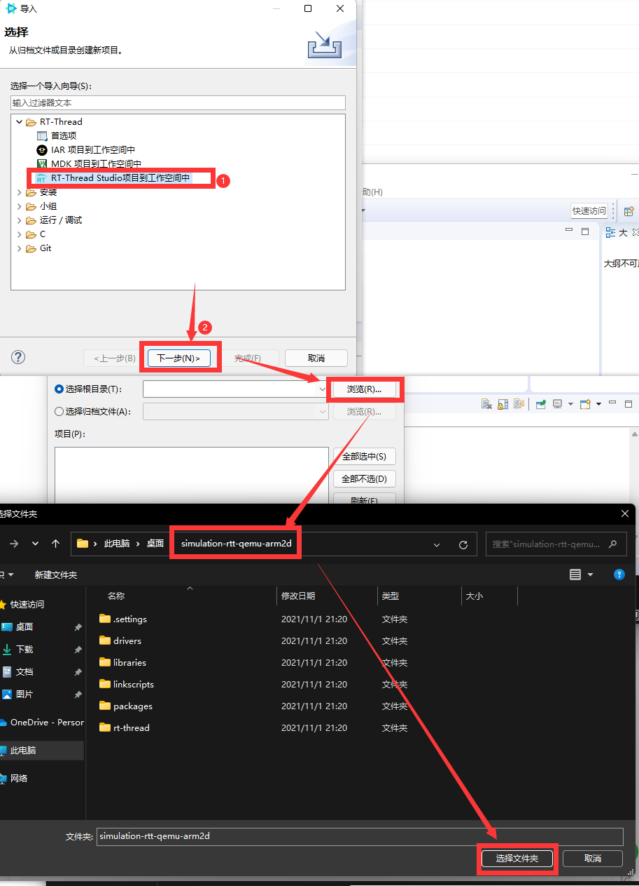
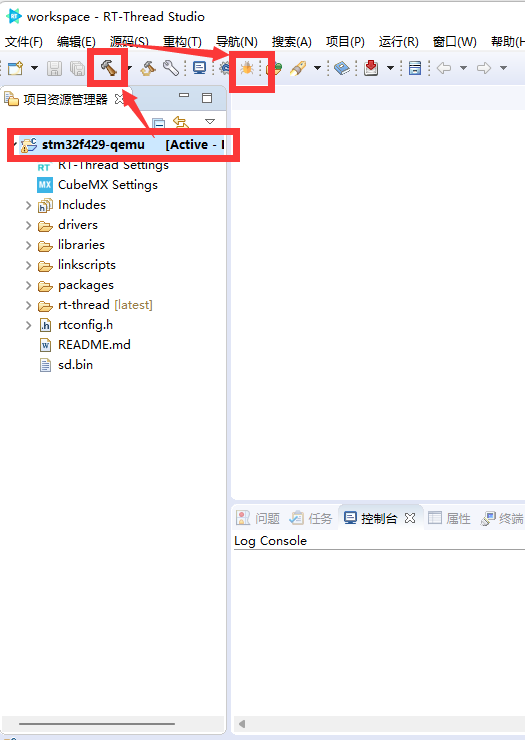
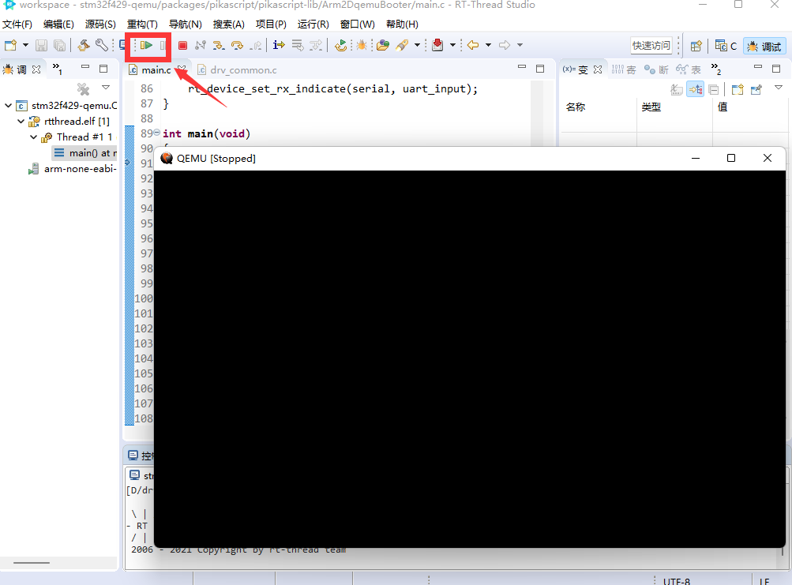
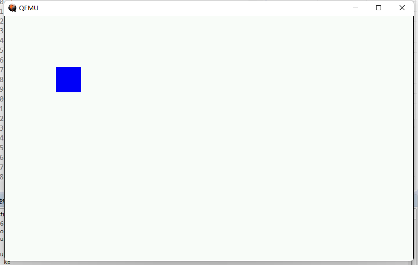
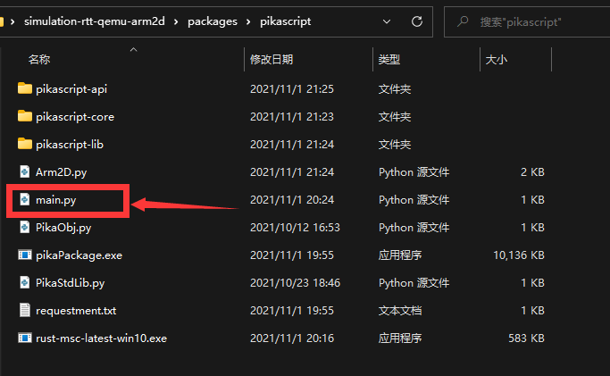
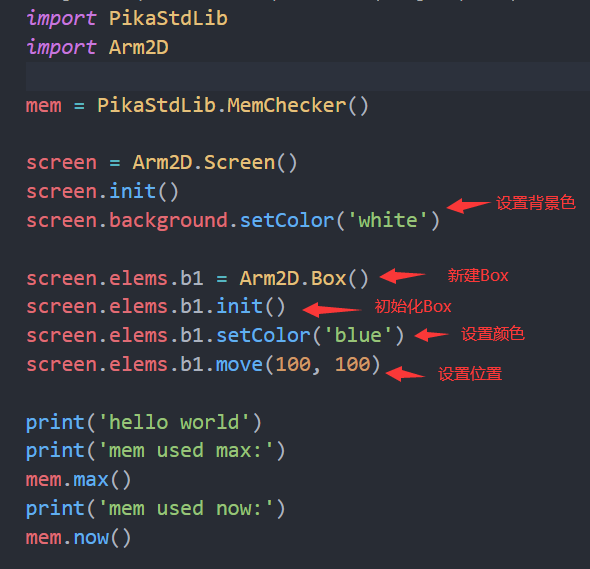
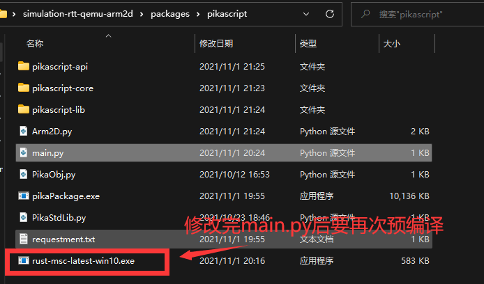
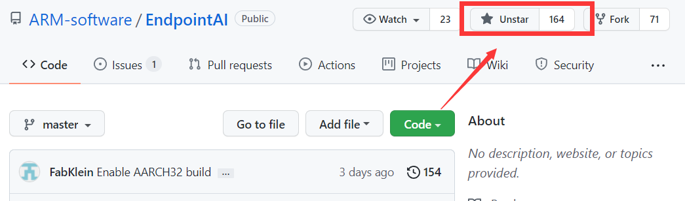

# 基于 ARM-2D 的 GUI 仿真工程

## 前言

好消息！ pikascript 的 Arm2D 模块以及仿真工程初步整理好了！pikaScript，ARM-2D，rt-thread 齐活儿，解锁python 玩 Arm2D 的新姿势！还不需要硬件，可以直接仿真，可以说是非常方便了。

在自己的电脑上部署运行这个仿真工程也非常简单，按照下面的几步操作就可以了~
## 获得仿真工程

进入 PikaScript 官网: http://pikascript.com ，然后平台选择 `sumulation-rtt-qemu-arm2d`，然后点开始生成即可得到工程。

## 安装开发环境

有了工程之后，还需要安装开发环境，需要安装的只有两个东西，一个是 rt-thread studio，用来做IDE，rt-thread studio 里面集成了 qemu，用来仿真 mcu 和 gui 非常方便。另一个是最新的 arm gcc 工具链。

### rt-thread studio 安装包链接

[https://download-sh-cmcc.rt-thread.org:9151/www/studio/download/RT-Thread Studio-v2.1.2-setup-x86_64_20210831-1200.exe](https://download-sh-cmcc.rt-thread.org:9151/www/studio/download/RT-Thread%20Studio-v2.1.2-setup-x86_64_20210831-1200.exe)

### arm gcc 安装包链接

[https://developer.arm.com/-/media/Files/downloads/gnu-rm/10.3-2021.10/gcc-arm-none-eabi-10.3-2021.10-win32.exe](https://developer.arm.com/-/media/Files/downloads/gnu-rm/10.3-2021.10/gcc-arm-none-eabi-10.3-2021.10-win32.exe)

rt-thread studio 装在你喜欢的地方就可以，arm gcc 要装在默认的c盘。

装好之后，就可以开始用 python 玩 arm-2d 了。

## 运行

我们打开 RT-Thread Studio，点击导入

然后选择 simulation-rtt-qemu-arm2d 文件夹

选择工程，然后点锤子编译，再点虫子进入仿真

这时会弹出一个 QEMU 的框，然后点击运行。

运行成功的话，就可以看到白色背景上有一个蓝色的小方块了。到此为止部署就成功了。

## 修改python代码试试

python 的源码就在 simulation-rtt-qemu-arm2d/packages/pikascript/main.py 里面，可以打开看看~

下面就是 main.py 的内容，新建了一个 box 对象，然后设置了颜色和位置，你可以试着修改颜色为 'red' 或者改一下坐标看看，也可以新建另一个 screen.elems.b2 试试。

每次修改完后要记得预编译，才能把 python 转为工程里的 .c 文件

然后再编译，进入仿真，就可以看到效果了。这次我把方块改成了红色。

## 结语

这是 Arm-2D 的仓库~ 还没 star 的同学记得补个 star~

[https://github.com/ARM-software/Arm-2D](https://github.com/ARM-software/Arm-2D)

感谢 liuduanfei 大佬提供的 rtt-Arm2d-qemu 仿真工程~ 下面是 liuduanfei 大佬的 github 主页

[https://github.com/liuduanfei](https://github.com/liuduanfei)
