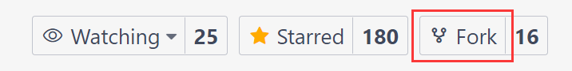

# 如何贡献 PikaScript 模块
## 帮助完善已有的模块


### 拉取最新的模块

- 在向已有的模块添加新的内容时，请确保已经拉取了最新的模块。

- 拉取最新的模块的方法是在 requestment.txt 中使用 latest 版本。

例如：
```
STM32G0==latest
```

- **删除 reqeustment.txt 中需要开发的模块**，防止误操作（比如再次拉取模块）导致正在开发的模块被覆盖掉。
### 修改模块并测试

- 为模块添加新的 Python 接口 --> [module].pyi
- 或者提供更好的实现 --> pikascript-lib/[module]/*.c

- （可选）在 pikascript/README.md 和 pikascript/README_zh.md 中更新模块信息。

### 提交模块的文件
   - fork 一份 pikascript 仓库，然后 clone 到本地。



   - 复制 [module].pyi 到 pikascript-lib/[module] 文件夹中。
   - 复制整个修改后的 pikascript-lib/[module] 文件夹到 fork 后的 pikascript/package 文件夹中。
   - git add 添加文件，并 git commit 提交一次。
   - git log 查看提交后的 commit id，在 fork 后的 pikascript/packages.toml 中填写新的版本名，并复制当前的 commit id。

例如：

```
[[packages]]
name = "STM32G0"
releases = [
  "v1.0.2 0052a28582ac8a85cc48e1d676d9a3be5cb1b93f",
  "<新的版本名> <当前的commit id>",
]
```

   - git commit -a再提交一次，添加packages.toml的修改。
   - git push到你fork后的仓库中。
   - 提交pull request。


## 提交新的模块

- 新建 [module].pyi 文件和pikascript-lib/[module]文件夹。
- 开发和测试新的模块。
- （可选）在 pikascript/README.md 和 pikascript/README_zh.md 中更新模块信息。
- 提交模块的文件
   - fork一份pikascript仓库，然后clone到本地。


   - 复制 [module].pyi 到pikascript-lib/[module]文件夹中。
   - 复制整个pikascript-lib/[module]文件夹到fork后的pikascript/package文件夹中。
   - git add 添加文件，并git commit 提交一次。
   - git log 查看提交后的commit id，在fork后的pikascript/packages.toml中新增新的模块，填写模块名、版本名和当前的commit id。

例如：

```
[[packages]]
name = "<新模块名>"
releases = [
  "<新的版本名> <当前的commit id>",
]
```

   - git commit -a再提交一次，添加packages.toml的修改。
   - git push到你fork后的仓库中。
   - 提交pull request。


