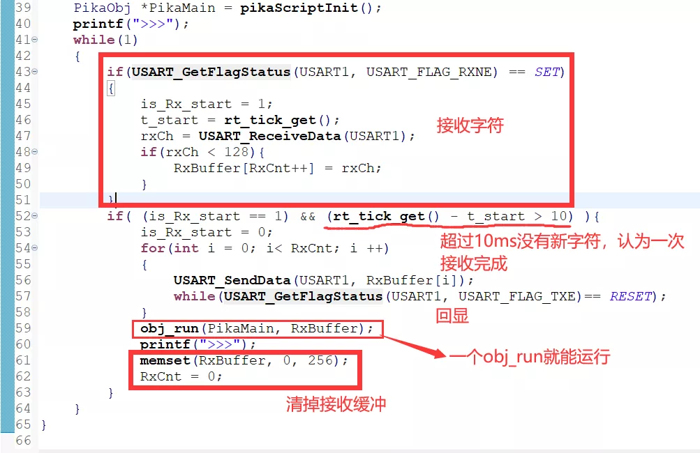

# 支持交互式运行

PikaScript 支持直接读取字符串运行 Python 脚本，因此支持交互式运行只需要制作一个串口接收驱动。

## 方案一：按字节读取运行（推荐）

### 实现一个阻塞的字节读取函数

交互式运行需要一个读取用户输入字节的底层接口 `__platform_getchar()` ，这个接口是一个 weak 函数，用户需要在自己的代码里面也实现一个 `__platform_getchar()` 来覆盖这个weak函数。

weak 函数原型在 PikaPlatform.c 里面，如果用户没有覆盖，就会在使用交互式运行时报错。

``` c
/* PikaPlatform.c */
PIKA_WEAK char __platform_getchar(void) {
    __platform_printf("[error]: __platform_getchar need an implement!\r\n");
    while(1){
    }
}
```

用户可以直接在工程的 main.c 里面实现一个```__platform_getchar()```。

如果平台本身支持 ```getchar()``` ，那么可以直接接入平台的 ```getchar()```。

``` c
/* main.c */
char __platform_getchar(){
    return getchar();
}
```

如果平台不支持，就需要自己实现，注意要实现一个**阻塞**的 ```getchar()```，也就是说，当没有串口输入字符时，要在 ```__platform_getchar()``` 中等待，有输入时返回一个字符。
例如：

``` c
/* main.c */
char __platform_getchar(){
    char res = 0;
    while(rx_char == 0){
    };
    res = rx_char;
    rx_char = 0;
    return res;
}

```
### 启动 PikaScript Shell，直接运行 `pikaScriptShell()` 即可启动交互运行。

```pikaScriptShell()``` 入口参数是 pika 的根对象，运行 ```pikaScriptInit()``` 就能创建一个根对象。

``` c
 pikaScriptShell(pikaScriptInit());
```

### 示例代码

stm32g070cb: [https://gitee.com/Lyon1998/pikascript/blob/master/bsp/stm32g070cb/Booter/main.c](https://gitee.com/Lyon1998/pikascript/blob/master/bsp/stm32g070cb/Booter/main.c)

rt-thread: [https://gitee.com/Lyon1998/pikascript/blob/master/package/pikaRTThread/rt_pika.c](https://gitee.com/Lyon1998/pikascript/blob/master/package/pikaRTThread/rt_pika.c)

### 注意事项：

- 内核版本需要不低于v1.3.0

- 强烈建议使用putty作为串口终端。


## 方案二：按字节输入运行

` obj_runChar ` 内核 API 可以指定一个对象执行脚本，且输入为一个字节。

在使用 `obj_runChar` 前，需要先运行 `obj_runCharInit()` 。

示例代码：

``` C

PikaObj* pikaMain = pikaScriptInit();

obj_runCharInit(pikaMain);

while(1){
    char ch = my_get_char();
    obj_runChar(pikaMain, ch);
}

```

### 注意事项：
内核版本需要不低于v1.8.3

## 方案三：整行输入运行

`obj_run` 内核API可以指定一个对象执行脚本，使用这个API可以执行**单行**或者**多行**的脚本。
下面以CH32的交互式运行驱动为例，这个交互式运行的支持写在固件的主循环内，在 `pikaScriptInit()` 初始化脚本执行完毕之后，开始执行。


### 驱动的内容

- 轮询接收字符，存入缓冲区。

- 当超过10ms没有新的字符接收时，认为一次接收完成。

使用空闲时间来判断字符串的传输完成就可以支持交互式运行多行脚本了。如果只需要运行单号脚本，则可以使用换行符 `'\n'` 来判断字符串接收结束。在运行单行脚本时，可以不带 `'\n'` 换行符，多行脚本需要带 `'\n'` 换行符。`"\r\n"` 形式的换行符也是支持的。

- 接收完成后回显接收到的字符串。

- 使用 `obj_run` 内核API执行脚本。

指定的对象是 `pikaScriptInit()` 初始化脚本创建的根对象，执行的内容是接收到的字符串。

- 清理接收缓冲区。

### 注意事项：

-  内核版本需要不低于v1.2.6
-  在执行多行脚本时，需要传入完整的代码块

例如：下面的脚本是完整的代码块，尤其需要注意的是第4行，需要有一个缩进为0的行，用来标志代码块的结束。以及最后一行需要有一个空行，这意味着 `print('the end')` 这行脚本末尾带有换行符。

``` python
while a < 10：
	a = a + 1
    print(a)
print('the end')
(空行)
```
以下的例子也是可以的
``` python
while a < 10：
	a = a + 1
    print(a)
(空行)
```
以下的例子是不行的
``` python
# 缺少最后的换行符
while a < 10：
	a = a + 1
    print(a)
```

```python
# 缺少while代码块的内容
while a < 10：

```


## 退出交互运行

输入 `exit()` 即可退出交互运行，即可退出交互运行。
