# C 模块裁剪

PikaPython 模块，除了 PikaStdLib 标准库之外，其他所有的**模块都支持一键裁剪**

如下图中的 CH32V103 驱动模块，不需要的模块可以直接裁剪掉，那如果一个模块中有几个类是需要用的，可以按类进行精细裁剪吗，这也是可以的，后面会介绍。

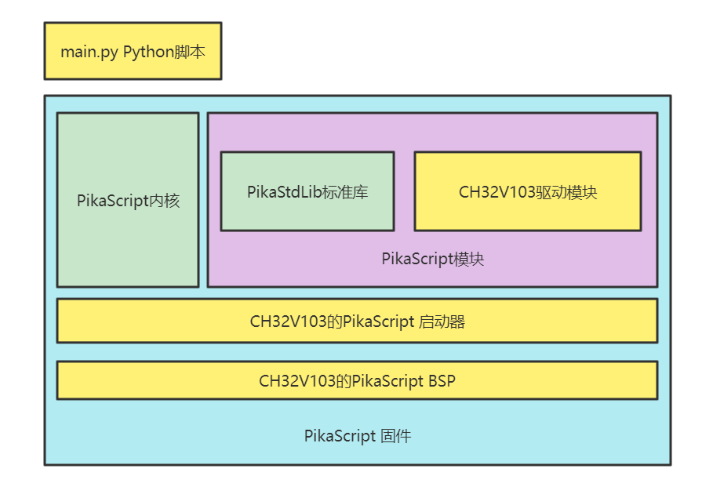

### 按照模块进行裁剪
按照模块进行裁剪非常简单，只要在 main.py 中删除 import 语句即可，没有被导入的模块会被预编译器自动裁剪。

以 stm32g030c8 的工程为例，默认的 main.py 是如下所示：

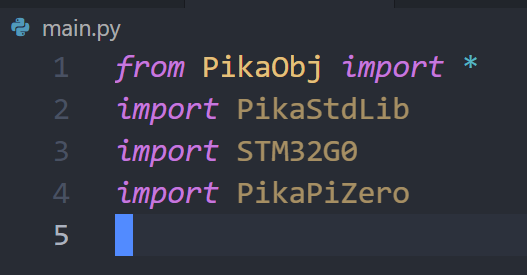

第一行是导入基础对象，基础对象由内核提供，不占用模块空间，不用裁剪。

第二行是标准库，不能裁剪。

而第三行 STM32G0 芯片模块和第四行 PikaPiZero 开发板的板上资源模块都是可以裁剪的。

编译运行，看到代码体积是 48k+3k，**51K**左右。

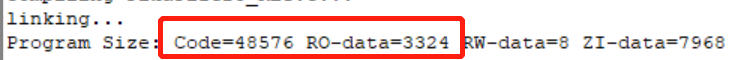

取消导入 PikaPiZero 模块

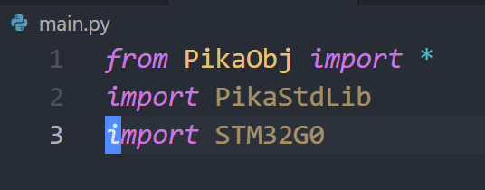

再进行预编译和编译后的结果：

可以看到代码体积减少了到了 **46K**，说明模块裁剪成功。

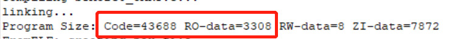

再取消导入 STM32G0 模块

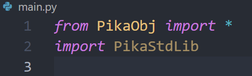

代码体积减少到了 **36K**

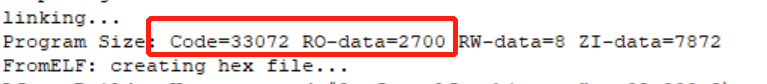

### **按照类进行裁剪**

使用模块的**继承**功能，就可以按照类进行精细裁剪。

在 main.py 中**直接导入**的模块，处于**运行时随时可用**状态，因此**所有的**类都会被添加进工程。

而被其他文件**间接导入**的模块，预编译**能够判断哪些是不会被用到的**，因此只有**用到的**类会被添加进工程。

这样，我们就可以**新建一个模块**，从需要用到的模块里面**继承**所需的类，再只导入新建的模块，就可以裁剪掉模块里不需要用到的类了。

例如，STM32G0 中有 GPIO、Time、ADC、UART、PWM、IIC、lowLevel 7 个类，而我只用到了 GPIO 这个类。

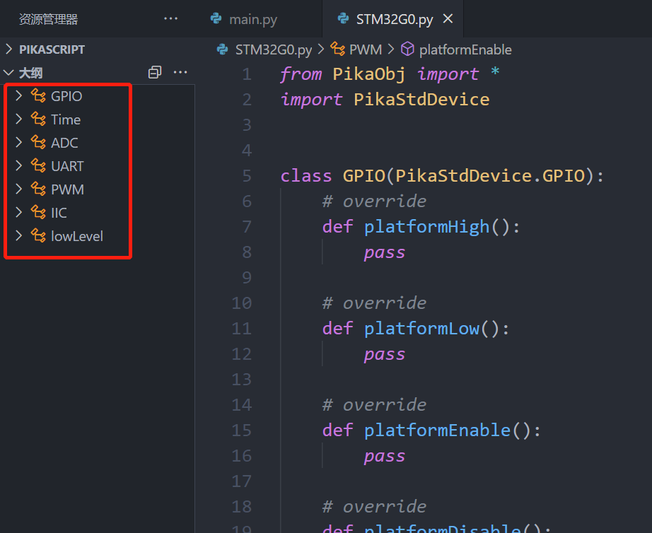

就可以新建一个 myDevice 模块，然后从 STM32G0 中只继承 GPIO 类。

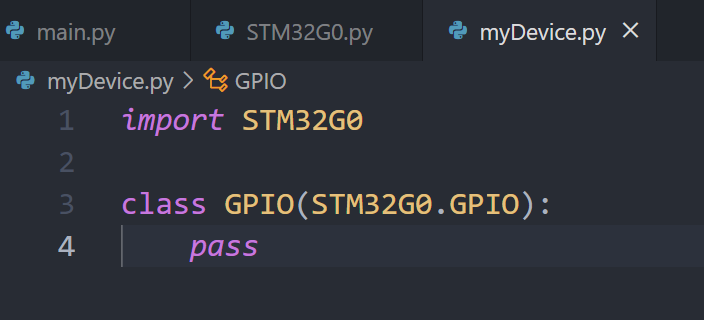

然后将 main.py 中 import STM32G0 改为 import myDevice

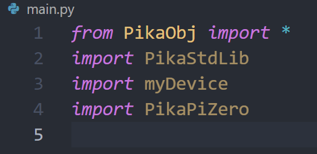

可以看到，和使用完整的 STM32G0 模块相比，代码体积减少到了 **43K**

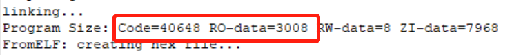

