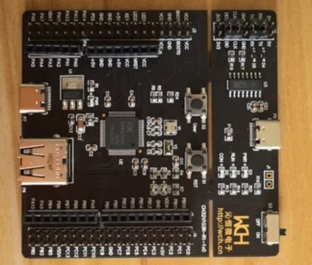
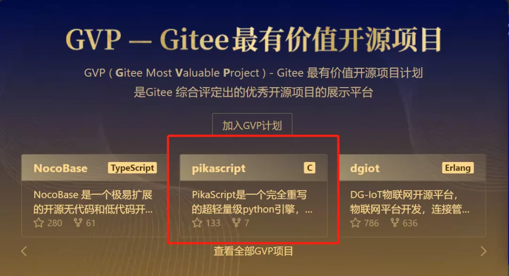
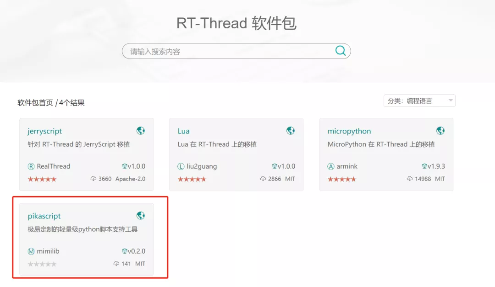
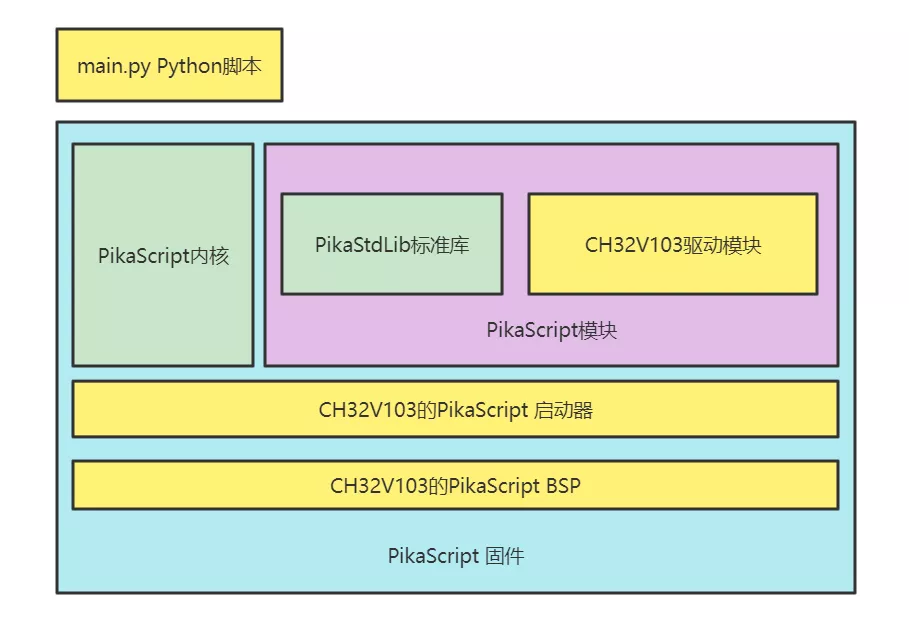
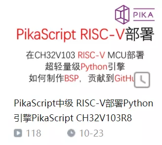
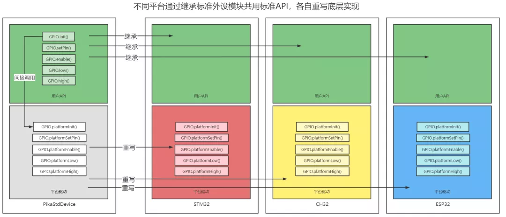
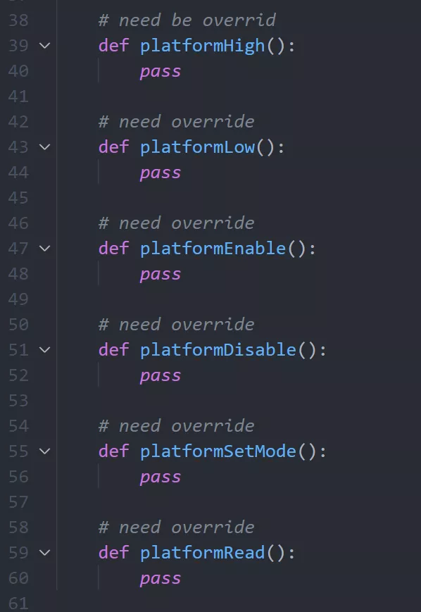
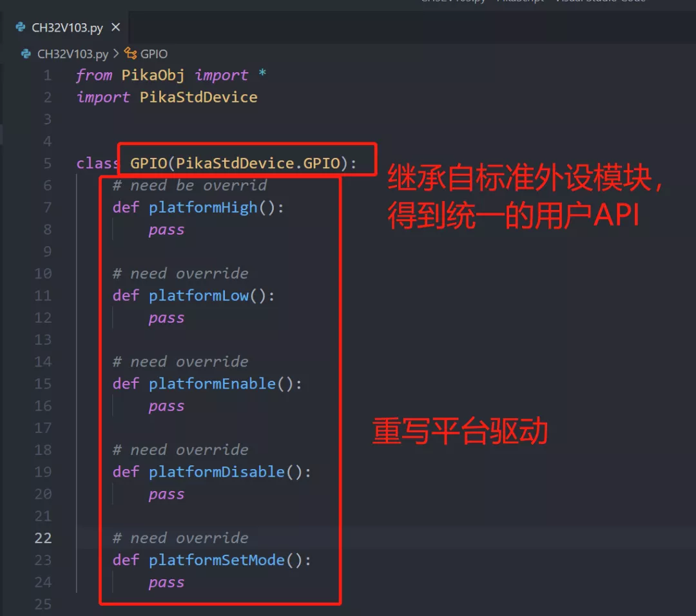
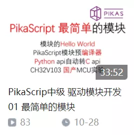
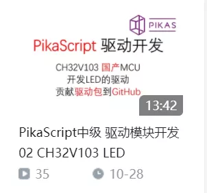

# 沁恒 RISC-V 模块开发实战

前言：
这是一个RTT设计大赛的参赛项目，实现了在CH32V103 RISC-V平台，基于rt-thread完成了PikaScript Python引擎的部署。
项目网页：
[http://www.elecfans.com/project/938](http://www.elecfans.com/project/938)​
（网页中还包含了视频展示）

下面是项目介绍的正文：
​

项目简介
PikaScript是一个完全重写的超轻量级python引擎，具有完整的解释器，字节码和虚拟机架构，可以在少于4KB的RAM下运行，用于小资源嵌入式系统。相比同类产品，如MicroPython，LuaOS等，资源占用减少85%以上。入选2021年度 Gitee最有价值开源项目，加入RT-Thread嵌入式实时操作系统编程语言类软件包。在CH32V103 RISC-V开发板上完成了PikaScript的部署，并为CH32V103提交了PikaSciprt标准BSP和驱动模块包，并完成了交互式运行的驱动。

**RT-Thread使用情况概述：**
整个方案涉及的技术栈有：RT-Thread线程和定时器， 编译原理、字节码设计、虚拟机设计、PikaScript部署技术和驱动模块开发技术等等。通过这个作品，扩充了PikaScript的BSP支持列表，验证了PikaScript和rt-thread的兼容性，验证了PikaScript在小容量(64Kb)RISC-V架构的部署能力和兼容性。
内核部分：使用了线程、定时器 。
**软件包：**

PikaScript软件包
​

硬件使用了RTT大赛提供的CH32V103开发板，使用了板上的LED资源用于指示脚本运行状态，为GPIO硬件开发了Python脚本模块，用于测试脚本驱动拓展功能。

**软件说明**
**0.摘要**
​

PikaScript是一个完全重写的超轻量级python引擎，具有完整的解释器，字节码和虚拟机架构，可以在少于4KB的RAM下运行，用于小资源嵌入式系统。相比同类产品，如MicroPython，LuaOS等，资源占用减少85%以上。
入选2021年度 Gitee最有价值开源项目，加入RT-Thread嵌入式实时操作系统编程语言类软件包。

本项目在CH32V103 RISC-V开发板上完成了PikaScript的部署，为CH32V103提交了PikaSciprt标准BSP和驱动模块包，并完成了交互式运行的驱动。

**1.方案选型——CH32V103运行Python脚本，并不好办**
首先我们需要选择一个能够在CH32上运行的嵌入式Python解释器。

能够在flash为64Kb的RISC-V MCU上部署Python解释器，需要有极小的编译体积，还不能依赖于ARM架构的独享技术。
首先排除通用Python解释器CPython，不说CPython需要依赖linux，单是体积就可以排除。

其次在嵌入式领域大火的MicroPython技术是有可能选用的备选项，但是MicroPython在ARM平台需要最少128Kb的体积，而RISC-V平台的GCC编译器优化成熟度不如ARM平台，所以编译体积只会更大不会更小，所以MicroPython不能在本次的CH32V103平台部署。
​

好了，不卖关子了，能够在CH32V103平台部署的Python解释器，只有我目前在开发的PikaScript超轻量级Python解释器，（如果还有其他方案，请批评指正，我麻溜修改）。虽然相对于MicroPython，PikaScript没有那么完整的标准库支持，但基本的运行时对象、控制流、交互式运行都是可以实现的，且PikaScript的跨平台能力非常好，在极限的依赖管理策略下，PikaScript只依赖LibC，在任何平台都几乎没有依赖缺失问题，或许还能够运行在FPGA软核中（理论上可行，未验证）。

另外感谢Gitee提供的开源平台，PikaScript刚刚被Gitee评委大佬们选入GVP——最有价值开源项目，所以如果你现在打开Gitee首页，大概率可以看到PikaScript的金色牌牌。

PikaScript还入选了rt-thread软件包，rt-thread真的是非常有活力的开源社区

PikaScript严苛的依赖管理策略，使得部署非常轻松，这是跨平台，易部署的特点。但是单纯的易部署并没有什么用，如果难以拓展功能，就只是一个花瓶而已。我们知道在MCU开发领域，一直是C语言的天下，C语言的生态占据MCU开发的80%以上，大部分MCU都有厂家提供的C语言开发套件，因此MCU平台的Python解释器，最重要的拓展手段，就是绑定C语言的原生库，将C语言库绑定为Python模块，这通常被称为Python的C模块。
​

为MicroPython绑定C语言模块与通用的CPython类似，需要将C库编译为静态库，再进行链接，链接时需要手动注册许多全局表，且制作C模块的过程中需要使用大量linux平台独有的工具，这对于以Windows平台开发为主的MCU工程师来说，门槛很高。
​

而PikaScript可以在MCU工程师熟悉的Windos平台完成C模块的开发，通过自研的模块预编译器，能够自动完成模块的注册工作，C模块的开发者需要提供的仅仅是一个用Python写成的模块的调用API而已，预编译器会自动将这个Python文件预编译为C文件，完成模块的链接和注册。而只要使用正确的命名，原生的C的函数就能够被自动注册进模块中，供解释器调用，也不需要编译静态库。
​

让PikaScript在CH32V103跑起来，意思也就是开发一个能在CH32V103运行的PikaScript固件。
​

我们先看一下一个PikaScript固件有哪些部分。

在图中标注黄色的部分是我们需要制作的，而绿色部分是跨平台的，我们只需要拉取源码进行编译即可，不需要修改。

从下往上看，首先是需要一份PikaScript的BSP，BSP也就是板级支持包，这通常只要将厂商提供的MCU的标准库稍加整理即可获得。然后是PikaScript的启动器，这包含了固件入口main.c，以及基本的设备初始化代码，包括对printf的支持。

有了BSP和启动器，就已经可以运行PikaScript的固件了，只不过还只能使用PikaScript提供的标准库功能和Python的基本语法，还不能使用MCU上搭载的外设资源。

为了使用CH32V103的外设资源，我们还需要开发CH32V103的驱动模块，在这个项目中，我们开发了GPIO的驱动模块和基于rt-thread tick定时器的延时模块。
​

最上层的就是我们要运行的Python脚本了，模块预编译器也可以处理Python脚本，根据脚本中导入的模块来自动裁剪固件，在脚本中没有import的固件会被自动裁剪掉，我们可以在main.py中选择要加入固件的模块，以及编写系统初始化后最先运行的Python脚本，将其烧录进固件中。

**2.制作BSP和启动器——先跑起来再说**
BSP通常是用芯片的原厂提供的例程制作的，在这个项目中，我们就使用CH32V103的官方例程中的uart_printf和MounRiver River Studio生成的rt-thread模板来制作。完成了对rt-thread模板的一些剪裁之后，再加入printf的初始化函数，对项目稍作整理，BSP部分就完成了。
​

PikaScript的启动器的制作也比较简单，在main.c中添加#include “pikaScript.h”并调用pikaScriptInit()函数即可启动PikaScript。pikaScript.h和pikaScriptInit()都是由预编译器自动生成的，在制作启动器之前，需要拉取PikaScript的源码。

PikaScript官方(其实就是我自己)提供了一个包管理工具，只需要编写requestment.txt，就可以从gitee中自动拉取相应版本的源码和模块。在拉取内核源码时，预编译器也会自动被拉取下来，我们在main.py中写入import PikaStdLib，然后用我们使用拉取下来的预编译器进行预编译，就能得到pikaScriptInit()函数了。
​

包管理工具不仅可以拉取内核，还可以拉取模块，也就是说我们自己制作的CH32V103的驱动模块，也可以挂到PikaScript模块库中，进行自动拉取。
​

BSP和启动器的制作我录制了一个视频教程，想要了解细节或者想自己制作BSP的大佬可以看视频了解。
https://www.bilibili.com/video/BV1Cq4y1G7Tj

**3.制作CH32V103的驱动模块**
​

接下来我们制作CH32V103的驱动模块，使得CH32V103上面的外设资源能够被Python脚本调用到。
​

在这个项目中，我们制作了一个PikaScript的标准设备驱动，什么是标准设备驱动呢？我们先从其他的脚本技术说起，比如MicroPython，并没有统一的外设调用API，这使得用户在使用不同的平台时，都需要重新学习API，比如下面这个是MicroPython在STM32F4平台驱动GPIO的代码。

这个是ESP8266的

可以明显看到在选择pin的管脚时，一个用的是字符串，而另一个用的是整型数，驱动的API标准很混乱。

有没有什么办法，能够统一外设的API，使得用户只需要熟悉一套API，就能够在任意平台通用呢？

方法是有的，就是PikaStdDevice标准设备驱动模块！

PikaStdDevice是一个抽象的设备驱动模块，定义了所有的用户API，而各个平台的驱动模块只要从PikaStdDevice继承，就能够获得一模一样的用户API，而PikaStdDevice内部会间接调用平台驱动，通过多态特性重写底层的平台驱动，就可以在不同的平台工作了！
​

以GPIO模块为例，以下是PikaStdDevice定义的用户API
​

以下是PikaStdDevice需要重写的平台驱动
​

而我们要制作的CH32V103的GPIO模块，就从标准驱动模块中继承。
​

通过这个方法，我们就可以让STM32的驱动模块、CH32的驱动模块、ESP32的驱动模块有着一模一样的用户API！用户只要熟悉了一套API，就可以轻松使用支持了PikaScript标准驱动模块的所有平台！这才是真正的跨平台！
​

下面是部分被注册在驱动模块里面C原生驱动函数
​

驱动模块的开发，我也制作了两个视频，供想要了解细节的大佬们参考。
https://www.bilibili.com/video/BV1aP4y1L7pi
https://www.bilibili.com/video/BV1Jr4y117Z8

**4.支持交互式运行**

PikaScript不依赖文件系统，只要传入字符串就可以运行，所以只要制作支持字符串读取的串口驱动，就可以支持交互式运行了！
下面是本项目中支持交互式运行的驱动代码。

**5.main.py初始化脚本**​

最后我们编写一段用Python写成的初始化脚本，在固件启动后运行，初始化GPIO，并且获得一个系统对象，用于提供延时功能。在初始化结束后，led闪烁10次，并打印hello pikascript！

编写好初始化脚本后，用预编译器就可以集成在固件中了。

下面是预编译器生成的初始化函数
​

项目地址：

PikaPython-CH32V103参赛项目仓库：

https://gitee.com/lyon1998/ch32v103-pika

PikaScript总仓库：

https://gitee.com/lyon1998/pikapython

https://github.com/pikastech/pikapython
