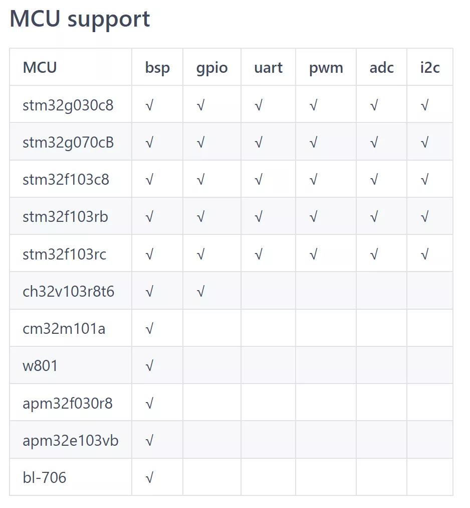
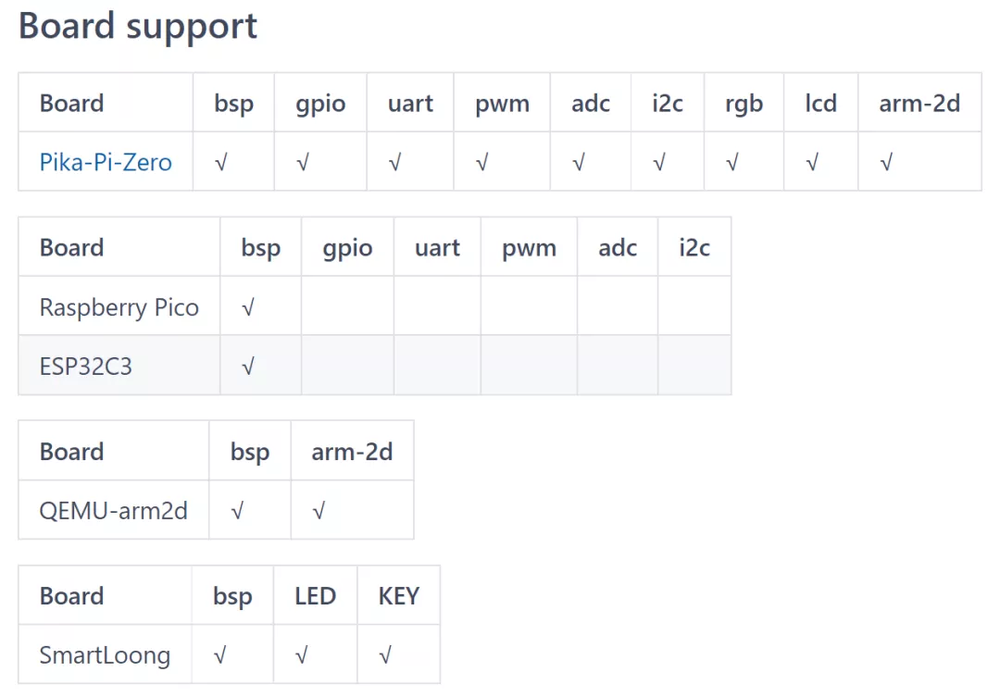
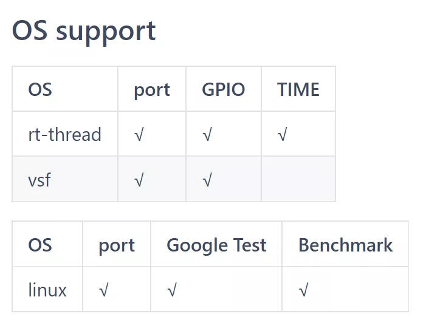
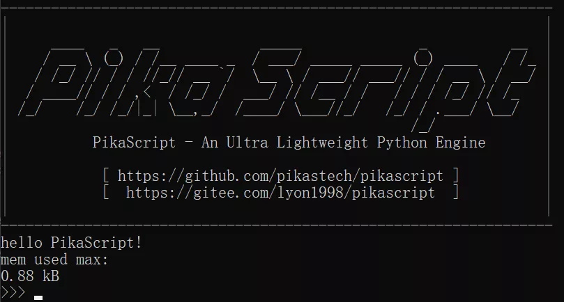
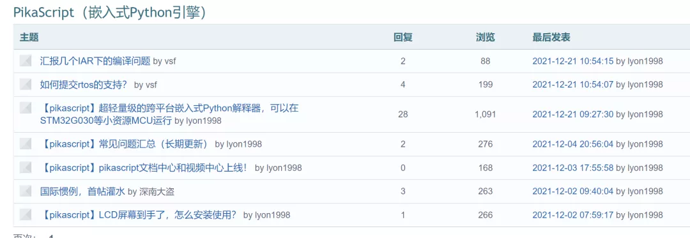

# 用 MDK 在树莓派 Pico 上玩 Python

我们知道树莓派 Pico 玩 Python 可以直接使用 MicroPython 的固件，但是 Micropython 的固件开发难度很大，如果你想要自己绑定 C 模块很麻烦，需要依赖大量 linux 生态下的工具，而且很难调试。

但是树莓派 Pico 的硬件资源和售价真的很香，pio 等特性也极具可玩性，那么，能不能在我们熟悉的平台，用接地气的开发方法，比如在 MDK 中，开发树莓派 Pico 呢？当然可以，隆重请出“傻孩子”大佬的 Pico_template，可以让你在熟悉的 MDK 中开发树莓派 pico，还支持免调试器单步调试（用一个核调试另一个）。

了解详情可以看：

GorgonMeducer 傻孩子，公众号：裸机思维[【独家】我就要用MDK来开发树莓Pico，怎么地吧！](http://mp.weixin.qq.com/s?__biz=MzAxMzc2ODMzNg==&mid=2656103324&idx=1&sn=f1d3ece87c81eeaa7d402f3cba60dc8f&chksm=8039c863b74e4175edc806b4e329c25e75b6372df53f07565bd9a46cfbf13a3c4cd9e20c08cc#rd)

MicroPython 绑定 C 模块很复杂，很难调试，有没有更方便的技术，可以很简单地绑定 C 模块呢？

有的，那就是 PikaScript，PikaScript 是一个完全重写的超轻量级 python 引擎，零依赖，零配置，可以在少于 4KB 的 RAM 下运行，具有框架式 C 模块开发工具，只要用 Python 写好调用 API，就能够自动连接到 C 模块，非常方便快捷。不用手动处理任何全局表、宏函数、模块注册等等过程。

而且 PikaScript 也支持 MDK 开发，能够轻松地调试 C 模块。

了解详情可以看：

李昂 1998，公众号：吉大仪电 216 小论坛[【独家】我就要用最便宜的单片机来跑 python，还要用 MDK 开发，怎么地吧！](http://mp.weixin.qq.com/s?__biz=MzU4NzUzMDc1OA==&mid=2247484313&idx=1&sn=2749a27bba09b2fe9c7bc0ad4977c8a6&chksm=fdebd4f0ca9c5de6f9160d42c58aa5d5e072168752c826cbf82f700f1fc301b96a3aaf4cfcfd#rd)

除了pico之外，pikascript 的易移植特性使其可以在非常多的平台上运行。

从 stm32g0，stm32f1，到国产的 ch32，apm32，cm32，还有平头哥的 w801，博流的 bl-706，统统支持。

很火的 ESP32C3，龙芯架构，还有这次的主角树莓派 Pico。

除了支持裸机，还支持 rt-thread、vsf 操作系统，linux 操作系统。

并且与 rt-thread 深度融合，能够基于软件包支持 rt-thread 全系列 BSP

下面进入正题，看看如何在树莓派 pico 上面用 MDK 开发，并玩上 Python。

使用说明：

[https://gitee.com/Lyon1998/pikascript/tree/master/bsp/pico#pikascript-in-pico](https://gitee.com/Lyon1998/pikascript/tree/master/bsp/pico#pikascript-in-pico)

如果能在串口看到下面的信息，就说明运行成功了！

Enjoy！

更多技术支持可以在论坛讨论~

https://whycan.com/f_55.html

