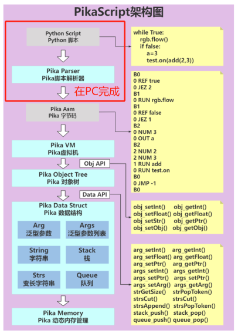

# 直接运行字节码

PikaScript的运行时架构如下图所示，在默认情况下，Python脚本解析成Pika字节码的过程是放在MCU执行的，这使得MCU可以直接运行Python脚本，包括支持交互式运行。
而在资源受限的情况下，可以将Python脚本解析为字节码的过程在PC提前完成，就可以不在MCU中解析Python脚本，转而直接执行Pika字节码，这样一来**解析Python脚本的代码就可以被裁剪掉了**。



## 在PC上将Python转为字节码：

预编译器 `rust-msc-latest-win10.exe` 集成了字节码生成器，在预编译时会生成 `.py` 文件的字节码，生成的字节码在 pikascript-api 文件夹下。

`.py` 文件会被生成为 `.py.o` 字节码文件，例如 `main.py` 会生成 `pikascript-api/main.py.o`。

同时，所有的 `.py.o` 文件会被自动打包成一个库文件 `pikascript-api/pikaModules.py.a`，库文件中包含了所有的字节码文件。

为了方便编译固件时在 mcu 中载入库文件，预编译器还会把库文件自动转换为 C 的字节数组文件 `pikascript-api/__asset_pikaModules_py_a.c`。

``` C
/* __asset_pikaModules_py_a.c */
#include "PikaPlatform.h"
/* warning: auto generated file, please do not modify */
PIKA_BYTECODE_ALIGN const unsigned char pikaModules_py_a[] = {
    0x7f, 0x70, 0x79, 0x61, 0x01, 0x00, 0x00, 0x00, 0x01, 0x00, 0x00, 0x00, 
    0x00, 0x00, 0x00, 0x00, 0x00, 0x00, 0x00, 0x00, 0x00, 0x00, 0x00, 0x00, 
    0x00, 0x00, 0x00, 0x00, 0x00, 0x00, 0x00, 0x00, 0x6d, 0x61, 0x69, 0x6e, 
...
```

## 使用库文件

使用 `obj_linkLibrary()` API 可以导入库文件，参考自动生成的 `pikaScriptInit()`
``` C
PikaObj *pikaScriptInit(void){
...
    __pikaMain = newRootObj("pikaMain", New_PikaMain);
    extern unsigned char pikaModules_py_a[];
    obj_linkLibrary(__pikaMain, pikaModules_py_a);
...
}
 ```
 
 导入库文件后，即可直接在 python 脚本里面 `import` 库文件中包含的模块。
 
 也可以直接将一个模块作为脚本运行，如：
 ``` C
 obj_runModule(__pikaMain, "main");
 ```

## 运行字节码

使用 `pikaVM_runByteCode()` API可以直接运行字节码，可以参考g030中从字节码启动的用法。
[https://gitee.com/Lyon1998/pikascript/blob/master/bsp/stm32g030c8/Booter/main.c](https://gitee.com/Lyon1998/pikascript/blob/master/bsp/stm32g030c8/Booter/main.c)
避免使用 `obj_run()` 执行 python 脚本，转而使用 `pikaVM_runByteCode()` 直接运行字节码，编译器就会自动优化掉Python解析的代码，降低代码体积占用。
